# Shared GCP Architecture and Data Pipeline

This is the source-of-truth architecture for all three publications:

- **Ape's Mac Salad** — Sleeper league truth and a public, team-name-only site.
- **Johnny's Jerks** — Sleeper redraft league truth, exact weekly pairings, matchup previews, and a public, team-name-only site.
- **Moosey's Mommy** — Yahoo league truth, a private local live-draft room, and a later public, team-name-only site.

The shared pipeline makes football inputs reusable while keeping league truth, credentials, draft ledgers, and publication releases strictly isolated. The machine-readable source policy is [`sleeper_work/provider_registry.json`](../sleeper_work/provider_registry.json); the per-publication boundary is [`sleeper_work/league_registry.json`](../sleeper_work/league_registry.json).

## 1. Design rules

1. **Capture once, consume by publication.** Global football inputs (ADP, market signals, player identities, permitted news metadata) are captured once and can serve every approved publication. League data is always scoped by `publication_id`.
2. **Providers retain their meaning.** ADP, market value, rankings, and stat-line projections are separate records. A market value must never be displayed as a projection.
3. **Rights travel with every snapshot.** Each raw snapshot has provider, fetch time, checksum, parser version, source URI, attribution, and a public-use classification.
4. **Private by default.** OAuth tokens, secrets, Yahoo identifiers, manager names, private chat, and restricted-provider fields never enter public release bundles.
5. **AI explains; deterministic code decides.** Vertex Gemini receives only compact, source-bound recommendation facts. It does not provide a data source, run web grounding, or alter calculated scores.

## 2. GCP footprint and credential boundary

| Component | Purpose | Authentication rule |
|---|---|---|
| Cloud Storage | Immutable raw captures and metadata sidecars | Managed runtime identity or user ADC; no credentials in paths or sidecars |
| BigQuery | Canonical, feature, analytics, and release-manifest data | Managed runtime identity or user ADC |
| Vertex AI | Optional private commentary and player summaries | User Application Default Credentials for local work; Vertex AI User role |
| Netlify | Static public sites only | Receives sanitized release artifacts, never raw or restricted data |

The GCP project is `apes-mac-salad`. Local development uses `gcloud auth application-default login`. The old administrator service-account key pattern is retired: no service-account JSON path is embedded in scripts, source control, frontend builds, or release artifacts.

## 3. End-to-end flow

```mermaid
flowchart LR
    subgraph Sources[Provider adapters]
        S[Sleeper league truth]
        Y[Yahoo league truth]
        FC[FantasyCalc market]
        FFC[Fantasy Football Calculator ADP]
        NV[nflverse identities / model inputs]
        RW[RotoWire RSS metadata]
        FP[FantasyPros private optional]
    end

    subgraph Raw[Immutable raw layer]
        G1[Global source snapshots]
        P1[Publication-scoped restricted snapshots]
        M[Checksums + rights metadata]
    end

    subgraph Canonical[BigQuery canonical]
        L[league configs + teams + rosters]
        X[player crosswalk]
        K[market signals + projections]
        N[news metadata]
        D[draft sessions + events]
    end

    subgraph Products[Publication products]
        A[Ape's Mac Salad analyses]
        J[Johnny's Jerks analyses]
        MM[Moosey's Mommy draft room + analyses]
        R[Sanitized public releases]
    end

    Sources --> Raw
    Raw --> M
    M --> Canonical
    Canonical --> A
    Canonical --> J
    Canonical --> MM
    A --> R
    J --> R
    MM --> R
```



### Storage layout

```text
gs://apes-mac-salad-raw/
  global/provider=<provider>/season=<season>/date=<YYYY-MM-DD>/as_of=<timestamp>/
    payload.<format>.gz
    payload.<format>.gz.meta.json
  publications/publication=<publication_id>/provider=<provider>/season=<season>/...
    payload.<format>.gz
    payload.<format>.gz.meta.json

gs://apes-mac-salad-releases/
  publications/<publication_id>/release=<release_id>/
    public-release.json
    manifest.json
```

Global snapshots are reusable only when the provider registry marks the provider `publicationScope: "shared"`. Restricted raw data is never copied into a public prefix.

## 4. Shared provider catalog

| Provider | Data type | Shared consumer | Public-release policy |
|---|---|---|---|
| Sleeper | League settings, rosters, schedules, results, transactions, and drafts | Ape's Mac Salad and Johnny's Jerks, isolated by publication | Sanitized team-name-only records may publish |
| Yahoo Fantasy Sports API | Moosey's Mommy league settings, rosters, draft results | Moosey's Mommy only | OAuth remains local; later team-name-only transform needs approval |
| FantasyCalc redraft / dynasty | Market values, ranks, 30-day movement | Approved publications, internally | Restricted until redistribution rights are confirmed |
| Fantasy Football Calculator | ADP by format and league size | Approved publications | May publish only with required attribution |
| nflverse | Player identities and permitted historical model inputs | Approved publications | Attribution required; publish derived model outputs, not unlicensed third-party fields |
| RotoWire NFL RSS | Headline, timestamp, link, and supplied reporter credit | Approved publications | Metadata only; no article body or subscriber analysis |
| FantasyPros | Optional private projections or expert consensus | Approved publications, only when licensed | Free prototype access is private/non-production; block public release |
| Vertex Gemini | Private source-bound explanations | Approved publications | Not a source; no private chat in releases |
| Legacy expert snapshots | Historical reproducibility inputs for Ape's Mac Salad | Ape's Mac Salad only | Inactive; do not treat as a live feed or republish source content |

The provider registry is the release gate. A provider with `publicAllowed: false` may support internal calculations but cannot contribute fields to a public artifact. [`source_registry.json`](../sleeper_work/source_registry.json) is the adapter inventory: endpoint shape, cadence, retention, activation conditions, and its mapping back to this policy. `rotowire-nfl-rss` is explicitly limited to `headline`, `publishedAt`, `sourceUrl`, and `reporter`.

## 5. Canonical data model

The existing DDL remains valid for Sleeper-oriented history. [`canonical_multileague_ddl.sql`](../sleeper_work/canonical_multileague_ddl.sql) extends it with a platform-neutral contract:

| Dataset | Tables | Purpose |
|---|---|---|
| `canonical` | `league_configs`, `provider_snapshots`, `player_crosswalk_v2` | Publication settings, source lineage, and durable player identity |
| `canonical` | `market_signals`, `projections`, `news_items` | Separate market/ADP signals, rescored stat-line projections, and metadata-only news |
| `canonical` | `draft_sessions`, `draft_events` | Replayable manual/Yahoo draft ledger without tokens or private chat |
| `analytics` | `draft_recommendation_runs`, existing forecast tables | Deterministic simulations, recommendations, and calibration artifacts |
| `features` | Existing weekly team/player feature tables | Point-in-time model inputs with no future leakage |

Every league-dependent table includes `publication_id`. Shared `provider_snapshots`, `market_signals`, and `news_items` use `scope = global` with a null `publication_id`; publication captures use `scope = publication` with the owning publication ID. `player_crosswalk_v2` treats GSIS/nflverse identity as durable and stores Sleeper/Yahoo/provider IDs as provider-specific joins. Ambiguous matches are quarantined; they are not guessed.

### Important record distinctions

- `market_signals` contains ADP, market ranks, values, and trends.
- `projections` contains a provider stat line and its score under the exact league scoring rules.
- `news_items` contains RSS metadata only.
- `draft_recommendation_runs` stores deterministic evidence and seeds; generated prose is not a substitute for the recommendation record.

## 6. How the three publications use the same pipeline

### Ape's Mac Salad

1. The Sleeper adapter writes publication-scoped league truth.
2. It reads shared FantasyCalc, FFC, nflverse, and permitted RotoWire snapshots through canonical records.
3. It generates Power Rankings, Matchups, Forecast, Draft Analysis, and Hall of Mac releases.
4. The release sanitizer removes manager names, platform IDs, restricted-provider fields, and any private source metadata.

### Johnny's Jerks

1. Its Sleeper adapter captures league, draft, roster, user, and exact Weeks 1–14 matchup payloads under `publication_id = johnnys-jerks`.
2. The current-week artifact joins the official Sleeper pairing with deterministic preview analysis and the separately sourced NFL kickoff/broadcast schedule.
3. The season forecast simulates the exact remaining Sleeper schedule. It never substitutes a generic balanced rotation.
4. The open Matchups screen polls Sleeper every 60 seconds for team scores. Opening odds and analysis remain fixed until a remaining-player projection model is implemented.
5. Its public release uses team names only and cannot read Ape's Mac Salad league truth even though both use Sleeper.

### Moosey's Mommy

1. The local draft room captures manual events immediately; Yahoo events reconcile only after OAuth succeeds.
2. The same shared market, ADP, identity, and metadata-only news records power its board and dossier.
3. Its 14-team Yahoo scoring and roster configuration is stored as a separate `LeagueConfig` and never alters Ape's Mac Salad calculations.
4. Post-draft, approved team-name-only data joins the shared release flow for Draft Analysis, Power Rankings, Matchups, Forecast, and Hall of Callers.

No publication can read another publication's league truth, draft session, raw restricted capture, or private AI chat.

## 7. Draft-room and Vertex integration

The local service is authoritative during a live draft. It writes an immutable SQLite ledger first, exports a privacy-safe ChatGPT packet, and may later replicate approved canonical rows to GCP.

Vertex is optional and bounded:

- Model: `gemini-3.1-flash-lite` through Vertex AI.
- Inputs: one player or recommendation's compact, already-calculated evidence plus permitted news metadata.
- Limits: 100 session calls, 300,000 input tokens, 30,000 output tokens, five-second timeout.
- Failure behavior: deterministic prose fallback with no recommendation change.
- Storage: no private chat transcript or credentials in GCS, BigQuery, or public releases.

## 8. Implementation sequence

1. **Apply schema with user ADC.** Run `python sleeper_work/apply_bigquery_ddl.py` only after user ADC and BigQuery permissions are confirmed. It creates new canonical tables and reconciles safe additive/nullable schema changes; it does not fetch data.
2. **Add shared source ingestion.** [`capture_shared_sources.py`](../sleeper_work/capture_shared_sources.py) captures FantasyCalc, FFC ADP, nflverse identities, and metadata-only RotoWire into the `global/` prefix with `provider_registry.json` metadata. It has an offline `--replay` mode. Send Sleeper/Yahoo league truth only to the matching publication prefix; Yahoo stays inactive until OAuth approval.
3. **Normalize and crosswalk.** Populate `provider_snapshots`, `player_crosswalk_v2`, `market_signals`, `projections`, and `news_items`. Retain source snapshot IDs on every derived record.
4. **Backfill Ape's Mac Salad.** Use the shared global inputs with the existing Sleeper adapter; do not alter historical output until its input manifest is regenerated and checked.
5. **Integrate Johnny's Jerks.** Move its currently local Sleeper capture and recap builder under the repository-owned pipeline, write publication-scoped raw/canonical rows, and add its build to the weekly orchestrator.
6. **Enable Yahoo after approval.** Discover the real Yahoo league key and team key through OAuth. Keep refresh tokens local; persist only approved, source-bound league records.
7. **Release through one sanitizer.** Build a preview, validate manifest checksums and privacy rules, then promote the exact artifact. Preserve the prior release for rollback.

## 9. Validation gates

- Provider registry JSON is valid and every source has a rights classification.
- GCS sidecars contain checksum, fetch time, parser version, source URI, scope, and rights classification.
- Crosswalk quality is 100% unambiguous for the top 100 players and at least 99% for the top 200; unresolved records are quarantined.
- Restricted providers, RotoWire article text, Yahoo IDs, OAuth material, manager names, local paths, and private chat fail the public-release scan.
- Ape's Mac Salad, Johnny's Jerks, and Moosey's Mommy have separate manifests, release prefixes, and regression tests.
- Draft-event replay yields unique contiguous picks and only deterministic evidence can change a recommendation score.

## 10. Current status

Johnny's Jerks now has a fully repository-owned weekly pipeline: it captures all 14 exact regular-season matchup weeks from Sleeper, regenerates current previews and the 10,000-run season forecast, and builds the site with `npm run refresh:johnny`. Its open Matchups screen polls current team scores from Sleeper every 60 seconds.

The GCP setup and GitHub workflow have been repaired:
- **Cloud Run / Cloud Scheduler**: Scheduled capture failures (`code 7 PERMISSION_DENIED`) were resolved by binding `roles/run.invoker` to `ams-capture`. The job was verified with an immediate run writing to `gs://apes-mac-salad-raw-prod`.
- **Workload Identity Federation**: GitHub-to-GCP Workload Identity Federation was configured for `alexanderjohnson2011-cpu/-fantasy-sports-projects` to impersonate `ams-pipeline`. A fallback service account key was also generated.
- **Pipeline Relocation**: Johnny's adapter, recap builder, and fixtures were moved inside the repository-owned pipeline under `sleeper_work/`, eliminating external path assumptions and adding focused unit tests.
- **Workflow Automation**: `.github/workflows/weekly-refresh.yml` supports both Workload Identity Federation and service account keys, and executes Johnny's capture and build steps.

The local Moosey's Mommy draft room continues to use the shared provider vocabulary and source-rights policy. Its Yahoo adapter remains inactive until OAuth approval.

Sleeper provides fantasy schedules and team scores but not NFL television networks. Week 1 uses a captured official NFL schedule. If subsequent weeks lack an approved broadcast schedule fixture, the pipeline cleanly emits pending status markers and the UI displays "TV guide pending" without inventing networks or kickoff times.
