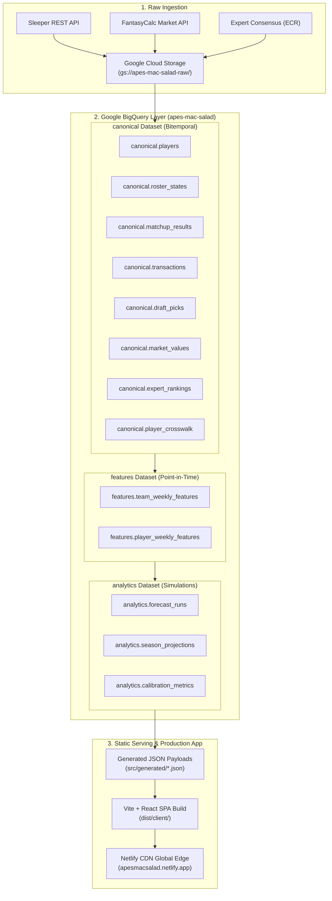

# Apes Mac Salad: GCP Architecture & End-to-End Data Pipeline

This document provides a complete technical specification of how the **Apes Mac Salad / Ape Invitational Almanac** platform interfaces with **Google Cloud Platform (GCP)**, what datasets and tables live there, and how data moves from external sources down to the live user application.

---

## 1. Executive Summary & GCP Footprint

The platform uses Google Cloud Platform as an enterprise data warehouse and immutable analytical backend:



---

## 2. GCP Authentication & Infrastructure Credentials

| Property | Value |
| :--- | :--- |
| **GCP Project ID** | `apes-mac-salad` |
| **GCP Project Number** | `854652250262` |
| **Service Account Key** | `apes-mac-salad-0d52b5a00417.json` |
| **Authentication Method** | `GOOGLE_APPLICATION_CREDENTIALS` via Python `google-auth` / `google-cloud-bigquery` / `google-cloud-storage` |
| **Active GCP APIs** | `bigquery.googleapis.com`, `storage.googleapis.com`, `run.googleapis.com`, `cloudscheduler.googleapis.com`, `secretmanager.googleapis.com`, `workflows.googleapis.com` |

---

## 3. What Data Lives on GCP?

### A. Google Cloud Storage (`gs://apes-mac-salad-raw/`)
Cloud Storage houses immutable, compressed copies of raw payload bytes before transformation:
- **Exact Raw Response Bytes**: `raw/sleeper/league/<id>/as_of=<YYYY-MM-DD-HH>/data.json.gz`
- **Metadata Sidecars**: `data.meta.json` containing:
  - `sha256` content hash for cryptographic deduplication.
  - `observed_at_utc` timestamp.
  - `cadence_bucket` (hourly / daily / weekly idempotency partition).
  - `parser_version` string.

---

### B. Google BigQuery Datasets & Tables

BigQuery acts as the canonical data warehouse and analytical compute engine across 3 distinct datasets:

#### 1. Dataset: `apes-mac-salad.canonical` (Bitemporal Source of Truth)
Every table in this dataset tracks two time dimensions: **valid time** (when a league event occurred) and **system/observed time** (when our pipeline ingested it).

| Table Name | Partitioning & Clustering | Description & Stored Data |
| :--- | :--- | :--- |
| [`players`](file:///c:/Users/alexa/Documents/Codex/Apes%20Mac%20Salad/apes-mac-salad-codex-handoff/ape-invitational-almanac/sleeper_work/canonical_ddl.sql#L5-L25) | Part: `DATE(observed_at_utc)`<br>Cluster: `position, nfl_team, player_id` | Master list of all NFL players, team affiliations, positions, ages, and injury/active status. |
| [`roster_states`](file:///c:/Users/alexa/Documents/Codex/Apes%20Mac%20Salad/apes-mac-salad-codex-handoff/ape-invitational-almanac/sleeper_work/canonical_ddl.sql#L28-L51) | Part: `DATE(observed_at_utc)`<br>Cluster: `league_id, roster_id` | Historical snapshots of all 12 league rosters, including starters array, bench, taxi, IR reserve, and cumulative PF/PA. |
| [`matchup_results`](file:///c:/Users/alexa/Documents/Codex/Apes%20Mac%20Salad/apes-mac-salad-codex-handoff/ape-invitational-almanac/sleeper_work/canonical_ddl.sql#L53-L75) | Part: `DATE(observed_at_utc)`<br>Cluster: `league_id, season, week, roster_id` | Weekly head-to-head matchup outcomes, exact starter points arrays, and total fantasy scores. |
| [`transactions`](file:///c:/Users/alexa/Documents/Codex/Apes%20Mac%20Salad/apes-mac-salad-codex-handoff/ape-invitational-almanac/sleeper_work/canonical_ddl.sql#L77-L99) | Part: `DATE(observed_at_utc)`<br>Cluster: `league_id, type, transaction_id` | Complete transaction ledger: trades, FAAB waiver bids, free agent additions, and traded future draft picks. |
| [`draft_picks`](file:///c:/Users/alexa/Documents/Codex/Apes%20Mac%20Salad/apes-mac-salad-codex-handoff/ape-invitational-almanac/sleeper_work/canonical_ddl.sql#L101-L121) | Part: `DATE(observed_at_utc)`<br>Cluster: `draft_id, round, pick_no` | Every pick made in rookie/startup drafts with slot numbers, original owners, acquiring owners, and selection metadata. |
| [`market_values`](file:///c:/Users/alexa/Documents/Codex/Apes%20Mac%20Salad/apes-mac-salad-codex-handoff/ape-invitational-almanac/sleeper_work/canonical_ddl.sql#L123-L143) | Part: `DATE(observed_at_utc)`<br>Cluster: `position, is_dynasty, player_id` | Time-series market valuations from FantasyCalc (dynasty values, redraft values, overall ranks, 30-day value momentum). |
| [`expert_rankings`](file:///c:/Users/alexa/Documents/Codex/Apes%20Mac%20Salad/apes-mac-salad-codex-handoff/ape-invitational-almanac/sleeper_work/canonical_ddl.sql#L145-L162) | Part: `DATE(observed_at_utc)`<br>Cluster: `position, consensus_rank` | Expert Consensus Rankings (ECR), tier distributions, and expert consensus spreads. |
| [`player_crosswalk`](file:///c:/Users/alexa/Documents/Codex/Apes%20Mac%20Salad/apes-mac-salad-codex-handoff/ape-invitational-almanac/sleeper_work/canonical_ddl.sql#L164-L175) | Cluster: `sleeper_id, gsis_id` | Master ID entity resolution bridging Sleeper IDs, NFL GSIS IDs, FantasyCalc IDs, and FantasyPros IDs. |

---

#### 2. Dataset: `apes-mac-salad.features` (Point-in-Time Feature Store)
Eliminates data leakage by computing team and player metrics strictly as they existed at specific historical timestamps.

| Table Name | Partitioning & Clustering | Stored Feature Metrics |
| :--- | :--- | :--- |
| [`team_weekly_features`](file:///c:/Users/alexa/Documents/Codex/Apes%20Mac%20Salad/apes-mac-salad-codex-handoff/ape-invitational-almanac/sleeper_work/features_ddl.sql#L5-L29) | Part: `DATE(input_cutoff_utc)`<br>Cluster: `league_id, season, week, roster_id` | Dynasty total value, redraft starting lineup value, bench depth value, youth value share (<25 yo), 3-year future pick inventory, positional room ratings (QB/RB/WR/TE), and lineup efficiency percentage. |
| [`player_weekly_features`](file:///c:/Users/alexa/Documents/Codex/Apes%20Mac%20Salad/apes-mac-salad-codex-handoff/ape-invitational-almanac/sleeper_work/features_ddl.sql#L31-L50) | Part: `DATE(input_cutoff_utc)`<br>Cluster: `position, player_id` | Player market values, 30-day value trend, consensus expert rank, starter status, and depth-chart position. |

---

#### 3. Dataset: `apes-mac-salad.analytics` (Simulation & Model Outputs)
Stores the outputs of our analytical pipelines, including the 10,000-run Monte Carlo simulations and calibration tests.

| Table Name | Partitioning & Clustering | Stored Analytical Outputs |
| :--- | :--- | :--- |
| [`forecast_runs`](file:///c:/Users/alexa/Documents/Codex/Apes%20Mac%20Salad/apes-mac-salad-codex-handoff/ape-invitational-almanac/sleeper_work/analytics_ddl.sql#L5-L20) | Part: `DATE(observed_at_utc)`<br>Cluster: `season, as_of_week, forecast_run_id` | Metadata on each simulation run: 10,000 iterations, random seed (42), input cutoff timestamp, convergence status, Brier score (0.071), and Log-loss (0.286). |
| [`season_projections`](file:///c:/Users/alexa/Documents/Codex/Apes%20Mac%20Salad/apes-mac-salad-codex-handoff/ape-invitational-almanac/sleeper_work/analytics_ddl.sql#L22-L41) | Part: `DATE(observed_at_utc)`<br>Cluster: `season, roster_id, forecast_run_id` | Team-by-team season projection metrics: expected wins/losses, expected points, playoff probability (%), 1st-round bye probability (%), championship odds (%), last place odds (%), and median projected seed. |
| [`calibration_metrics`](file:///c:/Users/alexa/Documents/Codex/Apes%20Mac%20Salad/apes-mac-salad-codex-handoff/ape-invitational-almanac/sleeper_work/analytics_ddl.sql#L43-L55) | Part: `DATE(observed_at_utc)`<br>Cluster: `target_event` | Statistical calibration verification bins, predicted probability means vs. observed frequencies, and reliability weights. |

---

## 4. End-to-End Data Pipeline Execution Flow

```
[ External APIs ]
       │
       ▼ (1. Ingest with retry & exponential backoff)
[ capture_sleeper_data.py / expert_rankings.py ]
       │
       ├──► Writes Raw Response & Sidecar to GCS (gs://apes-mac-salad-raw/)
       │
       ▼ (2. Parse, entity-resolve & hash content)
[ build_canonical_layer.py / canonical_schema.py ]
       │
       ├──► Streams bitemporal rows to BigQuery `canonical.*` tables
       │
       ▼ (3. Point-in-time feature extraction)
[ build_feature_store.py ]
       │
       ├──► Writes AS OF feature vectors to BigQuery `features.*` tables
       │
       ▼ (4. High-performance Monte Carlo simulation engine & ranking models)
[ monte_carlo_forecast.py / build_power_rankings.py / week1_matchups_data.py ]
       │
       ├──► Streams simulation results to BigQuery `analytics.season_projections`
       │
       ▼ (5. Export typed JSON payloads to frontend client)
[ src/generated/*.json ]
   ├── forecast-insights.json
   ├── matchups-week1.json
   ├── league-insights.json
   └── draft-recap.json
       │
       ▼ (6. Static bundling & global deployment)
[ Vite Build (tsc && vite build) ] ──► Netlify CDN Edge (apesmacsalad.netlify.app)
```

---

## 5. Summary of Key Python Pipeline Scripts

| Script Path | Primary Role & GCP Interactions |
| :--- | :--- |
| [`capture_sleeper_data.py`](file:///c:/Users/alexa/Documents/Codex/Apes%20Mac%20Salad/apes-mac-salad-codex-handoff/ape-invitational-almanac/sleeper_work/capture_sleeper_data.py) | Ingests Sleeper league, roster, draft, bracket, matchup, and transaction data; uploads raw JSON snapshots and SHA256 sidecars to GCS. |
| [`apply_bigquery_ddl.py`](file:///c:/Users/alexa/Documents/Codex/Apes%20Mac%20Salad/apes-mac-salad-codex-handoff/ape-invitational-almanac/sleeper_work/apply_bigquery_ddl.py) | Executes `canonical_ddl.sql`, `analytics_ddl.sql`, `features_ddl.sql`, and `as_of_functions.sql` against BigQuery. |
| [`build_canonical_layer.py`](file:///c:/Users/alexa/Documents/Codex/Apes%20Mac%20Salad/apes-mac-salad-codex-handoff/ape-invitational-almanac/sleeper_work/build_canonical_layer.py) | Transforms raw GCS captures into typed canonical schemas and streams to BigQuery `canonical.*` tables. |
| [`build_feature_store.py`](file:///c:/Users/alexa/Documents/Codex/Apes%20Mac%20Salad/apes-mac-salad-codex-handoff/ape-invitational-almanac/sleeper_work/build_feature_store.py) | Computes point-in-time feature vectors and writes to BigQuery `features.*` tables. |
| [`monte_carlo_forecast.py`](file:///c:/Users/alexa/Documents/Codex/Apes%20Mac%20Salad/apes-mac-salad-codex-handoff/ape-invitational-almanac/sleeper_work/monte_carlo_forecast.py) | Executes 10,000-run Monte Carlo simulations across the official 14-week Sleeper schedule matrix; writes projections to BigQuery `analytics.season_projections` and exports `forecast-insights.json`. |
| [`week1_matchups_data.py`](file:///c:/Users/alexa/Documents/Codex/Apes%20Mac%20Salad/apes-mac-salad-codex-handoff/ape-invitational-almanac/sleeper_work/week1_matchups_data.py) | Generates Week 1 head-to-head matchup previews, Tale of the Tape rosters, TV viewing schedules, and point-differential leverage models, exporting `matchups-week1.json`. |
