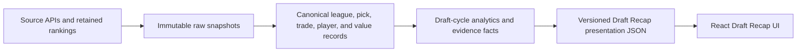

# Draft Recap Data Pipeline — Detailed Implementation Plan

> **Reference document — not the plan of record.** [MASTER_PLAN.md](MASTER_PLAN.md) governs. This remains the detailed specification for task P5-1; note the corrections listed in MASTER_PLAN.md §9 before implementing §4.3, §10.4 or §18.4.

> **Scope note:** This is a detailed sub-plan for the Draft Recap domain. The system-wide GCP pipeline, weekly source schedule, simulation, recap timeline, and live Netlify publication contract are defined in [WEEKLY_LEAGUE_INTELLIGENCE_GCP_PIPELINE_IMPLEMENTATION_PLAN.md](WEEKLY_LEAGUE_INTELLIGENCE_GCP_PIPELINE_IMPLEMENTATION_PLAN.md).

**Project:** Ape's Mac Salad / Ape Invitational Dynasty  
**Scope:** Make the 2026 Draft Recap fully data-driven, reproducible, auditable, and safe to refresh without hand-editing frontend data  
**Plan date:** 2026-08-21  
**Recommended owner:** Data/platform engineer, with product review for grading policy and editorial tone  
**Implementation style:** Static-first batch pipeline; no live browser-side Sleeper calls  

---

## 1. Executive summary

The Draft Recap currently has two competing sources of truth:

1. `../sleeper_work/output_latest/website_data.json` and `src/generated/league-insights.json` contain generated roster and partial draft-audit data.
2. `src/Prototype.tsx` contains the displayed team order, manager/team names, picks, original-versus-acquired flags, component scores, capital ratios, superlatives, and all Draft Recap prose.

That split is why a Sleeper refresh does not reliably refresh the page. The checked-in analytical snapshot is still provisional at 45 of 48 picks, even though the live Sleeper draft now reports `complete` with 48 picks. The final three picks are:

| Overall | Slot | Roster | Player |
|---:|:---:|---:|---|
| 46 | 4.10 | 6 | Carson Beck |
| 47 | 4.11 | 7 | Zavion Thomas |
| 48 | 4.12 | 1 | Barion Brown |

The target state is a deterministic pipeline that produces a single versioned Draft Recap presentation contract. The React app will render that contract and will not calculate grades, infer draft state, or carry team-specific Draft Recap facts in TypeScript.

The pipeline will have five logical layers:



The recommended implementation freezes pick execution, roster fit, and the official draft-cycle award at the completed-draft snapshot. A separately labeled retrospective capital metric may continue to change as player values change, but it must not silently rewrite the official 2026 Draft Recap winner.

---

## 2. Outcomes and non-goals

### 2.1 Required outcomes

At completion:

- One command fetches, validates, scores, narrates, and publishes the Draft Recap data.
- Replaying the same raw snapshot produces byte-identical canonical, analytics, and presentation artifacts.
- All 48 draft picks are present exactly once.
- All 12 rosters are present exactly once, including the roster that made no selection.
- Team identity, manager identity, pick ownership, pick provenance, player identity, scores, grades, rank, capital accounting, superlatives, and page copy come from the generated payload.
- Every displayed score and narrative claim has machine-readable evidence.
- The final draft award cannot be emitted from a partial draft or an invalid scoring run.
- A failed refresh cannot overwrite the last known good artifact.
- The Vite/Sites build performs no external data fetches and can be reproduced from checked-in or otherwise pinned inputs.
- Draft Recap and Power Rankings remain separate products and do not share grades or detail screens.

### 2.2 Non-goals for this implementation

- Do not redesign the website.
- Do not change protected mobile/runtime files.
- Do not implement weekly matchup stories, forecasts, or season simulations.
- Do not deploy or change hosting providers as part of the data refactor.
- Do not auto-submit waivers, trades, or any write operation to Sleeper.
- Do not let an LLM calculate grades or invent factual claims.
- Do not make current FantasyCalc values look like weekly point projections.
- Do not rebuild the Power Rankings methodology in the same change set.

---

## 3. Current-state assessment

### 3.1 What already works

- `sleeper_league_analyzer.py` resolves the league, rosters, users, draft, picks, traded-pick inventory, the Sleeper player map, FantasyCalc values, and retained expert rankings.
- The analyzer produces normalized CSV and JSON outputs.
- Pick market value and expert-implied value are compared against the value expected at the actual slot.
- Pre-draft position-room rank is available for fit analysis.
- The frontend already imports generated JSON and has a static-first architecture.
- The app already displays the intended 60% execution / 30% capital / 10% fit formula.
- `npm run check:runtime`, `npm run build`, and `npm run test:sites` provide existing handoff gates.

### 3.2 Gaps that must be closed

| Gap | Evidence in current code | Impact |
|---|---|---|
| Stale source snapshot | `output_latest/snapshot_metadata.json` says `paused`, 45/48 | A refresh can display an incomplete draft as current. |
| Draft facts embedded in UI | `const teams: Team[]` in `src/Prototype.tsx` | Pick and team changes require code edits. |
| Scores embedded in UI | `scores: { execution, capital, fit }` per team | The page cannot prove how its final grades were reproduced. |
| Trade ledger not implemented in analyzer | Analyzer reads current `traded_picks` inventory but not historical transaction packages | Capital scores and provenance depend on a hand-built analysis. |
| Two execution formulas | Python uses 55/45 expert/market ratios; UI uses a 50/50 pick ratio and different grade cutoffs | Pick letters and aggregate execution can disagree. |
| Roster fit is double-counted | Python applies fit to execution; frontend also gives fit a 10% component | The displayed 60/30/10 model is not cleanly decomposed. |
| No-pick roster uses zero as missing | Bronco has execution `0`, while UI also calls it incomplete | Zero performance and not-applicable are conflated. |
| Hard-coded draft status and date copy | Homepage says Aug 20 and “Provisional while the slow draft remains live” | Completed drafts retain stale copy. |
| Hard-coded superlatives | `draftSuperlatives` is a TypeScript array | New picks cannot change the notebook automatically. |
| Network fetch during data bridge | `build-league-insights.mjs` calls Sleeper during generation | The same source tree can build different output or fail offline. |
| No versioned contract | Imported JSON is cast to a TypeScript type | Schema drift can reach the UI undetected. |
| No atomic publish | Generated artifacts are overwritten directly | A partial or failed run can become the displayed snapshot. |
| Editorial claims have no evidence references | Headline/commentary/verdict are free text | Stale names, slots, ranks, and percentages are difficult to detect. |

### 3.3 Baseline that must be captured before refactoring

Create a reconciliation report before changing formulas. For every roster, record:

- Current displayed rank and cycle grade.
- Current displayed execution, capital, and fit scores.
- Current displayed pick count and slot list.
- Analyzer execution grade and value-capture values.
- Current capital ratio and its source transactions.
- Current best pick, question, verdict, and headline.
- Differences between the 45-pick retained snapshot and the 48-pick live board.

This report is evidence, not a requirement to preserve every hand-entered number. Any intentional score change caused by the deterministic model must be listed and approved.

---

## 4. Design decisions

### 4.1 Static-first presentation

The browser will import a generated JSON artifact. It will not call Sleeper, FantasyCalc, or expert-ranking sources. This keeps API availability, rate limits, source parsing, and scoring out of the visitor experience.

### 4.2 Separate Draft Recap payload

Create `src/generated/draft-recap.json` for Draft Recap data. Keep `src/generated/league-insights.json` for roster/power inputs until the Power Rankings pipeline is separately migrated.

Reasons:

- It preserves the product boundary between draft-cycle evaluation and roster viability.
- It removes the need to retain a generic static `teams` array only because multiple screens currently share it.
- It allows Draft Recap schema/model versions to evolve without silently changing Power Rankings.

### 4.3 Freeze official draft results

Use the first validated completed-draft run as the official finalization snapshot:

- `draft.status == "complete"`
- `picks.count == teams * rounds`
- pick numbers are exactly `1..48`
- no duplicate slot or player selection
- all required value/rank coverage gates pass
- scoring and presentation schemas pass

After finalization:

- Official pick execution, roster fit, cycle score, cycle grade, order, and draft Mac Salad recipient are immutable for model version `draft-cycle-2026-v1`.
- A correction requires a new model or restatement version and a written reason.
- Current retrospective capital values may be refreshed, but are displayed separately and cannot silently rewrite the official grade.

### 4.4 Deterministic narratives first

Use an evidence-driven template engine for the first production version. Optional LLM polishing can be evaluated later, but the initial output should be deterministic and testable.

### 4.5 One scoring implementation

All pick, component, cycle, and letter-grade calculations live in Python. React only formats values received from the payload.

### 4.6 Missing is not zero

Use `null` plus an explicit status for unavailable or not-applicable components. For a roster with no picks:

- `execution.status = "not_applicable"`
- `execution.score = null`
- `fit.status = "not_applicable"`
- `fit.score = null`
- `cycle.status = "incomplete_no_picks"`
- `cycle.grade = "INC"`
- capital facts remain visible

---

## 5. Target repository structure

Add a focused pipeline package beside the current analyzer:

```text
sleeper_work/
  pyproject.toml
  config/
    leagues/
      ape_invitational.2026.json
    scoring/
      draft_cycle.v1.json
    narratives/
      draft_recap.v1.json
  contracts/
    raw-manifest.schema.json
    canonical-draft.schema.json
    analytics-draft-recap.schema.json
    presentation-draft-recap.schema.json
  draft_pipeline/
    __init__.py
    cli.py
    config.py
    logging.py
    hashing.py
    io.py
    http.py
    sleeper_client.py
    market_client.py
    ranking_loader.py
    snapshot.py
    identity.py
    normalize.py
    draft_state.py
    trade_ledger.py
    valuation.py
    scoring.py
    superlatives.py
    narratives.py
    presentation.py
    quality.py
    publish.py
  data/
    raw/2026/<snapshot_id>/
    canonical/2026/<snapshot_id>/
    analytics/2026/<model_version>/<snapshot_id>/
    presentation/2026/<model_version>/<snapshot_id>/
    latest/
  tests/
    fixtures/
      sleeper/
      market/
      rankings/
      completed_draft_48/
    unit/
    contract/
    integration/
    golden/
  refresh_draft_recap.py

ape-invitational-almanac/
  contracts/
    presentation-draft-recap.schema.json
  scripts/
    sync-draft-recap.mjs
    validate-generated-data.mjs
  src/
    generated/
      draft-recap.json
      draft-recap.types.ts
    Prototype.tsx
```

Keep `sleeper_league_analyzer.py` working during migration. The new CLI may initially import stable helper functions from it, but the end state should make the monolith a compatibility wrapper or retire its Draft Recap responsibilities after parity is proven.

---

## 6. Configuration contract

Move league IDs, season, model weights, grade thresholds, cache rules, and narrative thresholds out of code.

### 6.1 League configuration

`config/leagues/ape_invitational.2026.json`:

```json
{
  "league_key": "ape_invitational",
  "season": "2026",
  "league_id": "1312209616372772864",
  "draft_id": "1312209616385343488",
  "league_chain_ids": [
    "1187879775490527232",
    "1312209616372772864"
  ],
  "teams": 12,
  "rounds": 4,
  "scoring_profile": "1qb_half_ppr_no_tep_3flex",
  "transaction_rounds": { "min": 1, "max": 18 },
  "timezone": "America/Los_Angeles"
}
```

Validate configured IDs against the returned Sleeper objects. Fail if the league or draft points to a different season or league.

### 6.2 Scoring configuration

`config/scoring/draft_cycle.v1.json` should contain:

- expert/market weights
- pick weighting rule
- ratio-to-score anchors
- letter-grade thresholds
- positional fit multipliers
- cycle component weights
- missing-data coverage gates
- official finalization behavior

Configuration is versioned and hashed. The hash is included in every analytics and presentation artifact.

---

## 7. Source ingestion

### 7.1 Sleeper source matrix

Use the public, read-only [Sleeper API](https://docs.sleeper.com/).

| Entity | Endpoint | Refresh rule | Required validation |
|---|---|---|---|
| Current league | `/v1/league/{league_id}` | Every run | Correct ID, season, roster count, scoring settings |
| Users | `/v1/league/{league_id}/users` | Every run | Unique `user_id`; all owned rosters resolvable |
| Rosters | `/v1/league/{league_id}/rosters` | Every run | Unique `roster_id`; count 12 |
| League drafts | `/v1/league/{league_id}/drafts` | Every run | Exactly one selected by configured `draft_id` |
| Draft object | `/v1/draft/{draft_id}` | Every run | League/season match; status known |
| Draft picks | `/v1/draft/{draft_id}/picks` | Every run until finalized | Unique pick number and slot |
| Draft traded picks | `/v1/draft/{draft_id}/traded_picks` | Every run | Used as a reconciliation source |
| League traded picks | `/v1/league/{league_id}/traded_picks` | Every run | Used for current ownership, not full history |
| Transactions | `/v1/league/{league_id}/transactions/{round}` | Every run for all configured league-chain IDs and rounds | De-duplicate by transaction ID; keep completed trades |
| NFL players | `/v1/players/nfl` | At most daily | Non-empty map; record source hash and fetch time |

Sleeper states that its API is read-only, requires no token, and recommends staying below 1,000 calls per minute. The pipeline should still use a much lower self-imposed limit: no more than five concurrent requests and exponential backoff with jitter.

### 7.2 Market and expert sources

Retain source isolation:

- FantasyCalc dynasty values: snapshot and hash the full response used by the run.
- Expert rankings: use the retained normalized multi-source snapshot, including per-source rank and source timestamp.
- Do not refresh or scrape expert pages inside the UI build.
- If a source is unavailable, use an explicitly pinned prior snapshot only if it satisfies the maximum-age policy. Mark the run degraded and do not finalize an official result from degraded data.

### 7.3 HTTP behavior

Implement in one client wrapper:

- connect/read timeout
- retry only on timeouts, connection failures, `429`, and `5xx`
- capped exponential backoff with jitter
- `User-Agent` identifying the project and version
- response byte count, HTTP status, duration, and checksum in structured logs
- no response bodies in normal logs
- immediate failure on malformed JSON
- configurable offline replay mode that never performs network calls

### 7.4 Raw snapshot layout

Each run writes to a staging directory first:

```text
data/raw/2026/<snapshot_id>/
  manifest.json
  sleeper/
    league.json
    users.json
    rosters.json
    drafts.json
    draft.json
    draft_picks.json
    draft_traded_picks.json
    league_traded_picks.json
    transactions_<league_id>_01.json
    ...
    transactions_<league_id>_18.json
    players_nfl.json.gz
  market/
    fantasycalc_dynasty_1qb_12team_halfppr.json.gz
  rankings/
    expert_rankings_2026.json
```

`snapshot_id` should be content-addressed, for example the first 16 characters of the SHA-256 of the normalized source manifest. Fetch time belongs in `manifest.json`, not in the identifier.

### 7.5 Raw manifest

For each source file store:

- logical source name
- exact endpoint or retained file path
- retrieval time in UTC
- HTTP status where applicable
- content SHA-256
- uncompressed byte count
- record count
- cache hit/miss
- source age
- parser version

Write the manifest last. A raw directory without a valid manifest is incomplete and cannot progress.

---

## 8. Canonical data model

The canonical layer removes source-specific nesting and gives every entity a stable key.

### 8.1 Core entities

#### `league`

- `league_id`
- `season`
- `name`
- `status`
- `previous_league_id`
- `roster_count`
- `draft_rounds`
- `roster_positions`
- normalized scoring settings
- `scoring_settings_hash`

#### `team`

- `team_key = {league_id}:{roster_id}`
- `roster_id`
- `owner_user_id`
- `manager_display_name`
- `team_name`
- `avatar_id`
- source timestamps

Do not use team name or username as a join key. Both can change.

#### `player`

- `player_id` from Sleeper
- full name
- position
- NFL team
- rookie year
- age when available
- identity match method: `sleeper_id`, `normalized_name`, or `unmatched`
- market source ID when matched

#### `draft`

- `draft_id`
- `league_id`
- `season`
- `status`
- `teams`
- `rounds`
- `expected_pick_count`
- `actual_pick_count`
- start/completion timestamps when available

#### `draft_pick`

- `pick_key = {draft_id}:{pick_no}`
- `pick_no`
- `round`
- `draft_slot`
- display slot such as `4.10`
- `roster_id` receiving the player
- `picked_by_user_id`
- `player_id`
- `original_roster_id`
- `previous_owner_id`
- `owner_roster_id_at_selection`
- `provenance = original | acquired | unresolved`

Provenance should be reconciled from the final pick record, draft traded picks, league traded picks, and transaction history. Never infer “original” merely because no current traded-pick row was found.

#### `transaction`

- `transaction_id`
- league ID and season context
- `status`
- `type`
- created and completed timestamps
- participating roster IDs
- normalized asset legs

#### `transaction_asset_leg`

- `transaction_id`
- `asset_type = player | draft_pick | faab`
- stable asset key
- sender roster ID
- receiver roster ID
- original pick owner where applicable
- pick season/round where applicable
- current asset status: `unrealized`, `realized`, or `not_applicable`
- as-traded value if a historical value snapshot exists
- official completion-snapshot value
- current retrospective value
- valuation source and match status

#### `value_snapshot`

- source
- source player/pick identifier
- Sleeper player ID when matched
- value
- overall rank
- rookie rank
- as-of timestamp
- format parameters
- source snapshot hash

#### `expert_rank_snapshot`

- player ID/name key
- consensus rank
- individual source ranks
- rank low/high
- source count
- as-of timestamps
- snapshot hash

### 8.2 Canonical joins

Use the following precedence:

1. Sleeper player ID.
2. Explicit crosswalk retained in `config/player_aliases.json`.
3. Normalized exact name plus compatible position.
4. Unmatched and quarantined.

Never silently join on name alone when two candidates share a normalized name or positions conflict.

### 8.3 Pre-draft roster reconstruction

Roster fit must use the roster immediately before the draft window, not the post-draft roster.

Recommended order:

1. Start from the closest validated roster snapshot before draft start.
2. Replay completed transactions between that snapshot and draft start.
3. Exclude all players selected in the configured draft.
4. Compute room strength and competitive window.
5. Persist the reconstructed roster and its source lineage.

If only a post-draft roster is available, subtract drafted players and mark the reconstruction method `post_draft_minus_rookies`. This is acceptable for the backfill but must be visible in metadata.

---

## 9. Draft completion and source-quality gates

### 9.1 Completion invariant

The draft is final only when all conditions are true:

```text
draft.status == "complete"
expected_pick_count == teams * rounds
actual_pick_count == expected_pick_count
set(pick_no) == set(1..expected_pick_count)
all player_id are non-null
all roster_id values are valid canonical teams
all (round, draft_slot) pairs are unique
```

Do not treat pick count alone as proof of completion.

### 9.2 Coverage gates

Recommended finalization thresholds:

- Sleeper player identity: 100% of picks.
- Market value match: at least 95% of picks and 100% of first-round picks.
- Expert consensus match: at least 90% of picks and 100% of first two rounds.
- Trade provenance: 100% resolved.
- Trade asset direction: 100% resolved for every transaction used in capital scoring.
- Capital valuation coverage: at least 98% of value-weighted assets.
- Team identity: 12 of 12.
- Scoring settings hash: exactly matches approved league configuration.

If a gate fails, emit a quality report and stop before analytics publication. Do not convert missing rank/value data to zero.

### 9.3 Drift checks

Warn or fail on:

- league or draft ID changes
- scoring setting changes
- roster count changes
- draft round changes
- duplicate managers/owners where the model assumes one owner per roster
- large market snapshot age
- a selected rookie missing from the rookie market board
- more than a configured percentage change in a team component score after finalization
- official award recipient differing from the Hall of Mac record

---

## 10. Trade ledger implementation

This is the largest missing analytical capability.

### 10.1 Transaction discovery

For every league in `league_chain_ids`:

1. Fetch configured transaction rounds.
2. Flatten all responses.
3. De-duplicate by `transaction_id`.
4. Retain only `type == "trade"` and `status == "complete"`.
5. Select transactions whose `draft_picks` contain at least one 2026 pick.
6. Retain the full transaction package, not only the 2026-pick leg.

The final ledger must reconcile to the retained historical analysis that identified 21 completed transactions containing 2026 capital across the linked league years. A different count is not automatically wrong, but it requires a documented explanation before rollout.

### 10.2 Asset direction

Normalize each trade into sender/receiver legs:

- Player: use the transaction `drops[player_id]` as sender and `adds[player_id]` as receiver.
- Draft pick: use `previous_owner_id` as sender and `owner_id` as receiver.
- FAAB: use explicit sender/receiver fields.

Fail the transaction if a leg points to a roster not listed in `roster_ids` or if sender equals receiver.

### 10.3 Pick realization

For each traded 2026 pick:

- Join on season, round, and original roster ID.
- Resolve the final draft slot and selected player.
- Preserve both representations:
  - `as_traded_asset`: the pick asset
  - `realized_asset`: the selected player

Do not replace the historical pick leg in canonical data. Realization is a derived relationship.

### 10.4 Valuation views

Publish three clearly named values when available:

1. `transaction_time_value`: historical value closest to trade completion; optional until historical market snapshots exist.
2. `completion_snapshot_value`: value frozen at the official draft completion snapshot; used for the official grade.
3. `current_retrospective_value`: most recent comparable market value; contextual only.

Never mix views in one ratio.

### 10.5 Team capital aggregates

For each roster and valuation view:

```text
sent_value = sum(asset legs sent by roster)
received_value = sum(asset legs received by roster)
capital_ratio = received_value / sent_value
```

Special cases:

- `sent_value == 0` and `received_value == 0`: `not_applicable`.
- `sent_value == 0` and `received_value > 0`: flag for manual audit; do not emit infinity.
- Unvalued asset above the coverage threshold: block scoring.
- Multi-team trades: aggregate directly from normalized legs; do not assume a two-team counterparty.

### 10.6 Capital evidence

Store per team:

- transaction IDs
- assets sent and received
- each asset's valuation and source
- total sent/received
- ratio
- coverage percentage
- valuation view
- any capping or uncertainty rule applied

The frontend needs only the compact summary, but the analytics artifact must retain the full audit trail.

---

## 11. Scoring specification

### 11.1 Principles

- The three components answer different questions.
- Pick execution must not include roster fit.
- Additional pick volume cannot improve execution by itself.
- Early picks carry more weight because their expected slot value is larger.
- A single nonlinear value-ratio curve is used for individual picks and aggregate execution.
- Scores are computed with full precision; rounding occurs only in presentation.
- All thresholds are configuration, not UI code.

### 11.2 Ratio-to-score curve

Use monotonic piecewise-linear interpolation across approved anchors. Recommended initial anchors:

| Value ratio | Score |
|---:|---:|
| 0.00 | 0 |
| 0.48 | 40 |
| 0.58 | 50 |
| 0.68 | 60 |
| 0.76 | 67 |
| 0.84 | 72 |
| 0.90 | 76 |
| 0.96 | 80 |
| 1.02 | 84 |
| 1.08 | 88 |
| 1.15 | 92 |
| 1.25 | 96 |
| 1.40 | 100 |

Clamp below 0 to 0 and above 1.40 to 100. Store the exact curve version in the artifact.

These anchors should be calibrated against the existing report before approval. Calibration may move anchors, but it must remain monotonic and cannot contain team-specific exceptions.

### 11.3 Individual pick execution

For pick `p`:

```text
market_ratio_p = selected_player_market_value / expected_market_value_at_slot
expert_ratio_p = expert_implied_value / expected_market_value_at_slot

market_score_p = ratio_to_score(market_ratio_p)
expert_score_p = ratio_to_score(expert_ratio_p)

pick_execution_score_p =
    0.45 * market_score_p
  + 0.55 * expert_score_p
```

The displayed individual pick letter uses `grade_from_score(pick_execution_score_p)`.

This replaces the frontend's current 50/50 ratio average and makes the individual letter use the same curve as the aggregate.

### 11.4 Team execution

Weight picks by their expected slot value:

```text
pick_weight_p = expected_market_value_at_slot_p

team_execution_score =
  sum(pick_execution_score_p * pick_weight_p)
  / sum(pick_weight_p)
```

This makes the 1.04 materially more important than the 4.06 without rewarding a roster just for making more picks.

Publish for audit:

- each pick score
- each pick weight
- each pick's share of team expected capital
- team weighted numerator and denominator
- expert and market capture percentages

### 11.5 Capital score

Use a separate monotonic piecewise curve on the completion-snapshot capital ratio. Recommended calibration anchors:

| Capital ratio | Score |
|---:|---:|
| 0.70 | 45 |
| 0.80 | 58 |
| 0.85 | 65 |
| 0.90 | 71 |
| 0.95 | 77 |
| 1.00 | 82 |
| 1.05 | 85 |
| 1.10 | 88 |
| 1.20 | 92 |
| 1.35 | 95 |
| 1.60 | 98 |
| 2.00 | 100 |

Do not add a team-specific contender/rebuild bonus to this component. Strategic roster direction belongs in fit and narrative, not in capital arithmetic.

If the product wants to recognize consolidation quality, add it later as a separately displayed metric with its own contract. Do not hide it inside the capital score.

### 11.6 Roster-fit score

For each pick, derive a pre-draft need signal from the team's position-room rank:

```text
need_percentile = (pre_draft_room_rank - 1) / 11
```

Apply format multipliers from configuration:

```text
QB = 0.55
RB = 1.15
WR = 1.15
TE = 0.80
```

```text
pick_fit_signal = clamp(need_percentile * position_multiplier, 0, 1)

team_fit_score = 100 * weighted_mean(
    pick_fit_signal,
    weight = expected_market_value_at_slot
)
```

The fit score is intentionally separate from execution. Do not multiply the execution ratio by a fit adjustment.

Before rollout, compare this raw fit score with the current hand-entered fit values. If the scale is too compressed, calibrate a single monotonic transform globally; never tune per team.

### 11.7 Draft-cycle score

For teams with at least one selection and complete component coverage:

```text
cycle_score =
    0.60 * execution_score
  + 0.30 * capital_score
  + 0.10 * fit_score
```

Recommended letter thresholds, matching the existing presentation scale:

| Minimum score | Grade |
|---:|:---:|
| 95.0 | A+ |
| 92.0 | A |
| 87.0 | A− |
| 80.0 | B+ |
| 76.5 | B |
| 73.0 | B− |
| 68.0 | C+ |
| 60.0 | C |
| 50.0 | C− |
| 0.0 | D |

Use the same Unicode or ASCII grade representation everywhere. The recommended JSON representation is ASCII (`A-`, `B-`, `C-`); the UI may render a typographic minus.

### 11.8 Ranking and ties

Rank by unrounded `cycle_score` descending.

Tie policy:

- Equal full-precision scores receive the same analytical rank.
- Roster ID may determine display order only; it cannot break an award tie.
- If first place is tied, block automatic award publication and require an explicit product decision.

### 11.9 Official versus retrospective metrics

The official payload contains:

- frozen `official` component scores and grade
- optional `current_retrospective.capital_ratio`
- delta from official completion snapshot
- clear label that retrospective values do not alter the official award

---

## 12. Evidence and narrative generation

### 12.1 Evidence facts

Before writing prose, produce normalized facts with stable IDs. Examples:

- `pick:1312209616385343488:30:expert_surplus`
- `team:1312209616372772864:11:capital_ratio_official`
- `team:1312209616372772864:7:pre_draft_wr_room_rank`
- `team:1312209616372772864:6:top_pick_impact`

Each fact contains:

- value
- display value
- subject IDs
- source artifact and record key
- source snapshot hash
- model version

### 12.2 Best pick

Choose the pick with the highest weighted positive impact:

```text
impact = (pick_execution_score - neutral_score) * expected_slot_value
```

Use `neutral_score = 80` from configuration. If every pick is below neutral, label the highest-scoring pick “best of the class” without calling it a value.

### 12.3 Biggest question

Select one deterministic question driver in priority order:

1. Lowest first- or second-round pick execution score.
2. Largest negative expected-capital impact.
3. Strong-position duplication in 1QB/no-TE-premium format.
4. Low capital ratio.
5. No-pick strategy.

Emit a reason code and referenced entities, then render a configured template.

### 12.4 Headline and commentary

Choose a headline template from the component pattern:

- high execution / low capital
- high execution / high capital
- low execution / high capital
- low execution / low capital
- high fit / mixed value
- no picks / capital-only

Build commentary from at most three evidence claims:

1. Class-defining pick.
2. Capital outcome.
3. Roster-fit pattern.

Every number and named player in the generated sentence must come from the referenced facts.

### 12.5 Verdict

Verdict templates summarize the cycle score and the largest positive/negative driver. Avoid outcome predictions such as “will become a starter.” Use process language: value captured, price paid, roster need, and risk concentration.

### 12.6 Capital note

Generate from ledger fields:

- original/acquired pick count
- official value received/sent
- capital ratio
- largest transaction driver
- coverage or uncertainty note

Do not hard-code a transaction, player, or percentage in React.

### 12.7 Superlatives

Generate the notebook with explicit selectors:

| Category | Selector |
|---|---|
| Best foundational pick | Highest positive impact among first-round picks made by a pre-draft rebuild/retool roster |
| Best first-round value | Highest pick execution score in round 1 |
| Best late value | Highest positive impact in rounds 3–4 |
| Largest conviction bet | Largest absolute expert-versus-market rank disagreement, then largest expected slot value |

Every superlative has a `winner_pick_key`, reason code, evidence IDs, and generated note. If no pick qualifies, omit the category rather than inventing a winner.

### 12.8 Optional editorial override policy

If the product retains human-written polish, keep overrides outside React:

```json
{
  "roster_id": 11,
  "model_version": "draft-cycle-2026-v1",
  "input_snapshot_id": "...",
  "field": "headline",
  "text": "...",
  "evidence_fact_ids": ["..."],
  "approved_by": "...",
  "approved_at_utc": "..."
}
```

An override is invalid if the input snapshot or model version changes. This prevents stale copy from surviving a data refresh.

---

## 13. Analytics artifact

Write `analytics/2026/<model_version>/<snapshot_id>/draft-recap-analytics.json` with:

- run/input manifest references
- all canonical IDs
- per-pick ratios, scores, weights, grades, labels, and evidence
- per-team component calculations
- full trade ledger and valuation coverage
- pre-draft room ranks and fit calculations
- ranking and tie groups
- superlative selectors and candidates
- data-quality results
- official/finalization status

This file is the audit record. It may be larger than the frontend payload.

---

## 14. Presentation contract

### 14.1 Top-level shape

Recommended `presentation-draft-recap.schema.json`:

```json
{
  "schemaVersion": "1.0.0",
  "modelVersion": "draft-cycle-2026-v1",
  "league": {
    "leagueId": "1312209616372772864",
    "season": "2026",
    "name": "Ape Invitational Dynasty",
    "formatLabel": "12-team · 1QB · half-PPR · no TE premium · 3 FLEX"
  },
  "draft": {
    "draftId": "1312209616385343488",
    "status": "complete",
    "isFinal": true,
    "picksMade": 48,
    "totalPicks": 48,
    "completedAtUtc": null,
    "snapshotAsOfUtc": "..."
  },
  "methodology": {
    "executionWeight": 0.6,
    "capitalWeight": 0.3,
    "fitWeight": 0.1,
    "expertWeight": 0.55,
    "marketWeight": 0.45,
    "scoringConfigHash": "..."
  },
  "quality": {
    "status": "passed",
    "warnings": [],
    "reportPath": "..."
  },
  "award": {
    "status": "confirmed",
    "winnerRosterIds": [6],
    "hallOfMacRecordId": "draft-2026"
  },
  "superlatives": [],
  "teams": []
}
```

### 14.2 Team shape

Each team includes:

```json
{
  "rosterId": 6,
  "teamName": "Final Boss",
  "managerName": "OldManBacala",
  "rank": 1,
  "rankStatus": "ranked",
  "cycle": {
    "status": "official",
    "score": 90.4,
    "grade": "A-"
  },
  "components": {
    "execution": { "status": "scored", "score": 94.0, "grade": "A+" },
    "capital": { "status": "scored", "score": 77.0, "ratio": 0.961 },
    "fit": { "status": "scored", "score": 91.0 }
  },
  "capture": {
    "expertPct": 120.1,
    "marketPct": 118.5
  },
  "pickCounts": {
    "total": 4,
    "original": 3,
    "acquired": 1
  },
  "picks": [],
  "narrative": {
    "headline": "...",
    "commentary": "...",
    "bestPick": "...",
    "biggestQuestion": "...",
    "verdict": "...",
    "capitalNote": "...",
    "evidenceFactIds": []
  }
}
```

The values above illustrate shape only; the pipeline must calculate the final post-4.12 numbers.

### 14.3 Pick shape

Each pick includes:

- pick key, pick number, slot, round, and draft slot
- player ID, name, position, and NFL team
- provenance status and original roster ID
- expert consensus rank and source count
- market rookie rank
- market and expert ratios
- market, expert, and blended execution scores
- expected slot value and team weight percentage
- pick grade, label, tone, and generated analysis copy
- evidence fact IDs

### 14.4 Contract rules

- Reject unknown top-level schema versions.
- Disallow additional properties in stable production objects.
- Use numbers for numeric fields; never formatted percentage strings.
- Use UTC ISO-8601 timestamps.
- Use `null` only where the schema explicitly permits missing/not-applicable data.
- Include stable IDs in addition to display names.
- Keep display copy and evidence IDs together.

---

## 15. Frontend cutover

### 15.1 Data import

Add:

```ts
import draftRecapJson from "./generated/draft-recap.json";
import type { DraftRecap } from "./generated/draft-recap.types";

const draftRecap = draftRecapJson as DraftRecap;
```

The build-time validation script must validate JSON before TypeScript compiles. The cast alone is not sufficient.

### 15.2 Remove Draft Recap static state

Delete or replace the following Draft Recap-owned data from `Prototype.tsx`:

- `Pick` shape if superseded by generated type
- Draft Recap fields in `Team`
- `const teams: Team[]`
- `draftSuperlatives`
- `draftCycleScore`
- `gradeDraftScore`
- `draftCycleGrade`
- pick execution calculations in `pickAnalysis`
- hard-coded draft date/status copy
- hard-coded provisional note
- hard-coded no-pick slot reference

Keep formatting helpers only when they do not calculate model results.

### 15.3 Team directory for other products

Because Power Rankings currently uses the same static `teams` list for identity, derive a small shared team directory from generated data:

```ts
const teamDirectory = draftRecap.teams.map(({ rosterId, teamName, managerName }) => ({
  rosterId,
  name: teamName,
  manager: managerName,
}));
```

Power-specific metrics remain sourced from `league-insights.json`; power editorial remains out of scope. This removes Draft Recap facts without forcing a Power Rankings rewrite.

### 15.4 Rendering rules

- Featured team comes from `award.winnerRosterIds`, not `teams[0]`.
- Board order comes from numeric `rank`; ties display the same rank.
- Award ribbon appears only when `award.status == "confirmed"`.
- Status line and method note derive from `draft.isFinal` and `quality.status`.
- For a no-pick team, display `INC`, not score zero.
- Never calculate a grade in React.
- Never fall back to a fabricated team or player name.
- If payload validation fails, the production build fails. Do not render partially trusted data.

### 15.5 Hall of Mac consistency

Read the confirmed draft record in `mac-salad-awards.json` and compare it with the generated winner:

- Match: build continues.
- No record: build fails with an actionable “award confirmation required” message.
- Different record: build fails; do not silently rewrite history.
- First-place tie: build fails until tie handling is approved.

---

## 16. Orchestration and commands

### 16.1 Primary command

```powershell
python ..\sleeper_work\refresh_draft_recap.py `
  --config ..\sleeper_work\config\leagues\ape_invitational.2026.json `
  --mode refresh `
  --publish-to .\src\generated\draft-recap.json
```

Stages:

1. Load and validate config.
2. Fetch sources into a temporary raw directory.
3. Create and validate raw manifest.
4. Normalize canonical entities.
5. Run canonical quality checks.
6. Build/reconcile trade ledger.
7. Join market and expert values.
8. Calculate pick, team, and cycle scores.
9. Generate evidence facts, narratives, and superlatives.
10. Validate analytics output.
11. Build and validate presentation output.
12. Compare with the last official snapshot.
13. Write a change/reconciliation report.
14. Atomically publish only if all blocking checks pass.

### 16.2 Useful modes

- `--mode refresh`: perform network ingestion and run all stages.
- `--mode replay --snapshot-id <id>`: run offline from retained raw data.
- `--mode verify`: validate the current latest artifacts without changing them.
- `--mode diff --left <id> --right <id>`: produce a human-readable change report.
- `--finalize`: create the official completed-draft result if all gates pass.
- `--restate --reason <text>`: create a new official version without overwriting the prior version.
- `--no-publish`: produce staged artifacts and reports only.

### 16.3 Atomic publish

On Windows:

1. Write the candidate file beside the destination with a unique `.tmp` suffix.
2. Flush and close it.
3. Validate the file from disk.
4. Replace the destination with a same-volume atomic rename.
5. Write/update the latest manifest only after the payload succeeds.

Never delete or overwrite the previous official version during staging.

---

## 17. Data-quality framework

### 17.1 Severity levels

- `ERROR`: blocks analytics/presentation publication.
- `WARN`: permits a provisional artifact but blocks official finalization.
- `INFO`: recorded for observability only.

### 17.2 Required checks

#### Raw

- All configured endpoints returned valid JSON.
- Response record counts are plausible.
- Manifest hashes match files on disk.
- Player/market snapshots satisfy freshness policy.

#### Canonical

- 12 unique teams.
- Valid owner/team joins.
- 48 unique picks for a completed draft.
- Pick numbers are contiguous.
- All picks have valid players and receiving rosters.
- Pick provenance is fully resolved.
- Transaction IDs are unique after de-duplication.
- Every transaction asset has a valid sender and receiver.

#### Analytics

- All ratios are finite and non-negative.
- All scores are within `[0, 100]`.
- Grade thresholds are monotonic.
- Team pick weights sum to 1 within tolerance.
- Component weights sum to 1 exactly.
- Ranking is monotonic by full-precision score.
- No-pick team has `null`, not zero, execution/fit.
- Every narrative evidence ID exists.
- Official winner equals the highest untied official score.

#### Presentation

- JSON Schema passes.
- Exactly 12 teams.
- Sum of team pick counts is 48.
- Pick keys are globally unique.
- No stale provisional copy when `draft.isFinal == true`.
- No “through 4.09” copy in the completed payload.
- No missing headline, verdict, or capital note.
- No `NaN`, `Infinity`, empty player name, or unresolved placeholder.

### 17.3 Quality report

Write both JSON and Markdown:

```text
quality/<snapshot_id>/draft-recap-quality.json
quality/<snapshot_id>/draft-recap-quality.md
```

Include check ID, severity, status, affected records, actual value, expected rule, and remediation hint.

---

## 18. Testing strategy

### 18.1 Unit tests

Test at minimum:

- slot formatting and pick-number conversion
- name normalization and alias precedence
- exact ratio-to-score anchor values
- interpolation between anchors
- clamping above/below the curve
- grade threshold boundaries
- 55/45 expert/market weighting
- expected-slot-value weighting
- no volume bonus
- fit calculation and format multipliers
- no fit leakage into execution
- transaction de-duplication
- player asset sender/receiver direction
- pick asset sender/receiver direction
- multi-team trade aggregation
- pick realization
- missing/unvalued asset behavior
- no-pick roster status
- tie ranks and award block
- narrative selector priority
- evidence-reference validation

### 18.2 Contract tests

- Validate raw, canonical, analytics, and presentation fixtures against schemas.
- Verify a schema version mismatch fails clearly.
- Verify additional unexpected fields fail where disallowed.
- Generate TypeScript types and fail CI on an uncommitted diff.

### 18.3 Integration fixtures

Create compact fixtures for:

1. Partial 45-pick draft.
2. Complete 48-pick draft.
3. No-pick roster.
4. Original and acquired picks.
5. Two-team player-plus-pick trade.
6. Multi-team trade.
7. Unmatched rookie.
8. Missing expert rank.
9. Missing market value.
10. First-place score tie.
11. Hall of Mac mismatch.
12. Source retry followed by success.

### 18.4 Golden test

The completed 48-pick snapshot is the primary golden fixture. Assert:

- status is complete
- pick count is 48
- picks 46–48 are Beck, Thomas, and Brown at 4.10–4.12
- all 12 rosters are represented
- roster 12 has no picks and an incomplete cycle status
- presentation artifact matches the reviewed golden file

Golden changes require a reconciliation report and explicit review.

### 18.5 Determinism test

Run replay twice from the same raw snapshot in different temporary directories. Excluding the operational run log, every canonical, analytics, and presentation file must have the same SHA-256.

### 18.6 Frontend tests

- TypeScript compilation against generated types.
- Build-time JSON Schema validation.
- Draft home renders 12 teams from payload.
- Featured award team matches payload.
- Completed status renders final copy.
- No-pick detail renders `INC` and no zero execution bar.
- All pick cards render generated grade/copy.
- Existing Power Rankings navigation still resolves every roster ID.
- `npm run check:runtime` passes.
- `npm run build` passes.
- `npm run test:sites` passes.

No browser screenshot/visual pass is required unless the implementation changes layout or the user explicitly asks for browser QA.

---

## 19. CI and automation

### 19.1 Pull-request workflow

Add a workflow that runs:

1. Python unit, contract, and integration tests.
2. Offline golden replay.
3. Generated artifact verification.
4. Type generation drift check.
5. `npm ci`.
6. `npm run check:runtime`.
7. `npm run build`.
8. `npm run test:sites`.
9. Upload quality and reconciliation reports as artifacts.

### 19.2 Refresh workflow

Add `workflow_dispatch` inputs:

- season
- mode: provisional/finalize/retrospective
- refresh market yes/no
- publish yes/no
- restatement reason

Use a concurrency group such as `draft-recap-2026` so two refreshes cannot publish concurrently.

For future live drafts, a temporary schedule may run every 15–30 minutes during the draft window. Disable it after finalization. The completed 2026 Draft Recap does not need a permanent high-frequency schedule.

### 19.3 Secrets

Sleeper needs no token. Any future paid source credentials belong in the CI secret store. Never place them in generated JSON, browser code, logs, or workflow artifacts.

### 19.4 Build isolation

The app build must consume the published generated payload only. It must not call external APIs. This allows a deploy retry to reproduce the already-approved snapshot.

---

## 20. Observability and run metadata

Emit structured JSON logs with:

- run ID
- stage name
- snapshot ID
- model/schema version
- start/end/duration
- input/output record counts
- cache hits/misses
- retry count
- warning/error codes
- published/not-published outcome

Summary metrics:

- picks observed versus expected
- player match coverage
- market coverage
- expert coverage
- provenance coverage
- capital valuation coverage
- transactions inspected/selected
- teams scored
- narrative evidence coverage
- count and maximum magnitude of changes from prior official output

Do not log complete player maps or full API bodies.

---

## 21. Security, privacy, and source use

- The pipeline is read-only against Sleeper.
- Publish only league-facing display names and IDs already required by the product.
- Do not publish email addresses, private notes, access tokens, or raw workflow secrets.
- Keep raw responses out of the browser bundle.
- Retain only derived expert ranks, source metadata, and links; do not republish source articles.
- Record source terms/licensing decisions before commercializing the site.
- Treat FantasyCalc as a market signal, not a projection or guaranteed outcome.

---

## 22. Rollout plan by pull request

### PR 1 — Freeze baseline and add contracts

Deliverables:

- Capture live complete draft raw fixture.
- Add current-vs-live reconciliation report.
- Add league/scoring configuration.
- Add JSON Schemas.
- Add test skeleton and golden fixture.

Exit criteria:

- Complete 48-pick fixture validates.
- Current 45-pick artifact discrepancy is documented.
- No production UI behavior changes.

### PR 2 — Ingestion and immutable snapshots

Deliverables:

- HTTP client, retries, rate limiting, and offline replay.
- Sleeper/market/ranking ingestion.
- Raw manifest and content hashes.
- Atomic staging behavior.

Exit criteria:

- Refresh and replay modes produce the same raw manifest hashes.
- No source fetch occurs during `npm run build`.

### PR 3 — Canonical models and trade ledger

Deliverables:

- Team/player/draft/pick canonicalization.
- Pre-draft roster reconstruction.
- Transaction discovery across league chain.
- Asset-leg normalization and pick realization.
- Provenance and valuation coverage reports.

Exit criteria:

- 48 picks and 12 teams reconcile.
- All pick provenance resolves.
- Trade count differences from the retained 21-transaction analysis are explained.

### PR 4 — Scoring engine

Deliverables:

- Shared ratio curve.
- Pick and team execution.
- Capital and fit scoring.
- Cycle score, grade, rank, tie handling.
- Official-versus-retrospective split.
- Score reconciliation report.

Exit criteria:

- No scoring code remains in the React Draft Recap path.
- Unit boundaries and golden calculations pass.
- Product owner approves intentional differences from hand-entered values.

### PR 5 — Evidence, narratives, and presentation payload

Deliverables:

- Evidence fact store.
- Narrative selectors/templates.
- Superlatives.
- Presentation JSON and schema validation.
- TypeScript type generation.

Exit criteria:

- Every sentence claim resolves to evidence.
- No stale provisional language is present.
- Candidate `draft-recap.json` passes schema and golden review.

### PR 6 — Frontend cutover

Deliverables:

- Import generated Draft Recap payload.
- Remove static Draft Recap team blocks and formulas.
- Derive shared team directory.
- Add Hall of Mac consistency gate.
- Update source/method copy from metadata.

Exit criteria:

- `rg` finds no team-specific Draft Recap scores, pick lists, capital ratios, or provisional copy in `Prototype.tsx`.
- All existing app build/runtime/Sites tests pass.
- Draft and Power detail routes remain separate.

### PR 7 — Automation and operations

Deliverables:

- CI validation workflow.
- Manual refresh/finalize workflow.
- Runbook, rollback procedure, and restatement policy.
- Retention policy for raw and official artifacts.

Exit criteria:

- A clean checkout can replay the golden snapshot and build the app.
- A failed refresh leaves the previous published payload untouched.

---

## 23. Estimated effort

Approximate engineering effort after plan approval:

| Workstream | Estimate |
|---|---:|
| Baseline, config, schemas, fixtures | 0.5–1.0 day |
| Ingestion, manifests, replay | 1.0–1.5 days |
| Canonical model and trade ledger | 1.5–2.5 days |
| Scoring and reconciliation | 1.0–1.5 days |
| Narrative and presentation builder | 1.0–1.5 days |
| Frontend cutover | 0.5–1.0 day |
| CI, runbook, final QA | 0.5–1.0 day |
| **Total** | **6–10 engineer-days** |

The trade ledger and historical asset valuation are the highest-uncertainty items. If the initial official version uses only completion-snapshot values and defers transaction-time valuation, the lower end is realistic.

---

## 24. Rollback and recovery

### 24.1 Failed refresh

- Stop before publish.
- Preserve staged raw data and quality report.
- Keep `src/generated/draft-recap.json` unchanged.
- Return a non-zero exit code.

### 24.2 Bad published artifact discovered before deploy

- Replace the candidate with the last known good official artifact.
- Re-run schema, golden, build, and Sites tests.
- Record the rejected snapshot ID and reason.

### 24.3 Bad artifact already deployed

- Redeploy the last known good build/artifact.
- Do not edit generated JSON manually in production.
- Create a restatement run from corrected inputs or code.
- Record old/new model version, snapshot ID, affected teams, and award impact.

### 24.4 Award-impacting correction

- Block automatic Hall of Mac mutation.
- Produce an explicit award-difference report.
- Require commissioner/product approval.
- Preserve both historical records and mark the superseded one.

---

## 25. Operational runbook

### 25.1 Refresh checklist

1. Confirm league/draft IDs and season from config.
2. Run `--mode refresh --no-publish`.
3. Review source freshness and coverage.
4. Review completion and trade-ledger checks.
5. Review score changes from official output.
6. Review award/tie status.
7. Run offline replay.
8. Publish atomically.
9. Run frontend validation/build tests.
10. Deploy only through the normal approved hosting flow.

### 25.2 Finalize checklist

1. Sleeper draft status is complete.
2. Pick numbers are exactly 1–48.
3. Picks 46–48 reconcile to Beck, Thomas, and Brown for this snapshot.
4. Coverage gates pass.
5. Trade provenance is complete.
6. Scoring reconciliation is reviewed.
7. First place is not tied, or a tie policy is approved.
8. Hall of Mac record matches the approved winner.
9. `--finalize` writes a new immutable official version.
10. The final payload and checksums are archived.

### 25.3 Restatement checklist

1. Identify source correction versus model correction.
2. Preserve the prior official artifact.
3. Increment model version for scoring changes; increment data revision for source corrections.
4. Supply a written reason.
5. Produce team-by-team before/after differences.
6. Confirm award impact.
7. Obtain explicit approval before publishing.

---

## 26. Definition of done

The implementation is complete only when all statements are true:

- [ ] A live refresh ingests the completed 48-pick Sleeper draft.
- [ ] A replay from the same raw snapshot is deterministic.
- [ ] The pipeline reconstructs all pick provenance and 2026-capital transactions.
- [ ] Pick execution, capital, fit, cycle scores, grades, and ranks are generated in one scoring engine.
- [ ] Individual and aggregate pick grades use the same nonlinear curve and 55/45 expert/market weights.
- [ ] Roster fit is not embedded in execution.
- [ ] The no-pick roster uses `null`/`INC`, not an execution score of zero.
- [ ] The official grade is frozen at a validated finalization snapshot.
- [ ] Retrospective capital is separately labeled.
- [ ] Every Draft Recap narrative claim has evidence IDs.
- [ ] Superlatives are generated from explicit selectors.
- [ ] `src/generated/draft-recap.json` passes JSON Schema validation.
- [ ] TypeScript types are generated from the contract.
- [ ] The React Draft Recap contains no team-specific data or scoring logic.
- [ ] Draft status, date, and final/provisional copy come from the payload.
- [ ] The Hall of Mac check prevents a fabricated or mismatched award.
- [ ] A failed refresh cannot replace the last known good payload.
- [ ] Python tests, golden replay, runtime check, production build, and Sites worker tests pass.
- [ ] The refresh, finalize, restatement, and rollback procedures are documented and exercised.

---

## 27. Recommended decisions to approve before implementation

The plan recommends the following defaults:

1. **Official grade policy:** Freeze official scores and the draft award at the first validated completed-draft snapshot.
2. **Retrospective policy:** Allow current capital values to refresh only as a separately labeled contextual metric.
3. **Narrative policy:** Use deterministic evidence-backed templates for v1; no LLM dependency.
4. **No-pick policy:** Keep the overall cycle grade `INC` while displaying capital analysis separately.
5. **Tie policy:** Block automatic award publication on a first-place tie.
6. **Hosting policy:** Keep the current hosting/build flow unchanged during the data migration.
7. **Migration policy:** Accept explained score movement when deterministic formulas replace hand-entered judgments; do not force the model to reproduce subjective exceptions.

If these defaults are accepted, implementation can proceed without additional architecture discovery.
