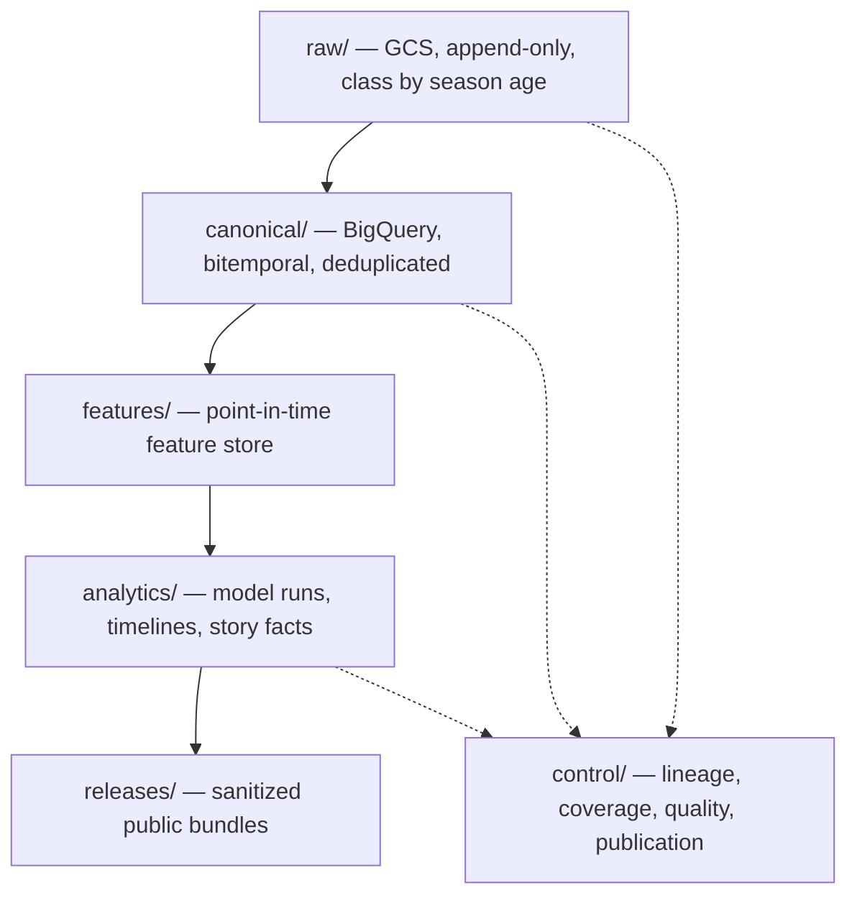

# Ape's Mac Salad — Master Plan

**Status:** Authoritative. This is the single plan of record.
**Plan date:** 2026-08-21
**Supersedes:** the build sequences in `PROJECT_CONTEXT.md`, `SEASON_FORECASTING_ROADMAP.md`, and `WEEKLY_LEAGUE_INTELLIGENCE_GCP_PIPELINE_IMPLEMENTATION_PLAN.md`
**Audience:** a data engineer (human or agent) picking this up cold
**Governing decision:** corpus-first — build the archive, then the analytics off the archive

---

## 0. How to use this document

This document dictates **what to build, in what order, and how to know each step is done.** Every constant needed to start is in §1. Every task in §6 has an acceptance condition. Nothing in §6 requires reading another document to begin.

Every other file in `docs/` is **historical reference**, retained for detail and provenance. None of them is a plan of record any more. See §9 for what each one is, what in it is still trustworthy, and what in it is stale. **Where any other document conflicts with this one, this one wins.**

Three rules for whoever executes this:

1. **Do not skip P0.** It is two to three days and it is the only irreversible deadline in the project. §2 explains why.
2. **Check §8 before starting a task marked `BLOCKED`.** Three product decisions gate specific tasks. Do not guess them.
3. **Never violate §7.** Those are invariants, not preferences.

---

## 1. Ground truth

Everything in this section was verified against the repository and live data on 2026-08-21. Treat it as the starting configuration.

### 1.1 League identity

| Key | Value |
|---|---|
| Platform | Sleeper (public, read-only, no API token) |
| Current league ID | `1312209616372772864` |
| Prior league ID | `1187879775490527232` |
| League chain | both of the above; walk `previous_league_id` for any earlier |
| Current draft ID | `1312209616385343488` |
| Season | `2026` |
| League name | Ape Invitational Dynasty |
| Commissioner account | `mannyrsox24`, user_id `1188396239775678464` |
| Owner's roster | `roster_id 11` (Terry Tate's Pain Train) |

### 1.2 League shape

```text
12 teams · 1QB · half-PPR · no TE premium
Starters: QB 1, RB 2, WR 2, TE 1, FLEX 3 (RB/WR/TE), K 1, DEF 1
Bench 14 · Taxi 2 (rookie-only) · IR 5
Rookie draft: 4 rounds, 48 picks, pick trading enabled
Passing TD: 4 points
```

**Never hard-code this shape.** Validate it from `roster_positions` and `scoring_settings` on every run and fail publication if the hash changes unexpectedly. The values above are the current expected state, not a constant.

### 1.3 Sleeper endpoints

```text
/v1/state/nfl
/v1/league/{league_id}
/v1/league/{league_id}/users
/v1/league/{league_id}/rosters
/v1/league/{league_id}/matchups/{week}
/v1/league/{league_id}/transactions/{round}      # rounds 1..18
/v1/league/{league_id}/traded_picks
/v1/league/{league_id}/winners_bracket
/v1/league/{league_id}/losers_bracket
/v1/league/{league_id}/drafts
/v1/draft/{draft_id}
/v1/draft/{draft_id}/picks
/v1/draft/{draft_id}/traded_picks
/v1/players/nfl                                   # ~15.9 MB, at most daily
```

Sleeper documents a 1,000 calls/minute ceiling. Self-impose far lower: max 5 concurrent, exponential backoff with jitter.

### 1.4 Market and expert sources

```text
FantasyCalc dynasty:
https://api.fantasycalc.com/values/current?isDynasty=true&numQbs=1&numTeams=12&ppr=0.5

FantasyCalc redraft: same, isDynasty=false
```

Expert boards currently in use, normalized to a consensus median: FantasyPros Dynasty Rookie ECR, RotoBaller, Justin Boone (Yahoo) rookie trade values, DraftSharks. FantasyPros rookie ADP is used only as an external sanity check, not in the composite. Retain derived ranks, metadata and links — never republish source article content.

### 1.5 Existing assets

| Path | What it is | Status |
|---|---|---|
| `sleeper_work/sleeper_league_analyzer.py` | Roster + draft analytics, 44 KB | Working; port incrementally, do not discard |
| `sleeper_work/expert_rankings.py` | Expert board normalization | Working |
| `sleeper_work/build_editorial_report.py` | Editorial markdown generator | Working |
| `sleeper_work/expert_rankings_2026.json` | Retained rank snapshot | **Perishable — ingest in P2** |
| `sleeper_work/editorial_draft_grades_2026.json` | Structured editorial overlay | **Perishable — ingest in P2** |
| `sleeper_work/raw/` | Cached snapshots, 2026-08-20 07:29 | **Perishable — ingest in P2** |
| `sleeper_work/.cache/` | Player map + FantasyCalc, 2026-08-20 13:30 | **Perishable — ingest in P2** |
| `sleeper_work/output_latest/` | Last normalized output | **Perishable — ingest in P2** |
| `ape-invitational-almanac/src/Prototype.tsx` | Product UI, 80 KB | Contains hard-coded Draft Recap data — see §1.7 |
| `ape-invitational-almanac/src/generated/league-insights.json` | Power Rankings feed, 173 KB | Generated; build script fetches network — see §1.7 |
| `ape-invitational-almanac/src/generated/mac-salad-awards.json` | Award records | Record id `2026-draft`, Final Boss, "A−" |
| `ape-invitational-almanac/scripts/build-league-insights.mjs` | Data bridge | **Line 51 fetches Sleeper at build time** |

Frontend commands that must keep passing: `npm run check:runtime`, `npm run build`, `npm run test:sites`.

### 1.6 Hosting

Static Vite SPA, published from `dist/client`, `netlify.toml` has the SPA catch-all. Intended site `https://apesmacsalad.netlify.app`, intended repo `alexanderjohnson2011-cpu/-fantasy-sports-projects`.

**The working directory is not currently a git repository and has no configured remote.** Confirm repository and deploy wiring before assuming a commit reaches Netlify. This is a P0 verification item.

### 1.7 Known-bad state to be fixed

These are real defects present today, not hypotheticals. Each is assigned to a task.

| Defect | Evidence | Fixed by |
|---|---|---|
| Retained raw draft is 44 picks | `sleeper_work/raw/picks.json` | P0-9 |
| Normalized output says 45/48, `paused` | `output_latest/snapshot_metadata.json` | P0-9 |
| No transaction feed retained anywhere | absent from `sleeper_work/raw/` | P0-9 |
| Site shows a finished draft as provisional | `Prototype.tsx:929` | P5-1 |
| Draft facts hard-coded in TypeScript | `Prototype.tsx:161` (`const teams`), `:509` (superlatives) | P5-1 |
| Grade math executes in React | `Prototype.tsx:562–581` | P5-1 |
| Build fetches Sleeper over the network | `scripts/build-league-insights.mjs:51` | P5-5 |
| Two conflicting execution formulas | Python 55/45 vs UI 50/50 | P5-1 |
| Award gate may fail on first run | see §8, decision 2 | P5-1 |

### 1.8 Scoring models currently in use

Carry these forward; they are the calibration baseline, not gospel.

```text
Draft-cycle grade  = 0.60 execution + 0.30 capital + 0.10 fit
Pick execution     = 0.55 expert consensus + 0.45 FantasyCalc market
Roster power       = 0.45 dynasty core + 0.35 current-year lineup + 0.20 depth
```

Value capture compares each pick against the value normally available **at that exact slot**, not against ordinal rank. Detailed curve anchors, grade thresholds and fit multipliers live in `DRAFT_RECAP_DATA_PIPELINE_IMPLEMENTATION_PLAN.md` §11 — that section remains the specification for P5-1.

---

## 2. Governing principle

> The test is not what a thing costs to store — it is what it would cost to get back. Capture what cannot be re-acquired, derive and discard what can, and start capturing before the platform is finished.

The corpus is the product; the website is its first consumer. This is deliberately **not** a keep-everything policy — retaining data nothing reads costs a parser to maintain, schema drift to absorb, and another cell in the coverage catalog to explain.

### 2.1 The triage that sets the order

**Perishable — no API returns what these were last Tuesday.** FantasyCalc values; expert ranks, tiers and disagreement; projections as they stood before lock; injury designations and practice participation; depth charts; odds and line movement; roster state before a trade; player status flags in the Sleeper map.

**Backfillable — identical whether loaded in week one or week thirty.** nflverse play-by-play and weekly stats; NFL schedules and final box scores; the Sleeper league chain; completed matchup results; transaction history; draft boards.

**This is why P0 exists and why it ships before Terraform, before BigQuery, and before any licensing decision.** Every day of platform-building first is a day of market values and injury states permanently lost.

### 2.2 Accepted trade-off

P0–P4 change nothing on the live site. P5 is the first visible output, placed early enough that the stale Draft Recap gets fixed while the corpus keeps deepening behind it. If capacity is limited, P0–P2 run largely unattended and P5 can overlap them.

---

## 3. Retention model

Retention has two dimensions. **Class** says what a source is worth keeping. **Age** says how hot it needs to be.

### 3.1 Classes

| Tier | Policy | Contents | Size |
|---|---|---|---:|
| **A** | Irreplaceable — keep permanently | Weekly league state; perishable market and expert signals; every analysis, grade, forecast and commentary the site publishes | ~900 MB/season |
| **B** | Derive, keep the derivative, drop the source | Play-by-play reduced to per-player-per-week stat lines and the reconciled timeline; raw play rows held briefly, then dropped | ~5 MB/season |
| **C** | Re-acquirable — do not retain | nflverse historical releases, final box scores, completed schedules. Fetched on demand | 0 |

**Play-by-play is B, not A**, because nflverse republishes every season free and indefinitely. But the derivative must survive: forecast variance and QB-to-receiver correlation cannot be fit from one week. A *paid* live feed makes this sharper — a lapsed subscription is not re-fetchable.

**The full player map is A** even though most of it is never rostered. Not caution — filtering costs more than it saves, because per-entity hashing means a week writes a few hundred real status changes, not eleven thousand unchanged rows. Filtering to rostered-only breaks the first time someone is added off waivers in week 8.

### 3.2 Age — the season-close demotion

| Stage | Class | Rationale | Rate |
|---|---|---|---:|
| In season | Standard | Written daily, read by every compute run | $0.020/GB |
| Season close | Coldline | Not Archive — the offseason is when backtests read last season hardest, and Coldline retrieves at a fifth the price with no year minimum | $0.004/GB |
| Plus one year | Archive | Deep cold, still complete. Read only for a parser rewrite or restatement | $0.001/GB |

**Demote, do not delete.** Archiving and deleting are indistinguishable in cost, so deletion buys nothing and forecloses recovery. Sole exception: a licensed source whose terms require removal.

**Published outputs never demote.** They have no canonical derivative — the raw *is* the artifact.

### 3.3 Cost model

| Layer | Per season | After 10 seasons | Monthly |
|---|---:|---:|---:|
| Tier A raw, current season, Standard | ~900 MB | ~900 MB | $0.018 |
| Tier A raw, closed seasons, Coldline → Archive | ~900 MB | ~8 GB | $0.012 |
| Tier A published outputs, Standard, permanent | ~5 MB | ~50 MB | $0.00 |
| Tier B derivatives, permanent | ~5 MB | ~50 MB | $0.00 |
| BigQuery canonical, deduplicated, always hot | ~50 MB | ~500 MB | $0.00 (free tier) |
| Cloud Run, scale-to-zero | ~200 min/mo | — | <$1.00 |
| **Total** | | **~10 GB** | **~$1** |

Measured against real files: the Sleeper player map is 15.9 MB compressing to 2.36 MB; FantasyCalc is 403 KB compressing to 45 KB. The player map alone is 861 MB a season and dominates everything else — which is what the season-close demotion is for.

**The binding constraints were never storage.** They are query scanning without partition filters, provider licensing, and the maintenance surface of any source with a parser but no reader. Verify rates against current GCP pricing before setting a budget.

---

## 4. Architectural commitments

Four rules that turn a pile of snapshots into a corpus. These are not negotiable at task level.

### 4.1 Capture first, parse later

The capture job writes exact response bytes plus a metadata sidecar, and stops. No validation, no field mapping, no requirement that a parser exists. When a parser is wrong or a provider changes shape, you re-parse from raw rather than losing the interval.

*A parsing failure alerts and quarantines a record. It never fails the capture.*

### 4.2 Every fact is bitemporal

Two independent time axes on every canonical row. A single timestamp cannot express "on Sunday at 09:57 we believed he was questionable; on Monday we learned he was ruled out at 09:40." With both, the corpus answers *what was knowable at time T* — the basis for leakage-free backtesting, ex-ante lineup grading, and honest "why the odds moved."

```sql
-- required on every canonical table
observed_at_utc     TIMESTAMP   -- when the pipeline captured it
source_snapshot_id  STRING      -- the exact GCS object behind this row
valid_from_utc      TIMESTAMP   -- provider-stated, else observed_at
valid_to_utc        TIMESTAMP   -- NULL while still believed true
content_hash        STRING      -- per-entity, drives change detection
parser_version      STRING
ingest_run_id       STRING

-- the one read pattern, exposed as a table function, never hand-rolled
SELECT * FROM canonical.player_injury_status
WHERE player_id = @player
  AND observed_at_utc <= @as_of
QUALIFY ROW_NUMBER() OVER (
    PARTITION BY player_id ORDER BY observed_at_utc DESC) = 1
```

### 4.3 Full fidelity in storage, deduplicated facts in the warehouse

Loading the 15.9 MB player map daily would write ~4 million near-identical rows a year. Instead: GCS keeps every byte; the canonical loader hashes **per entity** and inserts only genuine changes. Twelve status changes write twelve rows. Per-entity rather than per-file hashing is the whole trick.

### 4.4 Everything below raw is disposable and rebuildable

Canonical, features, analytics and presentation are pure functions of `(raw, code version, config version)`. A bad parser or wrong weight is recoverable by dropping the derived layer and rebuilding. This must be *proven*, not assumed — it is the gate on season-close demotion (P9-4).

*Corollary: never edit a fact in place to fix a story. Restate with a new version and keep both.*

---

## 5. Layers and source register

### 5.1 Layers



| Layer | Contents | Durability |
|---|---|---|
| `raw/` | Exact response bytes, gzipped, content-addressed, with sidecar metadata. Never rewritten; deleted only per retention class, and only after its derivative is written | GCS, class by season age |
| `canonical/` | Parsed entities, both time axes, per-entity change detection, player crosswalk. Partitioned `DATE(observed_at_utc)`, clustered on league/season/week/entity | BigQuery, rebuildable |
| `features/` | Features carrying the observation time of their inputs, reconstructable as of any past moment | BigQuery, rebuildable |
| `analytics/` | Model runs, timelines, simulations, story facts. Immutable per run with seed and model version; a new forecast never overwrites an old one | BigQuery, append-only |
| `releases/` | Versioned JSON with manifest and checksums, candidate → production, consumed by the Netlify build. Only what the site renders | GCS, immutable |
| `control/` | Run records, snapshot register, quality results, model registry, publication log, season-close records, coverage catalog | BigQuery, operational |

The **coverage catalog** is the part most often skipped and must not be. One table keyed on source × season × week × date, each cell marked present / missing / degraded / not-applicable, populated by the capture job itself. It makes gaps visible the week they happen, when they can sometimes still be recovered.

### 5.2 Raw path convention — permanent, do not change after P0

```text
raw/source=<source>/season=<YYYY>/week=<WW>/date=<YYYY-MM-DD>/
  run=<run_id>/as_of=<utc_iso>/<entity>.json.gz
  run=<run_id>/as_of=<utc_iso>/<entity>.json.gz.meta.json
```

Sidecar contains: logical source, exact endpoint, retrieval UTC, HTTP status, content SHA-256, uncompressed bytes, record count, parser version, run id, idempotency key, and rate-limit headers where present.

### 5.3 Source register

Adding a source must be a config row plus a client class — never an architectural change.

| Source | Gives the corpus | Nature | Keep | Cadence | Access |
|---|---|---|:---:|---|:---:|
| `sleeper/league` | Settings, scoring hash, roster positions, playoff rules | Backfillable | A | Weekly + on change | Free |
| `sleeper/rosters` | Membership, starters, taxi, IR — state before every transaction | Perishable | A | Daily + kickoff-relative | Free |
| `sleeper/matchups` | Pairings, per-player points, official totals | Backfillable | A | In-window + final | Free |
| `sleeper/transactions` | Trades, waivers, FAAB, commissioner actions | Backfillable | A | Weekly, all rounds | Free |
| `sleeper/players` | Identity, team, position, *status flags that overwrite* | Perishable | A | Daily | Free |
| `sleeper/drafts` | Boards, picks, traded picks, provenance | Backfillable | A | Weekly, live in window | Free |
| `fantasycalc/values` | Dynasty and redraft values, ranks, 30-day trend | Perishable | A | Twice daily | Free |
| `expert/ranks` | Consensus rank, tier, spread — the four boards | Perishable | A | Weekly in season | Free |
| `site/outputs` | Published grades, forecasts, commentary, awards — **never demotes** | Perishable | A hot | Every release | Own |
| `nflverse/stats` | Weekly player and team stat lines — the calibration derivative | Backfillable | B | Weekly after release | Free |
| `nflverse/pbp` | Play rows for the recap week, then expired | Backfillable | B | Weekly after release | Free |
| `nflverse/history` | Prior-season archives, pulled when a backtest needs them | Backfillable | C | On demand | Free |
| `fantasypros/*` | Projections, ECR, injuries, news | Perishable | A | Tue/Thu/pre-kickoff | Gated |
| `sportsdataio/*` | Inactives, weather, depth, live PBP, projections | Perishable | A / B | Kickoff-relative | Gated |
| `oddsapi/nfl` | Spreads, totals, moneylines, line movement | Perishable | A | Kickoff-relative | Gated |

Gated sources are optional for a long time. The post-game reconstruction approach means nflverse's free cadence already covers the recap path; paid feeds buy pre-kickoff inactives, weather and latency, which serve ex-ante analysis — not a phase-one product.

---

## 6. Work breakdown

Every task has an acceptance condition. A phase is complete when all its tasks pass and its gate holds.

---

### P0 — Start the clock · 2–3 days

**The only deadline in this plan.** Ships before Terraform, before BigQuery, before licensing. Hand-written is acceptable; the path convention is permanent so nothing is thrown away.

| # | Task | Acceptance |
|---|---|---|
| **P0-1** | Create GCP project. Enable: Storage, Cloud Run, Cloud Scheduler, Artifact Registry, Secret Manager, BigQuery, Workflows, Logging, Monitoring | `gcloud services list --enabled` shows all nine |
| **P0-2** | Create `gs://<project>-raw-prod`, single region, uniform bucket-level access, public access prevention enforced, soft delete 30 days, no object versioning | Bucket exists with those settings; a write from another identity is denied |
| **P0-3** | Service account `ams-capture` with `roles/storage.objectCreator` scoped to that bucket only. No other grants | Cannot read BigQuery, cannot access secrets |
| **P0-4** | Capture script covering: all `/v1/league/...` and `/v1/draft/...` endpoints in §1.3, `/v1/players/nfl`, FantasyCalc dynasty and redraft | One invocation writes every entity plus sidecars |
| **P0-5** | Implement the §5.2 path convention and sidecar schema exactly | Object paths and sidecar fields match §5.2 |
| **P0-6** | Containerize, push to Artifact Registry, deploy as a Cloud Run Job | Manual execution succeeds and exits 0 |
| **P0-7** | Cloud Scheduler entry, daily 06:00 America/Los_Angeles | Scheduler shows a successful run |
| **P0-8** | Verify three consecutive unattended days land | Three dated prefixes present, all sidecars valid |
| **P0-9** | **Priority — capture the missing fixtures.** The completed 48-pick draft board, `/v1/draft/{draft_id}/traded_picks`, and rounds 1–18 of `transactions` for **both** league IDs. Commit as a test fixture | Draft shows `complete` with 48 unique picks numbered 1–48; transaction set reconciles to the 21 completed 2026-capital trades documented in the retained analysis, or the difference is written up |
| **P0-10** | Verify git remote and Netlify wiring (§1.6) | Documented: repo, branch, site, and whether a local commit reaches the live site |

> **Gate P0:** dated objects land daily without intervention, and the 48-pick fixture exists on disk. Perishable accumulation has begun.

> **Note on P0-9:** every fixture-dependent exit criterion in the Draft Recap sub-plan is unverifiable until this task completes. Do not begin P5-1 without it. In particular, do not assume a no-pick roster — the retained analysis established that only "through 4.08," and pick 45 (4.09) is unaccounted for. Derive it from the captured board.

---

### P1 — Capture harness and control plane · 1–1.5 wk

| # | Task | Acceptance |
|---|---|---|
| **P1-1** | Terraform the entire P0 footprint retroactively, plus Artifact Registry and Secret Manager | `terraform plan` is clean against the live project |
| **P1-2** | Source registry as config: per source — name, endpoints, cadence tier, auth mode, parser version, **retention class**, backfillable flag, retention rights | Registry file drives capture; no endpoint literals in code |
| **P1-3** | Single HTTP client: timeouts, retry only on timeout/connection/429/5xx, capped exponential backoff with jitter, identifying User-Agent, quota-header capture, structured logging without response bodies, and an **offline replay mode that performs no network calls** | Replay mode reproduces a prior run's sidecar hashes |
| **P1-4** | `control` dataset: `capture_run`, `raw_object`, `coverage`, `quality_result`, `season_close` | Every P0 run backfilled into `capture_run` and `raw_object` |
| **P1-5** | Coverage catalog written by the capture job — source × season × week × date, marked present/missing/degraded/n-a | One query answers "what do we have for week N" |
| **P1-6** | Cadence tiers and scheduler entries: continuous in-window, daily, weekly, seasonal, event-driven | Each tier fires independently and is separately disableable |
| **P1-7** | Idempotency key `<league>:<season>:<week>:<job>:<mode>:<as_of_bucket>`; first claim wins; retries resume or exit 0 | A duplicate invocation produces no duplicate objects |
| **P1-8** | Ingest the free nflverse schedule; generate kickoff-relative task rows at T−24h, T−3h, T−100m, T−30m, T−10m, T+5m, final+15m | Task rows exist for a full slate and survive a reschedule |

> **Gate P1:** adding a source is a config row plus a client class. The coverage table can state what the corpus holds.

---

### P2 — Historical backfill · 1–1.5 wk

| # | Task | Acceptance |
|---|---|---|
| **P2-1** | Walk `previous_league_id` recursively from the current league; capture every league object in the chain | Chain terminates; every league in it has a raw snapshot |
| **P2-2** | For each prior season: all weeks of matchups, rosters, transactions (rounds 1–18), traded picks | No week gaps in the coverage catalog for any prior season |
| **P2-3** | Winners and losers brackets for every prior season | Final standings derivable for each completed season |
| **P2-4** | **Ingest the handoff's retained artifacts as dated historical snapshots** — `sleeper_work/raw/`, `.cache/`, `output_latest/`, `expert_rankings_2026.json`, `editorial_draft_grades_2026.json`. These are perishable August 2026 captures existing nowhere else | Each lands under its true `as_of` date, not today's, with provenance noting it was a local file |
| **P2-5** | Multi-season nflverse **weekly stat lines** (Tier B derivative) | Stat lines present for every available season |
| **P2-6** | Do **not** mirror nflverse prior-season play rows — Tier C, on demand at P8 | Confirmed absent by design, recorded in the registry |

> **Gate P2:** every league-owned fact back to the first linked season is queryable, while perishable capture keeps running underneath.

---

### P3 — Bitemporal canonical layer · 2–2.5 wk

| # | Task | Acceptance |
|---|---|---|
| **P3-1** | `canonical` dataset and DDL. Every table carries the §4.2 block. Partition `DATE(observed_at_utc)`, cluster league/season/week/entity, `require_partition_filter` on large tables | DDL applied; a query without a partition filter is rejected |
| **P3-2** | Parsers per source, raw → canonical, versioned | Every raw object either parses or is quarantined with a reason |
| **P3-3** | Per-entity content hashing and change detection (§4.3) | A day with no real change inserts zero rows |
| **P3-4** | Player identity crosswalk anchored on Sleeper ID → nflverse/GSIS, FantasyCalc, and later providers. Join precedence: provider external ID → approved crosswalk → exact normalized name + compatible position → quarantine | No ambiguous name match reaches canonical |
| **P3-5** | Versioned Sleeper scoring adapter driven by the exact `scoring_settings` object, covering yards, TDs, receptions at half-PPR, turnovers, two-point conversions, FG bands, XP, D/ST categories and points-allowed thresholds. Store raw settings, hash, parsed rules, adapter version, and any unhandled keys | Publication fails if a nonzero scoring key is unhandled |
| **P3-6** | `AS OF` table functions so point-in-time logic is never hand-written | Every downstream read goes through them |
| **P3-7** | Rebuild drill harness: drop canonical, rebuild from raw, assert row-for-row equality | Drill passes and is runnable on demand |

> **Gate P3:** the rebuild drill passes — canonical dropped entirely and reconstructed from raw, matching row for row.

---

### P4 — Point-in-time feature store · 1–1.5 wk

| # | Task | Acceptance |
|---|---|---|
| **P4-1** | `features` dataset keyed on entity, week, observation time; each feature records the observation time of its inputs | Any feature row reproducible as of any past moment |
| **P4-2** | CI check failing any feature query lacking a time bound | A deliberately unbounded query fails the build |

> **Gate P4:** leakage is caught by the build, not by a suspiciously good backtest.

---

### P5 — First product off the corpus · 1.5–2 wk

The visible payoff. Closes every §1.7 defect.

| # | Task | Acceptance |
|---|---|---|
| **P5-1** | Draft Recap generated from canonical, implementing `DRAFT_RECAP_DATA_PIPELINE_IMPLEMENTATION_PLAN.md` §7–§15 — one scoring engine in Python, `null`/`INC` rather than zero for the no-pick roster, evidence IDs on every narrative claim, official grade frozen at a validated completed-draft snapshot. **Depends on P0-9. See §8 decision 2 before running the award gate** | `rg` finds no team-specific scores, pick lists, capital ratios or provisional copy in `Prototype.tsx`; payload passes JSON Schema; 12 teams; pick counts sum to 48 |
| **P5-2** | Weekly descriptive recap from Sleeper alone: score, opponent, margin, record, league median, all-play, points for/against, potential points, optimal-lineup miss, bench points, schedule luck | A completed week renders end to end with no licensed source |
| **P5-3** | Release builder: manifest with `schemaVersion`, `releaseId`, per-file SHA-256 and byte counts; candidate prefix validated before promotion to production | No production object written until every checksum validates |
| **P5-4** | Netlify build hook + `scripts/fetch-published-data.mjs` validating host allowlist, schema, checksums and release status; cache headers (`must-revalidate` for `current.json`, `immutable` for weekly files); post-deploy verification with rollback | A data-only release updates the live site; a bad checksum leaves the prior deploy standing |
| **P5-5** | **Remove the build-time Sleeper fetch.** Pin `league-insights.json` as a committed artifact and move regeneration behind the offline-replay CLI. Power Rankings *methodology* stays untouched — see §8 decision 3 | `npm run build` succeeds with networking disabled |

> **Gate P5:** the live site is fed by the corpus. The stale 45-of-48 Draft Recap is gone.

---

### P6 — Gated source expansion · 1 wk · `BLOCKED` on §8 decision 1

| # | Task | Acceptance |
|---|---|---|
| **P6-1** | Record per provider before any credential is activated: commercial-use allowance, request/row limits, retention rights, redistribution rights for derived data, attribution requirements, historical availability and cost | Registry carries all seven fields per source |
| **P6-2** | Clients for the approved providers; store keys in Secret Manager, never mapped to `VITE_*` | Keys absent from repo, logs, JSON and browser bundle |
| **P6-3** | Retention-rights enforcement: TTL on raw where terms require it, derived facts persisting | A TTL-bound source expires on schedule; its derivative survives |

> **Gate P6:** every new source has recorded terms before its first capture.

---

### P7 — Reconstruction and analytics · 2–3 wk

Implements `WEEKLY_LEAGUE_INTELLIGENCE_GCP_PIPELINE_IMPLEMENTATION_PLAN.md` §9–§11, reading from the corpus rather than a live fetch.

| # | Task | Acceptance |
|---|---|---|
| **P7-1** | Scoring reconciliation: recompute per-player points from provider stats, compare with Sleeper, attribute differences to rounding, D/ST state, missing events or corrections | Completed weeks reconcile; Sleeper remains the published score |
| **P7-2** | Legal lineup model derived from `roster_positions`, not hard-coded | Three-FLEX golden tests pass; a settings change needs no code change |
| **P7-3** | Actual and hindsight-optimal lineups, kept distinct | Bench points and lineup efficiency computed and clearly labelled hindsight |
| **P7-4** | PBP → fantasy event mapping, D/ST points-allowed state engine, matchup timeline with lead changes and decisive events | Monday one-point golden fixture identifies the correct play, time and margin |
| **P7-5** | Correction audit comparing Sleeper and provider revisions; corrections create a new release with a visible note | An archived story is never silently rewritten |
| **P7-6** | Ex-ante optimal lineup and the sequential lock-aware optimizer | *Deferred unless P6 completed — requires pre-kickoff inactives* |

> **Gate P7:** completed weeks reconcile to Sleeper. No drama claim survives without a reconciled event behind it.

---

### P8 — Forecast and calibration · 2–3 wk

Implements `WEEKLY_LEAGUE_INTELLIGENCE_GCP_PIPELINE_IMPLEMENTATION_PLAN.md` §12–§13 and `SEASON_FORECASTING_ROADMAP.md` phases 2–3.

| # | Task | Acceptance |
|---|---|---|
| **P8-1** | Pull Tier C nflverse history on demand for variance and correlation fitting | Retrieved, used, not permanently mirrored |
| **P8-2** | Player-week distributions: means from stat-line projections converted through Sleeper scoring; variance by position/role with shrinkage; availability model | Means and variances finite and within configured bounds |
| **P8-3** | Correlation: game-level latent environment plus player residuals; positive-semidefinite validation before sampling | Covariance validation blocks an invalid matrix |
| **P8-4** | Monte Carlo over the actual remaining Sleeper schedule with real tiebreakers; 10,000 runs, deterministic seed from `forecast_run_id`, auto-increase on convergence failure | Standings, seeds, byes, titles produced with recorded seed and count |
| **P8-5** | Rolling-origin backtests through the P4 feature store; MAE/RMSE, Brier, log loss, calibration curves, CRPS | Calibration published alongside probabilities, not instead of them |
| **P8-6** | Label all pre-provider outputs **market-implied lineup strength**, never "projected fantasy points" | No output implies a projection the sources do not support |

> **Gate P8:** probabilities calibrate acceptably against baseline; tiebreakers and brackets pass golden tests.

---

### P9 — Narrative, approval and hardening · 2–2.5 wk

| # | Task | Acceptance |
|---|---|---|
| **P9-1** | Story facts before prose; deterministic templates; optional LLM polish that cannot create numbers, names, times or causal claims absent from facts; claim/evidence validator blocking publication | Every published numeric claim resolves to an evidence record |
| **P9-2** | Mac Salad candidate generation with reason codes and evidence. **Never writes a Hall of Mac record automatically** | Award publication requires explicit approval |
| **P9-3** | One-click approval — `workflow_dispatch` or PR merge, not a Tuesday-morning CLI invocation | Approval recorded with actor and timestamp |
| **P9-4** | **Season-close job**, blocking end to end (see below) | Full rehearsal passes before the first real demotion |
| **P9-5** | Alerting, dashboards, runbooks, offseason posture parking schedules February–August | Stale-release and failed-run alerts fire in test |

```text
season-close job — runs when season N+1 opens, not at the final whistle

1. rebuild drill passes for season N     -- canonical dropped and reconstructed
                                            from raw, row for row
2. coverage catalog clean for season N   -- no unexplained gaps
3. all weeks reconcile to Sleeper        -- or exceptions logged
4. season outputs archived               -- releases/ holds every published bundle
5. write season_close record to control
6. transition raw/season=N/** -> Coldline
7. hard-delete only where retention_ttl requires it
8. mark season N closed in the coverage catalog
```

The lag is deliberate: stat corrections trickle for weeks, and the offseason is exactly when a parser bug surfaces — which is when raw needs to be one class away rather than gone. This also gives the rebuild drill a real annual trigger with consequences, which is the strongest argument for the scheme: it forces you to prove, once a year, that the derivative was sufficient.

> **Gate P9:** two shadow weeks complete before anything publishes automatically, and one full season-close rehearsal passes before the first real demotion.

---

## 7. Invariants

Never violated, at any phase, for any reason.

- **Raw is append-only; storage class follows the season, never convenience.** Tier A demotes Coldline → Archive and is never removed. Tier B raw expires on a window starting only once its derivative is written *and reconciled*. Published outputs never demote.
- **No demotion without a passing rebuild drill.** If canonical cannot be reconstructed from season N's raw, season N's raw stays hot until it can.
- **No `UPDATE` in canonical.** Corrections are new rows with a later `observed_at` and a closed `valid_to` on the superseded row.
- **Every query is partition-bounded.** `require_partition_filter` on large tables plus a `maximum_bytes_billed` ceiling. This, not storage, is where a corpus gets expensive.
- **Capture failures degrade, never block.** A down source marks its coverage cell degraded and the run continues.
- **A source with a parser but no reader is a liability.** Tier C stays out of the pipeline until something needs it.
- **Retention rights are recorded before first capture.**
- **Nothing licensed reaches the browser.** Public bundles carry derived, sanitized fields only. Raw and model buckets stay private.
- **Sleeper is the final authority** on league scoring, settings, actual starters, transactions and results. Provider recomputation is audit, never truth.
- **No LLM calculates a grade or invents a fact.** Numbers come from the scoring engine; prose cites evidence IDs.
- **Never hard-code the roster shape.** Validate from `roster_positions` every run.
- **The frontend calculates nothing.** React formats values received from the payload.
- **A failed run cannot replace the last known good artifact.**
- **No write operations to Sleeper, ever.** No waivers, lineups, or trades.

---

## 8. Decisions that block work

Three product decisions. Each names the tasks it gates. **Do not guess.**

### Decision 1 — Is there a gated-source budget, and what is the ceiling?
**Blocks:** P6 entirely; P7-6 (ex-ante lineups); the pre-kickoff half of P8-2.
**Why it can wait:** free sources cover P0–P5 completely. The post-game reconstruction approach means nflverse satisfies the recap path at no cost.
**What "no budget" means:** a fully functional corpus, Draft Recap, weekly recap and forecast. What is lost is pre-kickoff inactives and weather, and therefore defensible ex-ante lineup grading.

### Decision 2 — Can the 2026 draft award change if the model moves it?
**Blocks:** P5-1 finalization and the Hall of Mac gate.
**The problem:** `mac-salad-awards.json` records Final Boss at A−, but the retained analysis had three teams at A− separated only by hand-entered numbers. P5-1 replaces the UI's 50/50 pick ratio with a 55/45 weighted curve and replaces hand-entered fit with a formula. Fit carries a 10% weight but a 0–100 range, so it alone can move a cycle score by ten points — wider than the seven-point B+ → A− band.
**Required before P5-1 finalizes:** run the proposed formulas against the captured snapshot and check whether roster 6 still wins. Then decide — does the record follow the model, or does the model get calibrated until it reproduces the record? Also align the record id: the shipped file uses `2026-draft`; the presentation contract example uses `draft-2026`.

### Decision 3 — Is Power Rankings owned or frozen for 2026?
**Blocks:** nothing hard; shapes P5-5 scope.
**The problem:** it is the one product surface with no migration plan. After P5 it becomes the only hand-maintained analytical screen. Either is fine — the absence of a written answer is what leaves it rotting.

---

## 9. Document register

**This file is the only plan of record.** Everything below is retained for reference and detail. Where any of it conflicts with this document, this document wins.

| Document | What it is | Still trustworthy | Stale |
|---|---|---|---|
| `WEEKLY_LEAGUE_INTELLIGENCE_GCP_PIPELINE_IMPLEMENTATION_PLAN.md` | Target-state architecture, 2,045 lines. **The detailed specification for P7–P9** | §7 storage layout, §9 scoring normalization, §10 lineup lenses, §11 timeline engine, §12–13 forecast, §16 Netlify contract, §18 quality gates, §19 test plan | Its §25 phase order (superseded by §6 here); its §26 effort estimate excludes frontend work; its §21.3 SLOs assume an on-call that does not exist; its §9.3 "exact to 0.01" gate should be a band with a documented exception list |
| `DRAFT_RECAP_DATA_PIPELINE_IMPLEMENTATION_PLAN.md` | Draft Recap sub-plan, 1,692 lines. **The detailed specification for P5-1** | §7–§15 in full — ingestion, canonical model, trade ledger, scoring curves, evidence and narrative, presentation contract, frontend cutover | §18.4 asserts "roster 12 has no picks," derived from a 44-pick report and never verified — derive it from the P0-9 capture instead. §4.3/§10.4 call the capital basis a "completion snapshot" the retained data cannot reproduce; relabel it honestly. §2.1's no-network-build outcome is only met once P5-5 lands |
| `SEASON_FORECASTING_ROADMAP.md` | Forecasting design, 107 lines | Its model design, weighting schedule, volatility features and evaluation metrics — all still the spec for P8 | Its architecture advice (GitHub Actions before GCP) is superseded by the corpus-first decision |
| `DATA_PROVENANCE.md` | Source ledger and provenance, 72 lines | The source ledger, the Fantrax correction, the "no per-pick timestamps" limitation, and the snapshot contract — direct ancestor of §5 here | Its weekly snapshot layout is superseded by §5.2 |
| `PROJECT_CONTEXT.md` | Product decisions, 50 lines | **Its durable product decisions remain binding** — the four destinations, 12px/14px type floors, league settings, 60/30/10 grading, the Mac Salad award rules, the trophy description, and "never a phone mockup" | Its "next recommended build sequence" is superseded by §6. A now-removed root-level copy carried an older five-step sequence (snapshot contract → weekly recap → simulation → Tuesday automation → Hall of Mac); recorded here for provenance |
| `MIGRATION_MANIFEST.md` | Port manifest, 46 lines | The essential-paths table and the restore/run sequence | Assumes the pre-GCP local workflow |
| `source-analysis/2026-08-20_editorial-draft-grades.md` | Editorial report card, 44/48 picks | Editorial voice reference; the superlative selectors | Grades are provisional at 44 picks |
| `source-analysis/2026-08-20_trade-aware-draft-cycle-analysis.md` | Trade-aware analysis, 44/48 picks | **The 21-transaction ledger and the trade trees — the reconciliation target for P0-9** | Grades are provisional at 44 picks |
| `source-analysis/2026-08-20_league-analysis-and-draft-grades.md` | League analysis, 45/48 picks | Power table and methodology notes | Newest of the three, still pre-completion |
| `source-analysis/sleeper-pipeline-readme.md` | Analyzer README | Matches the shipped code; accurate grading model description | Describes the local workflow |
| `source-analysis/design-qa.md` | Design QA sign-off | Palette and type tokens are accurate product identity | **Historical.** QA'd against an iPhone runtime at 393×852, contradicting "never a phone mockup"; cites `/workspace/scratch/…` paths absent from the handoff |
| `source-analysis/mobile-runtime-components.md` | Mobile runtime component API | — | **Historical.** Documents a runtime the product decisions moved away from |
| `CORPUS_FIRST_MASTER_PLAN.md` | First draft of this plan | — | **Superseded by this file.** Safe to delete |

---

## 10. Definition of done

- [ ] Perishable capture has run unattended since P0 with no unexplained coverage gaps
- [ ] The completed 48-pick draft and both leagues' transaction feeds exist as committed fixtures
- [ ] Infrastructure is reproducible through Terraform
- [ ] Raw is immutable, content-addressed and traceable to endpoint, time and checksum
- [ ] Canonical is bitemporal, deduplicated per entity, and rebuildable from raw — proven by a passing drill
- [ ] Live Sleeper settings drive legal 1QB/2RB/2WR/1TE/3FLEX/K/DEF lineups
- [ ] Completed fantasy scores reconcile to Sleeper
- [ ] The feature store answers point-in-time queries and CI blocks unbounded ones
- [ ] Draft Recap renders entirely from generated payload; no scoring logic remains in React
- [ ] `npm run build` succeeds with networking disabled
- [ ] Weekly recap renders a completed week from Sleeper alone
- [ ] Forecast outputs carry model version, seed, simulation count, deltas and calibration
- [ ] Every published numeric claim resolves to an evidence record
- [ ] Hall of Mac cannot publish without explicit approval
- [ ] Public JSON is versioned, schema-validated, checksummed and sanitized
- [ ] A failed job or build leaves the last known good release untouched
- [ ] The season-close job has passed one full rehearsal
- [ ] Backtests, golden fixtures, shadow weeks, alerts, correction flow and rollback are complete
