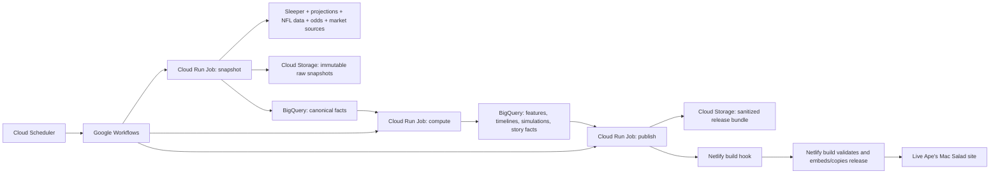

# Ape's Mac Salad Weekly League Intelligence Pipeline

> **Reference document — not the plan of record.** [MASTER_PLAN.md](MASTER_PLAN.md) governs. This remains the detailed specification for phases P7-P9; its own phase order and effort estimates are superseded. See MASTER_PLAN.md §9.

**Implementation plan for the live site:** [apesmacsalad.netlify.app](https://apesmacsalad.netlify.app/)  
**Plan date:** 2026-08-21  
**System boundary:** GCP data/analytics pipeline → versioned public data bundle → existing Netlify React site  
**League platform:** Sleeper  
**League shape:** 12 teams, 1 QB, 2 RB, 2 WR, 1 TE, 3 FLEX, kicker, defense, half-PPR, no TE premium  
**Primary product outputs:** weekly recaps, matchup timelines, manager decision analysis, forecasts, playoff/title simulations, and Hall of Mac award candidates

---

## 1. Executive summary

The existing React/Vite site remains the public product on Netlify. The new system is a batch-oriented data platform that feeds the site; it is not a replacement website and it does not introduce a public application backend.

The recommended production architecture is:



The system must preserve four distinct truths:

1. **League truth:** Sleeper is authoritative for league scoring, settings, actual starters, rosters, transactions, fantasy matchups, and final league outcomes.
2. **NFL event truth:** a licensed NFL data provider supplies game times, inactives, box scores, and play-by-play needed to reconstruct drama.
3. **Forecast inputs:** expert projection sources and betting markets supply priors and uncertainty; they do not override actual Sleeper results.
4. **Historical/audit truth:** immutable source snapshots, canonical facts, model versions, seeds, and publication manifests make every recap and forecast reproducible.

The first production source bundle should be:

- Sleeper — league truth.
- FantasyPros API — primary weekly/ROS projection consensus, ECR, tiers, injuries, and news.
- SportsDataIO NFL — NFL schedule, game status, inactives, weather, depth charts, player/game statistics, projections, and play-by-play.
- The Odds API — spreads, totals, moneylines, and historical closing context.
- FantasyCalc — dynasty and redraft market context only, not weekly score projections.
- nflverse — historical play-by-play/player-stat backtesting and an after-the-fact audit source, not the live recap feed.

The system will assume **ideal ex-ante roster management** in the published forecast: the best legal lineup that could have been selected using information known before player lock. It will never optimize after seeing simulated outcomes, because that would be hindsight masquerading as management skill.

---

## 2. Goals, non-goals, and success criteria

### 2.1 Goals

- Feed the existing Netlify site with compact, versioned weekly JSON.
- Retain exact raw inputs used for every published output.
- Reconstruct the fantasy matchup timeline from NFL play-by-play.
- Identify lead changes, final decisive events, comebacks, Monday-night swings, and one-point finishes.
- Produce factual weekly recap drafts whose claims link to evidence records.
- Simulate the remaining Sleeper schedule with legal three-FLEX lineups.
- Model player uncertainty and within-game correlation.
- Calculate playoff, bye, seed, finish, and title probabilities.
- Compare actual lineup, hindsight optimal lineup, and ex-ante optimal lineup.
- Publish ordinary forecast updates automatically when data checks pass.
- Require review before publishing weekly narrative awards and Hall of Mac changes.
- Make retries idempotent and failed runs non-destructive.

### 2.2 Non-goals for v1

- No live public API for the website.
- No Firestore or always-on database server.
- No user authentication or admin console.
- No automated Sleeper waiver, lineup, or trade actions.
- No simulated imaginary trades or assumed accepted waiver claims.
- No use of FantasyCalc as a weekly point projection.
- No unlicensed scraping of paywalled stories or projection pages.
- No automatic Hall of Mac winner without explicit approval.
- No claim of exact cross-game event order unless the provider supplies trustworthy UTC event timestamps.

### 2.3 Product success criteria

The first production release is successful when:

- A Tuesday job produces a complete candidate recap and new forecast after Monday Night Football.
- A one-point Monday comeback can identify the exact fantasy-relevant NFL play that created the final lead.
- Reconstructed final fantasy scores match Sleeper within the configured tolerance.
- The forecast starts only legal lineups under the live Sleeper roster-position settings.
- Every published probability is traceable to a forecast run, model version, seed, and input snapshots.
- Netlify deploys a validated release without changing application code.
- A bad GCP run cannot replace the last known good site data.

---

## 3. Architecture decisions

### 3.1 Keep Netlify as the public presentation tier

The current site is a static Vite SPA built with `npm run build` and published from `dist/client`. Its `netlify.toml` already has the SPA catch-all. Preserve that structure.

GCP will create data releases. Netlify will consume and serve them through its normal atomic deploy process.

### 3.2 Use one container image, three Cloud Run Job entry points

Keep operations lean by using one Python image with three subcommands:

```text
pipeline snapshot
pipeline compute
pipeline publish
```

Deploy that image as three Cloud Run Job definitions with different commands, IAM permissions, timeouts, and schedules. This preserves clear job boundaries without maintaining three repositories or images.

### 3.3 Orchestrate chains with Workflows

Cloud Scheduler can invoke Cloud Run Jobs directly, but the Tuesday chain has dependencies and conditional gates. Use Google Workflows for:

1. snapshot
2. wait/check execution
3. compute
4. quality gate
5. publish candidate or approved production release

Google documents both scheduled Cloud Run Job invocation and Cloud Run Job execution from Workflows. Keep one workflow definition per operational flow rather than putting orchestration logic inside a job.

### 3.4 Raw in Cloud Storage, facts/models in BigQuery

- Cloud Storage holds exact source responses and immutable release artifacts.
- BigQuery holds normalized history, features, model runs, outcomes, and audits.
- The Netlify bundle contains only the small fields needed to render the public site.

### 3.5 Reconstruct after the game; observe around lock

Do not poll every NFL snap in v1. Instead:

- capture lineup/projection/injury context around each kickoff;
- ingest complete/final play-by-play after a game ends;
- reconstruct the full fantasy timeline offline;
- reconcile to Sleeper before generating drama claims.

This produces the desired last-minute Monday-night story with much lower cost and fewer live-feed failure modes.

### 3.6 Freeze facts, version models

- Actual Sleeper matchup results and the NFL event ledger are append-only facts subject to explicit stat-correction revisions.
- Forecasts are immutable model runs; a newer forecast does not overwrite an older one.
- Public `current.json` is a pointer/manifest to immutable versioned files.

---

## 4. Source strategy

The design principle is not “every source gets a vote.” It is:

- one authoritative source per fact;
- independent sources for forecast uncertainty;
- additional sources only when they add a non-duplicative signal or audit capability;
- source correlation measured during backtesting so consensus inputs are not double-counted.

### 4.1 Source priority matrix

| Domain | Authority | Secondary/audit | Model use | Narrative use |
|---|---|---|---|---|
| League settings, roster, starters, fantasy points | Sleeper | Recalculated scoring ledger | Hard constraints and actual results | Final scores, lineup choices |
| NFL schedule/game status | SportsDataIO | The Odds API event times; nflverse after release | Game/opponent/time features | “Monday night,” game window, final status |
| Inactives/injuries/depth | SportsDataIO | FantasyPros | Availability and role adjustment | Availability context |
| NFL play events and box score | SportsDataIO | nflverse after release | Distribution calibration | Decisive-play timeline |
| Weekly projections | FantasyPros | SportsDataIO projections | Player mean/stat-line priors | Expected-versus-actual context |
| Expert rank/uncertainty | FantasyPros | Optional experimental source | Disagreement and uncertainty | Start/sit decision context |
| Game environment | The Odds API | SportsDataIO odds if licensed | Team totals, spread, correlation environment | Upset/shootout context |
| Dynasty/trade context | FantasyCalc | None initially | Long-horizon roster prior only | Roster direction, market movement |
| Historical model data | nflverse | SportsDataIO historical | Variance, correlation, backtest | Not live-copy source |
| Final fantasy outcome | Sleeper | Pipeline recomputation | Record/standings truth | Winner, margin, award candidate |

### 4.2 Source licensing gate

Before production credentials are purchased or activated, record for each provider:

- personal versus commercial-use allowance;
- request and row limits;
- retention rights;
- redistribution rights for derived data;
- attribution requirements;
- whether raw data may be retained indefinitely;
- whether data may be included in a public site payload;
- historical-data availability and cost.

FantasyPros distinguishes prototype, personal/non-commercial production, and commercial access. SportsDataIO NFL access requires an appropriate subscription. Do not begin public redistribution until the selected plans permit the intended site use.

---

## 5. Exact weekly sources to ingest

### 5.1 Sleeper API — authoritative league feed

The [Sleeper API](https://docs.sleeper.com/) is read-only and requires no token.

#### Required endpoints

| Endpoint | Pull cadence | Store/use |
|---|---|---|
| `/v1/state/nfl` | Every scheduled run | Current NFL week/season state and display week |
| `/v1/league/{league_id}` | Tuesday, Thursday, Sunday, and before publish | Settings, scoring settings, roster positions, playoff rules, league status |
| `/v1/league/{league_id}/users` | Tuesday and on detected change | Manager/team identity |
| `/v1/league/{league_id}/rosters` | Every snapshot; at each lock window | Players, starters, reserve, taxi, owner, season scoring totals |
| `/v1/league/{league_id}/matchups/{week}` | During and after every game window | Fantasy matchups, player points, starter points, official totals |
| `/v1/league/{league_id}/transactions/{week}` | Tuesday; then periodic change check | Waivers, free-agent moves, trades, FAAB, commissioner activity |
| `/v1/league/{league_id}/traded_picks` | Tuesday and after a trade | Current future-pick inventory |
| `/v1/league/{league_id}/winners_bracket` | Playoffs and Tuesday | Actual playoff bracket results |
| `/v1/league/{league_id}/losers_bracket` | Playoffs and Tuesday | Consolation/placement results |
| `/v1/league/{league_id}/drafts` | Preseason/draft workflows | Draft discovery and audit |
| `/v1/draft/{draft_id}` | Draft workflows | Draft status/settings |
| `/v1/draft/{draft_id}/picks` | Draft workflows | Pick board |
| `/v1/players/nfl` | Daily at most | Player identity, team, position, status, injury fields |

#### Sleeper facts to persist every week

- Exact `scoring_settings` object and hash.
- Exact `roster_positions` order.
- League settings used for playoff teams, playoff start, and known seeding behavior.
- Roster membership and status.
- Starters and all eligible rostered players.
- Matchup pairing and all reported player/team points.
- Every transaction and its effective timestamp.
- Team/manager identity as of the snapshot.

#### Sleeper quality rules

- Never hard-code the three-FLEX shape as the sole source; validate it from `roster_positions` on every run.
- Block publication if scoring settings change unexpectedly.
- Preserve decimal scoring components when reconstructing points.
- Sleeper remains final authority if the provider-derived fantasy ledger differs after corrections.

### 5.2 FantasyPros API — primary expert layer

Use the official [FantasyPros API](https://www.fantasypros.com/api-data/) with an API key in Secret Manager.

#### Required logical feeds

| Feed | Example logical endpoint | Cadence | Use |
|---|---|---|---|
| Player crosswalk | `/nfl/players` | Preseason, then weekly | FantasyPros IDs and external IDs |
| Weekly projections | `/nfl/{season}/projections?week={week}` by position | Tue, Thu, pre-kickoff | Full projected stat lines and fantasy priors |
| ROS projections | `/nfl/{season}/projections` with ROS context where licensed | Tuesday | Future-week baseline when weekly projections do not yet exist |
| Consensus rankings | `/nfl/{season}/consensus-rankings` with week/scoring filters | Tue, Thu, Sun | ECR, tier, best/worst/std-dev disagreement |
| Injuries | `/nfl/injuries?year={season}&week={week}&include_probabilities=true` | Tue/Thu/Fri/Sun and pre-lock | Practice status, designation, probability inputs |
| News | `/nfl/news` with recency/category filters | Tue/Thu/Sun | Evidence-backed injury/role context; not raw model score |
| Player points | `/nfl/{season}/player-points` | Tuesday | Independent actual-points audit, not league truth |

#### Projection ingestion rule

Store full stat lines, not only provider fantasy points. Recalculate projected fantasy points with the exact Sleeper scoring settings. This avoids scoring-format mismatch and allows distribution features by stat category.

#### Expert disagreement

Persist:

- consensus rank;
- tier;
- best rank;
- worst rank;
- rank standard deviation;
- number of experts;
- projection update timestamp.

Use disagreement to widen uncertainty, not to mechanically add/subtract points.

### 5.3 SportsDataIO NFL — live NFL/game-event layer

Use the official [SportsDataIO NFL API](https://sportsdata.io/developers/api-documentation/nfl) as the primary licensed NFL feed.

#### Required feed families

| Feed family | Cadence | Required fields/use |
|---|---|---|
| Games/schedules | Daily; validate 24h, 3h, and 15m before kickoff | Stable game ID, UTC kickoff, local time, home/away, stadium, status, reschedule/postponement |
| Game status/scores | During windows and after final | Live/final status, quarter, clock, final score |
| Play-by-play | After each game final; correction refresh Tuesday/Thursday | Stable play ID, sequence, quarter, clock, event UTC if available, description, participants, yards, scoring flags |
| Player game stats | After final; correction refresh | Complete stat line used to audit fantasy scoring |
| Team game stats | After final | Team scoring and D/ST points-allowed context |
| Inactives | 100m, 30m, and 10m before kickoff | Official active/inactive status |
| Injuries/practice reports | Tue, Wed, Thu, Fri, Sunday | Status, body part, practice participation, update timestamp |
| Depth charts | Tuesday and after material update | Position, depth order, team assignment |
| Weather/stadium | 24h, 3h, and 30m before kickoff | Wind, temperature, precipitation, surface/roof where provided |
| Weekly player projections | Tue through kickoff | Independent provider stat-line projection |
| News/notes if licensed | Tue through kickoff | Structured context only; retain attribution |

SportsDataIO documents that weekly projections are updated through kickoff and that depth/injury feeds update throughout the season. Confirm the purchased package contains play-by-play, projections, inactives, weather, and historical retention rights before implementation.

### 5.4 The Odds API — market game environment

Use the official [The Odds API v4](https://the-odds-api.com/liveapi/guides/v4/).

#### Required requests

```text
GET /v4/sports/americanfootball_nfl/odds
  ?regions=us
  &markets=h2h,spreads,totals
  &oddsFormat=american
```

Optional historical endpoint for backtesting/closing lines:

```text
GET /v4/historical/sports/americanfootball_nfl/odds
  ?regions=us
  &markets=h2h,spreads,totals
  &date=<ISO-8601>
```

#### Cadence

- Tuesday open.
- Thursday morning.
- 24 hours before each game.
- 90 minutes before kickoff.
- 10 minutes before kickoff for closing context.

#### Normalization

- Retain every bookmaker row in raw storage.
- Produce consensus median spread, total, moneyline, and implied team totals.
- Store dispersion across books.
- Do not pick the most favorable book.
- Use line movement as context/feature, not as an assertion about a player.
- Track quota headers and stop nonessential calls before quota exhaustion.

### 5.5 FantasyCalc — dynasty and market context

Use the current 12-team, 1QB, half-PPR feed already present in the project:

```text
https://api.fantasycalc.com/values/current
  ?isDynasty=true
  &numQbs=1
  &numTeams=12
  &ppr=0.5
```

Pull Tuesday and after material roster transactions. Store dynasty value, redraft value, ranks, 30-day trend, and source time.

Permitted model use:

- weak preseason/long-horizon roster-strength prior;
- depth and concentration context;
- dynasty direction and transaction commentary.

Prohibited model use:

- direct weekly points mean;
- replacement for weekly projections;
- evidence that a player will score more in a specific matchup.

### 5.6 nflverse — historical/backtesting layer

Use official [nflverse data releases](https://github.com/nflverse/nflverse-data) for historical play-by-play, weekly player stats, schedules, IDs, and derived performance fields.

Cadence:

- preseason historical load;
- nightly/weekly incremental load after published updates;
- no dependency for immediate Monday-night recap publication.

Use:

- player/position variance calibration;
- game-level correlation estimation;
- weather/game-script backtests where fields exist;
- scoring-event tests;
- independent audit of SportsDataIO after release;
- model training and rolling-origin validation.

nflverse reports that current-season play-by-play/player stats are generally updated after games rather than as a real-time commercial feed, which makes it appropriate for backtesting and audit rather than the live recap path.

### 5.7 Optional sources to evaluate later

Add only after measuring incremental value:

| Source | Candidate role | Admission test |
|---|---|---|
| FantasyNerds | Third projection consensus | Improves out-of-sample calibration after accounting for correlation with FantasyPros |
| Sportradar | Replacement enterprise event feed | Required latency/SLA or superior timestamp fidelity justifies cost |
| Official team/NFL feeds | Injury/inactive audit | Legal API access and stable IDs exist |
| NOAA/Open-Meteo | Weather audit | Adds useful stadium-level accuracy beyond the licensed feed |
| Player props | Role/usage signal | Licensed, historical, stable, and improves calibration without leakage |

Do not ingest another source merely to advertise a larger source count.

---

## 6. Pull schedule and game-window awareness

All schedules use `America/Los_Angeles` for operations and store timestamps in UTC.

### 6.1 Weekly schedule

| Time | Job mode | Key actions |
|---|---|---|
| Tuesday 06:00 PT | `snapshot postweek` | Sleeper final matchup, transactions, full game/PBP/stats refresh, projection/market snapshots |
| Tuesday 06:30 PT | `compute recap_forecast` | Reconcile scoring, timelines, recap facts, optimal-lineup analysis, new simulation |
| Tuesday 07:15 PT | `publish candidate` | Candidate story/award and automatic non-editorial forecast bundle |
| Tuesday after approval | `publish production` | Approved recap and Hall of Mac record to Netlify |
| Thursday 09:00 PT | `snapshot forecast` | Projections, injuries, depth, odds, rosters; recompute forecast |
| Friday 15:00 PT | `snapshot injuries` | Final practice reports and role changes |
| Sunday 05:00 PT | `snapshot pregame` | Full slate, rosters, projections, odds, injury context |
| Sunday game windows | `snapshot lock_observer` | Kickoff-relative snapshots/inactives/actual starters |
| Monday game window | `snapshot lock_observer` | Monday lineup locks and final-game context |
| Thursday after stat corrections | `compute correction_audit` | Compare Sleeper/provider revisions and publish correction only if needed |

### 6.2 Dynamic kickoff-relative schedule

NFL kickoff times change. Do not hard-code “Thursday/Sunday/Monday” as the only game schedule.

Run a lightweight lock observer every five minutes during broad NFL windows. On each run:

1. Query canonical games for kickoff-relative tasks due in the current time bucket.
2. Claim each task using a deterministic key.
3. Execute only missing tasks.
4. Record task completion.

Create tasks at:

- kickoff minus 24 hours;
- kickoff minus 180 minutes;
- kickoff minus 100 minutes;
- kickoff minus 30 minutes;
- kickoff minus 10 minutes;
- kickoff plus 5 minutes;
- detected final plus 15 minutes;
- Tuesday correction refresh;
- Thursday correction audit.

This handles international games, Saturday games, holiday games, flex scheduling, postponements, and doubleheaders.

### 6.3 Lineup-lock snapshot

At each player's NFL kickoff, persist what was knowable:

- Sleeper roster and current starter list;
- already locked players and scores;
- still-unlocked roster players;
- official inactive status;
- injury/practice state;
- both providers' latest projections;
- ECR/tier/disagreement;
- odds and implied team total;
- weather/stadium context;
- opponent fantasy lineup state;
- snapshot source timestamps.

This record is required for fair ex-ante lineup grading.

---

## 7. Cloud Storage design

### 7.1 Buckets

Recommended buckets:

```text
gs://apes-mac-salad-raw-prod
gs://apes-mac-salad-releases-prod
gs://apes-mac-salad-model-prod
```

Properties:

- uniform bucket-level access;
- public access prevention on raw/model buckets;
- Google-managed encryption initially;
- soft delete enabled;
- lifecycle rules for temporary staging objects;
- audit logging;
- region aligned with BigQuery/Cloud Run.

Raw object names are content-addressed/append-only, so routine overwrites do not occur. Use generation-match preconditions for mutable pointers such as `latest.json`. Cloud Storage recommends soft delete for broad accidental-deletion recovery; object versioning can still be used selectively for mutable release pointers if operationally useful.

### 7.2 Raw path convention

```text
raw/source=<source>/season=2026/week=01/date=2026-09-08/
  run_id=<run_id>/as_of=<utc_timestamp>/<entity>.json.gz
```

Examples:

```text
raw/source=sleeper/season=2026/week=01/.../matchups.json.gz
raw/source=sportsdataio/season=2026/week=01/.../play_by_play_game_<id>.json.gz
raw/source=fantasypros/season=2026/week=01/.../projections_rb.json.gz
raw/source=odds_api/season=2026/week=01/.../nfl_spreads_totals.json.gz
```

Every object metadata record includes:

- source endpoint/logical feed;
- retrieval UTC;
- HTTP status;
- content SHA-256;
- record count;
- schema/parser version;
- API request ID/quota headers when available;
- run ID;
- idempotency key.

### 7.3 Release path convention

```text
releases/candidate/<release_id>/manifest.json
releases/candidate/<release_id>/current.json
releases/candidate/<release_id>/2026/week-01/recap.json
releases/candidate/<release_id>/2026/week-01/forecast.json
releases/candidate/<release_id>/2026/week-01/matchups.json
releases/candidate/<release_id>/hall-of-mac.json

releases/production/<release_id>/...
releases/production/latest.json
```

No production object is written until every file and checksum is validated in candidate storage.

---

## 8. BigQuery datasets and table design

Use four datasets:

```text
control
canonical
analytics
presentation
```

Partition large history tables by event/snapshot date and cluster on the columns most often filtered together. BigQuery documents partitioning and clustering as the primary ways to reduce scanned bytes and improve performance.

### 8.1 `control` dataset

#### `pipeline_run`

Key: `run_id`

Fields:

- run/job/workflow IDs;
- job type and mode;
- idempotency key;
- season/week/as-of bucket;
- code image digest;
- config/model/schema versions;
- status and stage;
- start/end/duration;
- source snapshot IDs;
- error code/message;
- published release ID.

#### `source_snapshot`

- snapshot ID;
- source/feed;
- object URI and generation;
- retrieval/source timestamps;
- hash, bytes, record count;
- freshness and quality state;
- rate-limit usage.

#### `quality_result`

- run ID;
- check ID;
- severity;
- pass/fail;
- entity key;
- actual/expected;
- remediation.

#### `model_registry`

- model name/version;
- training cutoff;
- feature schema;
- parameters/weights artifact URI;
- validation metrics;
- approval status;
- created/approved by/at.

#### `publication`

- release ID;
- run ID;
- candidate/production;
- manifest URI/hash;
- approval record;
- Netlify hook/deploy identifiers;
- status and timestamps;
- previous release ID.

### 8.2 `canonical` dataset

#### League and identity

- `league_settings_snapshot`
- `manager_snapshot`
- `team_snapshot`
- `player_identity`
- `player_id_crosswalk`

#### Roster and league activity

- `roster_snapshot`
- `roster_player_snapshot`
- `fantasy_schedule`
- `fantasy_matchup_snapshot`
- `fantasy_player_score_snapshot`
- `lineup_lock_snapshot`
- `lineup_slot_snapshot`
- `league_transaction`
- `league_transaction_asset`

#### NFL facts

- `nfl_game`
- `nfl_game_status_snapshot`
- `nfl_play_event`
- `nfl_player_game_stat`
- `nfl_team_game_stat`
- `nfl_inactive_snapshot`
- `nfl_injury_snapshot`
- `nfl_depth_chart_snapshot`
- `nfl_weather_snapshot`

#### Forecast inputs

- `player_projection_snapshot`
- `player_projection_stat`
- `expert_rank_snapshot`
- `expert_rank_detail`
- `odds_snapshot`
- `market_value_snapshot`
- `player_news_item`

### 8.3 Table partition/cluster recommendations

| Table family | Partition | Cluster |
|---|---|---|
| Snapshots | `DATE(snapshot_at_utc)` | `league_id, season, week, source` |
| Fantasy scores/lineups | `DATE(lock_or_snapshot_at_utc)` | `league_id, season, week, roster_id` |
| NFL plays | `game_date` | `game_id, drive_id, player_id` |
| Projections/injuries | `DATE(as_of_utc)` | `season, week, player_id, source` |
| Transactions | `DATE(completed_at_utc)` | `league_id, season, roster_id` |

Require partition filters on large history queries. Do not partition tiny dimension tables.

### 8.4 `analytics` dataset

- `player_week_feature`
- `player_week_distribution`
- `team_week_feature`
- `legal_lineup_candidate`
- `actual_lineup_result`
- `hindsight_optimal_lineup`
- `ex_ante_optimal_decision`
- `matchup_timeline_event`
- `matchup_drama_summary`
- `forecast_run`
- `forecast_team_outcome`
- `forecast_matchup_outcome`
- `forecast_finish_distribution`
- `model_backtest_result`
- `weekly_story_fact`
- `weekly_story_draft`
- `mac_salad_candidate`
- `stat_correction_audit`

### 8.5 `presentation` dataset

- `release_manifest`
- `current_team_card`
- `current_matchup_card`
- `current_forecast_card`
- `weekly_recap_card`
- `hall_of_mac_record`

These tables mirror public contracts and make production JSON regeneration simple.

---

## 9. Identity and scoring normalization

### 9.1 Canonical IDs

Use Sleeper player ID as the fantasy-league anchor. Build a versioned crosswalk to:

- FantasyPros player ID;
- SportsDataIO player ID;
- GSIS ID;
- nflverse identifiers;
- FantasyCalc ID;
- team/position effective dates.

Join precedence:

1. provider-supplied external ID;
2. approved crosswalk;
3. exact normalized name + position + team/effective date;
4. quarantined unmatched record.

No ambiguous name match can enter a production model.

### 9.2 Sleeper scoring engine

Implement a versioned scoring adapter driven by the exact Sleeper `scoring_settings` object.

Support at minimum:

- passing/rushing/receiving yards;
- passing/rushing/receiving touchdowns;
- receptions at the league's half-PPR value;
- interceptions and fumbles;
- two-point conversions;
- field goals by configured bands or distance scoring;
- extra points and misses;
- team defense sacks, interceptions, fumble recoveries, safeties, blocks, touchdowns;
- D/ST points allowed thresholds;
- any enabled bonuses or decimal fields.

Store:

- raw settings JSON;
- settings hash;
- parsed rule set;
- adapter version;
- unhandled setting keys.

Fail publication if a nonzero Sleeper scoring key is unhandled.

### 9.3 Scoring reconciliation

For every completed fantasy matchup:

1. Calculate per-player fantasy points from provider stats/PBP.
2. Sum actual starters.
3. Compare with Sleeper per-player and team totals.
4. Attribute differences to rounding, D/ST state, missing events, or corrections.
5. Mark the timeline `reconciled` only when tolerance passes.

Recommended tolerances:

- ordinary player: exact to 0.01 where stats support it;
- team total: exact to 0.01;
- D/ST: exact after final provider team stats;
- no decisive-play claim if the final scoring difference remains unexplained.

Sleeper remains the published final score even when reconstruction is unresolved.

---

## 10. Legal lineup and ideal roster management

### 10.1 Derive constraints from Sleeper

Create a generic slot-assignment model from `roster_positions`.

Expected current constraints:

```text
QB: exactly 1
RB: exactly 2
WR: exactly 2
TE: exactly 1
FLEX: exactly 3 from RB/WR/TE
K: exactly 1
DEF: exactly 1
```

The optimizer must validate these against live settings and support future changes without a code rewrite.

### 10.2 Three lineup lenses

#### Actual lineup

What the manager started at each player's lock. Used for official matchup results and recap.

#### Hindsight optimal lineup

The legal lineup with the most actual fantasy points. Used only for “points left on bench” entertainment and lineup-efficiency analysis.

#### Ex-ante optimal lineup

The legal lineup/policy that maximized projected matchup win probability using only information available before each lock. Used for manager decision quality and the forecast's ideal-management assumption.

### 10.3 Sequential lock-aware optimizer

The league has staggered NFL kickoffs, so ex-ante management is a sequence, not one Sunday-morning lineup.

At each lock event:

1. Freeze players whose games have started.
2. Observe realized fantasy points from already-locked games.
3. Update opponent score/distribution using their locked/unlocked players.
4. Remove inactive/ineligible players.
5. Enumerate or optimize remaining legal slot assignments.
6. Choose the lineup that maximizes win probability, not simply mean points.
7. Record the decision, alternatives, information snapshot, and marginal win probability.

The optimizer may prefer lower variance when favored and higher variance when trailing, but only when the distributional model supports the difference.

### 10.4 Forecast lineup selection

For a future simulated matchup:

- Choose the lineup from forecast information before drawing outcomes.
- Do not choose the highest realized players inside each simulation draw.
- Hold current rosters constant in v1.
- Exclude known out/suspended/IR players according to effective status.
- Include replacement-level fallback only when the player is actually rostered and legally startable.

### 10.5 Management metrics

Publish:

- actual points;
- hindsight optimal points;
- points left on bench;
- actual-versus-ex-ante projected win probability;
- avoidable win-probability loss;
- key start/sit decision with evidence;
- lineup efficiency season-to-date.

Avoid shaming a manager for a choice that was reasonable before kickoff but failed in hindsight.

---

## 11. Matchup timeline and game-drama reconstruction

### 11.1 Timeline objective

Produce an ordered ledger of every fantasy-relevant event for the two teams in a Sleeper matchup.

Each timeline event includes:

- fantasy matchup ID;
- event order;
- NFL game ID;
- NFL play ID/sequence;
- provider event UTC when available;
- quarter and game clock;
- NFL teams;
- fantasy player/DST;
- fantasy roster and manager;
- stat category deltas;
- fantasy point delta;
- fantasy score before/after;
- leader before/after;
- lead-change flag;
- remaining active players/games;
- forecast win probability before/after when available;
- reconciliation status and evidence IDs.

### 11.2 Event mapping

Map play-by-play to scoring events:

- passing/rushing/receiving yards;
- reception points;
- touchdowns;
- interceptions;
- fumbles and recoveries;
- two-point attempts;
- field goals/extra points;
- sacks and defensive turnovers;
- defensive/special-teams touchdowns;
- safeties and blocked kicks;
- D/ST points-allowed band transitions.

Yardage scoring may accrue on every play. D/ST points allowed is stateful and must be recomputed after each scoring play.

### 11.3 Cross-game ordering

- Within one NFL game, use provider sequence as authoritative.
- Across concurrent games, use trustworthy provider UTC event timestamps where present.
- If wall-clock event time is absent, order within each game and describe the Sunday window without claiming an exact cross-game second-by-second sequence.
- Monday-night single-game drama can be reported precisely by quarter and clock after reconciliation.

### 11.4 Drama features

Calculate:

- number of lead changes;
- final lead change;
- largest deficit overcome;
- closest margin;
- time/window of first and final lead;
- Monday-night players still active at start of game;
- score entering the final NFL game;
- score entering the fourth quarter;
- score entering the last five/two minutes;
- decisive fantasy event;
- final margin after the decisive event;
- maximum win-probability swing;
- bench points and lineup-decision swing;
- stat correction impact.

### 11.5 “Genuinely exciting fantasy night” rule

A Monday clutch claim requires all of:

1. The fantasy matchup was undecided entering Monday or the final NFL game.
2. The eventual winner trailed at a defined late checkpoint.
3. A reconciled fantasy event changed the lead or raised win probability materially.
4. The final margin stayed within the configured close-game threshold, for example 3.0 points.
5. No later event reversed the result.

Example structured fact:

```json
{
  "factType": "monday_night_final_lead_change",
  "trailingBefore": 1.3,
  "pointDelta": 2.0,
  "leadingAfter": 0.7,
  "finalMargin": 0.7,
  "nflGame": "SF@LAR",
  "quarter": 4,
  "clock": "01:42",
  "playerId": "...",
  "playId": "...",
  "reconciled": true
}
```

The story renderer may then say the manager “came through on Monday night” and cite the exact moment. It must not call an NFL play “clutch” in the real-football sense unless an NFL win-probability metric supports that separate claim.

### 11.6 Correction handling

- Tuesday story uses the best finalized data available and records `correction_state`.
- Thursday audit compares Sleeper scores, provider stats, and prior timeline.
- If a correction changes a winner, margin, decisive event, or award candidate, create a correction release and visible correction note.
- Never silently rewrite an archived weekly story.

---

## 12. Player score distributions

### 12.1 Means

Build player scoring means from stat-line projections converted through Sleeper scoring:

```text
primary mean = FantasyPros consensus stat projection
secondary mean = SportsDataIO stat projection
market environment = implied NFL team total and spread
role adjustment = depth, usage, injury, inactive probability
opponent adjustment = historically validated position/team features
```

Do not choose permanent blend weights by intuition. Fit nonnegative weights with rolling-origin backtests and compare against each source alone.

Initial MVP fallback before enough current-season data exists:

- 65% FantasyPros projected score;
- 35% SportsDataIO projected score;
- bounded game-environment adjustment;
- injury/active probability applied separately.

Mark these as provisional configuration values and recalibrate.

### 12.2 Availability model

For each player-game, model:

- probability active;
- probability limited;
- projected workload conditional on active;
- zero-score mass if inactive;
- late-game status uncertainty.

Source precedence:

1. Official inactive feed.
2. SportsDataIO injury/practice state.
3. FantasyPros injury probability/context.
4. Last known status with an explicit stale-data penalty.

### 12.3 Variance

Estimate residual variance by position, projection level, role, and recent usage from historical nflverse/SportsDataIO data.

Use shrinkage so small player samples borrow from position/role priors. Avoid using only a player's last few games.

### 12.4 Correlation

Simulate a game-level latent environment plus player residuals.

At minimum model:

- QB–pass catcher positive correlation;
- same-team pass catchers shared game environment;
- opposing passing attacks positive shootout correlation;
- lead RB and own defense/game script where validated;
- competing same-team RB workload negative correlation;
- kicker/team scoring environment;
- D/ST and opposing offensive outcomes negative relationship.

Estimate and cap correlations from historical data. Positive-semidefinite covariance validation is required before sampling.

### 12.5 Future weeks without weekly projections

Use a hierarchy:

1. weekly provider projection when available;
2. ROS projection allocated by upcoming schedule;
3. calibrated season baseline using role and opponent;
4. replacement-level fallback only with a quality warning.

Later weekly projections replace the earlier fallback in new forecast runs; old runs remain unchanged.

---

## 13. Monte Carlo season simulation

### 13.1 Inputs

- Actual Sleeper record, points for, and completed matchup results.
- Actual remaining Sleeper fantasy schedule.
- Current roster membership and status.
- Player-week distributions.
- Legal lineup constraints.
- Ex-ante ideal lineup policy.
- League playoff teams/start week.
- Explicitly configured seeding and tiebreak rules.
- Playoff bracket structure.

### 13.2 Simulation algorithm

For each run:

1. Initialize actual standings through completed week.
2. For each remaining NFL/fantasy week:
   1. build pre-outcome ideal legal lineups;
   2. sample availability;
   3. sample correlated NFL game/player outcomes;
   4. calculate Sleeper-format lineup scores;
   5. resolve fantasy matchup wins/losses/ties;
   6. accumulate points and standings.
3. Apply league tiebreakers.
4. Seed playoffs.
5. Simulate playoff matchups and bracket.
6. Record champion, runner-up, seed, bye, and finish.

### 13.3 Iterations and convergence

Start at 10,000 simulations. Increase automatically when:

- title/playoff Monte Carlo standard error exceeds the configured threshold;
- near-cutline teams are within one percentage point;
- first-round bye probabilities are unstable between batches.

Use deterministic random seeds derived from `forecast_run_id` and record the RNG implementation/version.

### 13.4 Outputs

Per team:

- expected final wins/losses/ties;
- expected points for;
- playoff probability;
- bye probability;
- seed distribution;
- finish distribution;
- title and runner-up probability;
- next-matchup win probability;
- strength-of-remaining-schedule;
- week-over-week probability deltas;
- major drivers with evidence;
- uncertainty interval and simulation count.

### 13.5 Tiebreakers

Treat tiebreaker implementation as a blocking configuration decision if Sleeper settings are insufficiently explicit.

Create golden cases for:

- two-way record tie;
- three-way record tie;
- points-for tie;
- divisional rules if applicable;
- playoff reseeding/no reseeding;
- consolation behavior.

Do not publish seed/title probabilities until the rules match league practice.

### 13.6 Backtesting and calibration

Use rolling-origin evaluation:

- train only on data available before each historical week;
- forecast the next week/remaining season;
- measure MAE/RMSE for player/team points;
- Brier/log score for matchup probabilities;
- calibration curves for 10% bins;
- CRPS/coverage for score distributions;
- compare blended model with each source alone;
- compare ideal-lineup forecast with simpler expected-points lineup.

Promote a new model only when it improves agreed metrics or fixes a documented defect without unacceptable calibration loss.

---

## 14. Weekly recap and narrative system

### 14.1 Facts before prose

Generate `weekly_story_fact` rows first. Examples:

- final score/margin;
- lead changes;
- final decisive play;
- Monday deficit/comeback;
- largest comeback;
- expected-versus-actual performance;
- ex-ante lineup decision impact;
- points left on bench;
- all-play result;
- luck metric;
- playoff-odds movement;
- roster transaction impact;
- injury/availability context.

Every fact stores source record keys, snapshot IDs, timestamps, and confidence/reconciliation state.

### 14.2 Story sections

Recommended structured recap:

1. Week headline.
2. Ape's Mac Salad candidate and reason.
3. Matchup cards for all six league matchups.
4. Game of the week timeline.
5. Monday-night drama.
6. Best/worst ex-ante lineup decision.
7. Hindsight bench explosion, clearly labeled hindsight.
8. Biggest forecast mover.
9. Standings/playoff picture.
10. Corrections/data note.

### 14.3 Narrative generation

Phase 1:

- deterministic templates;
- optional LLM polish only after facts exist;
- model cannot create numbers, player names, times, or causal claims not present in facts;
- output includes claim/evidence map;
- unsupported claim validator blocks publication.

### 14.4 Mac Salad candidate

Generate a candidate from configured weekly criteria, for example:

- exceptional win or upset;
- clutch timeline/drama;
- strong lineup management;
- season-impacting result;
- commissioner-approved editorial factors.

Store candidate score components, reason codes, and evidence. Do not write the Hall of Mac record automatically.

### 14.5 Approval

Lean v1 approval flow:

1. Compute job writes candidate story and award.
2. Publish job creates a Netlify deploy preview or review artifact.
3. User approves by running a manual `publish --approve-run-id <id>` job with an approval note.
4. Approval is written to BigQuery.
5. Production bundle includes the approved recap and Hall of Mac update.

No admin application is required initially.

---

## 15. Public JSON contract for the Netlify site

### 15.1 Release manifest

`manifest.json`:

```json
{
  "schemaVersion": "1.0.0",
  "releaseId": "2026-w01-<run-id>",
  "leagueId": "1312209616372772864",
  "season": "2026",
  "week": 1,
  "status": "production",
  "generatedAtUtc": "...",
  "sourceAsOfUtc": "...",
  "modelVersion": "season-forecast-v1",
  "storyStatus": "approved",
  "previousReleaseId": "...",
  "files": [
    { "path": "current.json", "sha256": "...", "bytes": 1234 },
    { "path": "2026/week-01/recap.json", "sha256": "...", "bytes": 1234 },
    { "path": "2026/week-01/forecast.json", "sha256": "...", "bytes": 1234 },
    { "path": "hall-of-mac.json", "sha256": "...", "bytes": 1234 }
  ]
}
```

### 15.2 `current.json`

Keep it small:

- current season/week;
- release ID;
- data status and timestamps;
- route payload paths;
- high-level league/forecast summary;
- schema compatibility fields;
- correction notice if any.

### 15.3 Weekly recap payload

Include:

- six final matchup cards;
- reconciled scores;
- drama summary and selected timeline events;
- manager-decision summaries;
- story sections and evidence references;
- award candidate/approved award state;
- correction state;
- source/method note.

Do not publish full raw PBP or licensed provider responses.

### 15.4 Forecast payload

Include:

- forecast run/model/input IDs;
- team probabilities and deltas;
- expected wins/finish;
- next-matchup odds;
- finish/seed distribution summarized for charts;
- uncertainty and simulation count;
- driver facts;
- methodology label.

### 15.5 History files

Use immutable URLs:

```text
/data/2026/week-01/recap.json
/data/2026/week-01/forecast.json
/data/2026/week-02/recap.json
```

Never overwrite an approved weekly story. Corrections create a revision and update the manifest pointer.

---

## 16. GCP-to-Netlify publication contract

### 16.1 Recommended flow

1. GCP writes a complete candidate release under a unique release ID.
2. GCP validates schemas, checksums, record counts, approvals, and compatibility.
3. GCP promotes/copies the candidate to the production release prefix.
4. GCP sends a POST to a Netlify build hook.
5. The custom hook payload contains only `release_id`, `manifest_url`, and `manifest_sha256`.
6. Netlify exposes the payload to the build as `INCOMING_HOOK_BODY`.
7. `scripts/fetch-published-data.mjs` downloads the manifest/files, validates host allowlist, schema, checksums, and release status, then writes `public/data/` and any compile-time generated files.
8. Normal `npm run build` runs.
9. Netlify deploys atomically.
10. A post-deploy verification checks the public release ID and key files.
11. GCP marks publication successful only after verification.

Netlify documents build hooks as unique URLs that accept POST requests and can pass a custom payload through `INCOMING_HOOK_BODY`.

### 16.2 Secrets

- Store the Netlify build-hook URL in Secret Manager.
- Do not place it in repository config, public JSON, logs, or BigQuery plaintext.
- Store provider API keys in Secret Manager.
- The sanitized release bundle may be public-readable because Netlify will publish it, but raw/model buckets remain private.

### 16.3 Candidate versus production hooks

Create two hooks:

- candidate/preview hook for story review;
- production hook for approved releases.

The production hook must be callable only by the publish job service account through Secret Manager access.

### 16.4 App loading strategy

Recommended phased cutover:

#### Phase A

- Fetch/copy GCP release files during Netlify build.
- Continue using generated imports for existing screens.
- Serve the same JSON under `/data/` for audit and future dynamic loading.

#### Phase B

- Add a typed same-origin data loader for `/data/current.json` and route payloads.
- Keep a small build-time fallback for graceful recovery.
- Add loading/error/stale-state UI.

Phase A minimizes risk to the live site. Phase B allows data-only releases without rebundling large application JavaScript if Netlify deployment behavior is later optimized.

### 16.5 Netlify headers

Add specific rules before the SPA catch-all:

```toml
[[headers]]
  for = "/data/current.json"
  [headers.values]
    Cache-Control = "public, max-age=0, must-revalidate"

[[headers]]
  for = "/data/*/week-*/*.json"
  [headers.values]
    Cache-Control = "public, max-age=31536000, immutable"
```

Use content-versioned/immutable URLs for weekly files. Netlify invalidates its static CDN on deploy; browsers should still revalidate mutable `current.json`.

### 16.6 Publish failure behavior

- If GCP release validation fails, do not call Netlify.
- If Netlify build fails, keep the prior production deploy.
- If post-deploy verification fails, mark the release failed and roll back/redeploy the previous known-good release.
- Never alter the live site directly from the snapshot/compute jobs.

---

## 17. Job contracts

### 17.1 Common input envelope

```json
{
  "jobType": "snapshot|compute|publish",
  "mode": "postweek|forecast|lock_observer|recap_forecast|candidate|production|correction_audit",
  "leagueId": "1312209616372772864",
  "season": 2026,
  "week": 1,
  "asOfUtc": "...",
  "requestedBy": "scheduler|manual|workflow",
  "parentRunId": null,
  "force": false
}
```

### 17.2 Idempotency key

```text
<league_id>:<season>:<week>:<job_type>:<mode>:<as_of_bucket>
```

The first running/successful claim wins. A retry reads existing outputs and resumes or exits successfully. `force=true` creates a new explicit revision and must include a reason.

### 17.3 `snapshot` output

- raw source snapshot manifest;
- canonical load job IDs;
- source freshness/coverage report;
- snapshot run status;
- due kickoff tasks completed.

### 17.4 `compute` output

- scoring reconciliation;
- legal lineup results;
- matchup timelines/drama;
- feature snapshot;
- forecast run/results;
- story facts/draft;
- Mac Salad candidate;
- quality report;
- candidate presentation tables/files.

### 17.5 `publish` output

- release manifest/files;
- approval validation;
- GCS generation IDs;
- Netlify hook request ID/title;
- deploy verification result;
- publication record.

---

## 18. Data quality and publication gates

### 18.1 Severity

- `ERROR`: no candidate or production publish.
- `WARN`: candidate allowed; production story/award blocked.
- `INFO`: observed only.

### 18.2 Required weekly gates

#### League

- exactly 12 rosters;
- settings and roster-position hashes match approved configuration;
- six matchup pairs for a normal week;
- starters legal for completed matchups or explicitly flagged Sleeper/commissioner exception;
- transaction de-duplication passes.

#### NFL/game

- every rostered player's game resolves to canonical schedule or valid bye/free-agent status;
- kickoff UTC and game status present;
- final games have box score and required PBP coverage;
- provider player IDs resolve above threshold;
- inactive snapshots captured for relevant players.

#### Scoring/timeline

- provider-derived player/team totals reconcile to Sleeper;
- every claimed decisive event is reconciled;
- no impossible time ordering;
- D/ST thresholds reconcile;
- stat correction state recorded.

#### Projection/model

- projection coverage for all viable starters above threshold;
- stale projections flagged;
- distribution means/variances finite and in configured bounds;
- covariance matrices valid;
- legal lineup exists for every roster or an explicit short-roster rule applies;
- simulation counts and probabilities sum correctly;
- deterministic seed recorded;
- playoff rules configured and tested.

#### Narrative/publication

- every number/name/time claim resolves to evidence;
- no award without approval;
- JSON Schemas pass;
- manifest checksums pass;
- public payload contains no secret/raw licensed data;
- site supports the payload schema version.

### 18.3 Freshness indicators

Every public payload includes:

- generated time;
- latest Sleeper snapshot time;
- latest projection time;
- latest injury/inactive time;
- games final/pending;
- correction status;
- model version;
- data quality status.

The UI should display stale/degraded status rather than hiding it.

---

## 19. Testing plan

### 19.1 Unit tests

- Sleeper settings parser, including decimal fields.
- Legal lineup assignment with three FLEX slots.
- K and D/ST scoring bands.
- Player ID crosswalk precedence and ambiguity.
- Kickoff-relative task generation/reschedule.
- Odds consensus and implied team totals.
- Projection conversion from stat lines.
- Sequential lineup locks.
- Win-probability lineup objective.
- PBP-to-fantasy event mapping.
- D/ST points-allowed state transitions.
- Lead change/final decisive event.
- Correlated sampler validity.
- Standings/tiebreak/bracket logic.
- Idempotency claim/retry.
- evidence/claim validator.
- release manifest/checksum validator.

### 19.2 Golden fixtures

Create anonymized or league-approved fixtures for:

1. Ordinary Sunday blowout.
2. Monday one-point comeback on a late 49ers play.
3. Monday comeback that later reverses.
4. Stat correction changes final margin.
5. Stat correction changes winner.
6. Simultaneous Sunday lead changes without reliable cross-game UTC.
7. D/ST scoring-band swing.
8. Kicker last-play win.
9. Inactive announced 90 minutes before kickoff.
10. Manager makes a valid late swap.
11. Three-FLEX lineup with scarce RB/WR/TE choices.
12. Short roster with no legal lineup.
13. Two-way and three-way standings tie.
14. Playoff bracket and title simulation.
15. Duplicate scheduler invocation.
16. Netlify build receives a bad checksum.

### 19.3 Scoring reconciliation test

Backfill several completed weeks and require:

- per-player comparison report;
- team total comparison;
- mismatch classification;
- zero unsupported decisive-play claims.

### 19.4 Model backtests

- compare provider A, provider B, simple average, and fitted blend;
- test early/mid/late-season calibration;
- test favored/underdog lineup-policy decisions;
- test correlation versus independent sampling;
- measure playoff probability calibration over historical leagues/seasons when available;
- report uncertainty, not only point accuracy.

### 19.5 Site contract tests

- current and weekly JSON validate.
- Netlify build fails on incompatible schema/checksum.
- live app loads last known good bundle.
- existing Draft Recap and Power Rankings still render.
- Matchups route renders a completed weekly recap.
- Forecast route renders probabilities and deltas.
- Hall of Mac shows only approved records.
- `npm run check:runtime`, `npm run build`, and `npm run test:sites` pass.

---

## 20. IAM and secrets

### 20.1 Service accounts

#### `scheduler-invoker`

- invoke Workflows only.

#### `workflow-runner`

- execute the three Cloud Run Jobs;
- read job execution status.

#### `snapshot-job`

- create raw objects;
- write canonical/control tables;
- access provider secrets;
- no Netlify secret access.

#### `compute-job`

- read raw/canonical/model artifacts;
- write analytics/presentation candidate tables;
- no provider secrets unless compute genuinely needs them;
- no Netlify secret access.

#### `publish-job`

- read approved presentation outputs;
- write release bucket;
- read Netlify build-hook secret;
- write publication records;
- cannot modify raw history.

### 20.2 Secret Manager

Store:

- FantasyPros API key;
- SportsDataIO API key;
- The Odds API key;
- Netlify candidate build hook;
- Netlify production build hook;
- any future licensed-source key.

Use version aliases and rotation. Never map secrets to `VITE_*` variables because those are browser-visible.

---

## 21. Observability, SLOs, and alerts

### 21.1 Structured logs

Every stage logs:

- run/idempotency key;
- source/model/schema version;
- stage start/end/duration;
- rows/bytes;
- freshness;
- API calls/retries/quota;
- quality counts;
- output artifact IDs;
- publication state.

No raw response bodies or secrets in logs.

### 21.2 Metrics

- job success/failure/duration;
- source latency/freshness;
- API quota remaining;
- projection/injury/PBP coverage;
- identity match rate;
- scoring reconciliation error;
- games final/pending;
- simulations per run and convergence error;
- narrative evidence coverage;
- Netlify deploy latency/success;
- stale public release age.

### 21.3 Initial SLOs

- Tuesday candidate recap within 60 minutes of the last NFL game becoming final.
- Forecast production bundle within 75 minutes of final game.
- 99% scheduled job completion across the season, excluding upstream outage.
- 100% published numeric claims linked to evidence.
- 100% approved Hall of Mac records traceable to approval.
- No production release on blocking quality failure.

### 21.4 Alerts

Alert on:

- failed or stuck workflow;
- stale/missing source beyond SLA;
- provider quota below threshold;
- scoring mismatch affecting winner/decisive event;
- model output outside bounds;
- failed Netlify build/deploy verification;
- site serving a release older than threshold;
- award candidate/approved record mismatch.

---

## 22. Cost controls

- Start with one region and one container image.
- Cloud Run Jobs scale to zero and exit.
- Use 10,000 simulations first; increase only on convergence need.
- Use Parquet/Avro for large GCS-to-BigQuery loads where practical.
- Partition BigQuery tables and require partition filters.
- Cluster by league/season/week/player/team as appropriate.
- Set maximum bytes billed on ad hoc queries.
- Set expiration on staging tables, not historical facts/model runs.
- Compress raw JSON.
- Use lifecycle rules for temporary objects and superseded candidate releases.
- Track provider quotas and avoid repeated unchanged requests.
- Do not poll PBP every snap in v1.

---

## 23. Infrastructure as code

Use Terraform for:

- APIs;
- buckets and lifecycle/soft-delete settings;
- BigQuery datasets/tables or schema deployment;
- Artifact Registry;
- Cloud Run Jobs;
- Workflows;
- Cloud Scheduler jobs;
- service accounts/IAM;
- Secret Manager secret resources, not values;
- logging metrics and alerts.

Use separate `dev` and `prod` variable files/projects if budget permits. At minimum, use separate GCS prefixes/BigQuery datasets and never point local tests at production publication credentials.

---

## 24. Repository implementation layout

Recommended monorepo addition beside the current site:

```text
pipeline/
  pyproject.toml
  Dockerfile
  src/apes_pipeline/
    cli.py
    config/
    clients/
      sleeper.py
      fantasypros.py
      sportsdataio.py
      odds.py
      fantasycalc.py
      nflverse.py
    ingest/
    canonical/
    scoring/
    lineups/
    timelines/
    features/
    forecast/
    narratives/
    quality/
    publish/
  sql/
    canonical/
    analytics/
    presentation/
  schemas/
    public/
    internal/
  tests/
    unit/
    integration/
    golden/
  infra/terraform/
  workflows/
  docs/runbooks/

ape-invitational-almanac/
  public/data/
  scripts/fetch-published-data.mjs
  contracts/
  netlify.toml
```

The existing `sleeper_work/` analyzer should be ported incrementally into `pipeline/` rather than discarded. The detailed Draft Recap migration remains documented in `DRAFT_RECAP_DATA_PIPELINE_IMPLEMENTATION_PLAN.md` and can be delivered as an early bounded pipeline slice.

---

## 25. Implementation phases

### Phase 0 — Lock decisions and baseline the live site

Deliverables:

- Confirm production Netlify repository/branch/site wiring.
- Capture current public data and page expectations.
- Approve provider licensing/budget.
- Confirm league tiebreakers and weekly award policy.
- Approve public JSON schemas.
- Document current Draft Recap inputs and Hall of Mac records.

Exit gate:

- No unresolved decision that changes model legality, publication, or provider access.

### Phase 1 — GCP foundation and control plane

Deliverables:

- Terraform project structure.
- Buckets, datasets, service accounts, IAM, secrets.
- Artifact Registry/container skeleton.
- `pipeline_run`, `source_snapshot`, `quality_result`.
- Cloud Scheduler → Workflows → Cloud Run smoke flow.

Exit gate:

- A no-op idempotent run completes and records full lineage.

### Phase 2 — Sleeper ingestion and canonical league model

Deliverables:

- Sleeper client and exact raw snapshots.
- League/settings/team/roster/matchup/transaction tables.
- Player identity anchor.
- Scoring settings parser.
- Current site Draft Recap data generated from pipeline or bridged.

Exit gate:

- Live league week can be reconstructed from canonical data.
- Three-FLEX constraints match Sleeper.

### Phase 3 — Licensed NFL/projection source ingestion

Deliverables:

- FantasyPros, SportsDataIO, Odds API, FantasyCalc clients.
- nflverse historical loader.
- crosswalk and coverage reports.
- kickoff-relative task scheduler/observer.
- projection/injury/inactive/odds snapshots.

Exit gate:

- Every viable starter resolves across required sources or is quarantined.
- Pre-kickoff context snapshot works for a full slate.

### Phase 4 — Scoring and lineup optimizer

Deliverables:

- Sleeper-format stat-line scorer.
- actual/hindsight/ex-ante lineups.
- sequential lock model.
- three-FLEX golden tests.
- lineup decision facts.

Exit gate:

- Completed-week team totals reconcile to Sleeper.
- No hindsight data enters ex-ante decisions.

### Phase 5 — Matchup timeline and drama engine

Deliverables:

- PBP normalization/event mapper.
- D/ST state engine.
- fantasy matchup timeline.
- lead change, decisive play, comeback, Monday drama metrics.
- correction audit.

Exit gate:

- Monday one-point golden story identifies the correct play/time/margin.
- Unsupported drama claims are blocked.

### Phase 6 — Forecast MVP

Deliverables:

- projection blend and availability model.
- historical variance and correlation model.
- weekly team distributions.
- 10,000-run schedule/playoff simulation.
- forecast outputs and deltas.
- backtest/calibration report.

Exit gate:

- Probabilities calibrate acceptably against baseline.
- tiebreakers/playoffs pass golden tests.

### Phase 7 — Recap facts, stories, and approval

Deliverables:

- story fact model.
- deterministic recap templates.
- optional controlled LLM polish.
- claim/evidence validator.
- Mac Salad candidate and approval record.
- correction workflow.

Exit gate:

- Complete candidate recap contains no unsupported claims.
- Award cannot publish unapproved.

### Phase 8 — Netlify release integration

Deliverables:

- release builder/manifests/checksums.
- candidate and production build hooks.
- Netlify fetch/validation script.
- cache headers.
- site data loader/generated adapters.
- post-deploy verification and rollback.

Exit gate:

- A data-only GCP production release updates the live Netlify site.
- Bad checksum/schema leaves previous site live.

### Phase 9 — Production hardening

Deliverables:

- alerting/dashboards.
- cost/quota policies.
- runbooks.
- disaster recovery and restatement drills.
- full-season schedule.
- Thursday stat-correction drill.

Exit gate:

- Two consecutive shadow weeks complete successfully before fully automated forecast publication.

---

## 26. Suggested delivery sequence and effort

| Increment | Product value | Approximate effort |
|---|---|---:|
| GCP control plane + Sleeper canonical layer | Reproducible league history | 1.5–2.5 weeks |
| Netlify release bridge | Pipeline visibly feeds live site | 0.5–1.0 week |
| Projections/injuries/odds ingestion + legal lineup optimizer | Robust matchup intelligence | 2–3 weeks |
| PBP scoring reconciliation + drama engine | Genuine weekly recap timeline | 2–3 weeks |
| Forecast MVP + calibration | Playoff/title probabilities | 2–3 weeks |
| Narrative facts/approval/production hardening | Safe weekly operation | 1.5–2.5 weeks |
| **Total initial production system** |  | **9.5–15 weeks** |

This assumes one experienced data engineer working with timely provider access and product decisions. A smaller MVP can go live sooner:

1. Sleeper + SportsDataIO + FantasyPros.
2. Actual/hindsight lineup analysis.
3. Reconciled PBP timeline.
4. Simple independent player distributions.
5. Netlify weekly bundle.

Then add fitted correlation, odds, advanced ex-ante win-probability lineups, and model-driven narrative polish.

---

## 27. Rollout and rollback

### 27.1 Shadow mode

For at least two weeks:

- run all scheduled jobs;
- publish only candidate artifacts;
- compare timelines with Sleeper/manual review;
- compare forecast calibration and lineup recommendations;
- review story claims and awards;
- do not replace existing live sections automatically.

### 27.2 First production mode

- Forecast cards may auto-publish after gates.
- Weekly recap requires approval.
- Hall of Mac always requires approval.
- Corrections create visible revisions.

### 27.3 Rollback

- Netlify retains prior atomic deploy.
- `production/latest.json` retains previous release ID/generation.
- Redeploy the prior manifest without recomputing data.
- Record rollback reason and affected release.
- Never edit BigQuery facts or raw snapshots in place to “fix” a story.

---

## 28. Runbooks

### 28.1 Tuesday recap

1. Confirm all scheduled NFL games are final or explicitly delayed.
2. Refresh Sleeper, PBP, stats, transactions, and injuries.
3. Reconcile all six fantasy scores.
4. Review unresolved player/DST differences.
5. Build matchup timelines.
6. Run lineup analyses.
7. Run forecast and compare with prior run.
8. Generate story facts/draft and award candidate.
9. Review quality report and evidence.
10. Publish candidate preview.
11. Approve/reject story and award.
12. Publish production and verify live release ID.

### 28.2 Provider outage

- Preserve successful raw responses.
- Mark source stale/unavailable.
- Use pinned prior projection only within allowed age.
- Do not make decisive-play claims without PBP.
- Publish a degraded forecast only if policy permits and UI labels it.
- Do not publish award/story automatically.

### 28.3 Stat correction

- Snapshot revised Sleeper/provider data.
- Create correction audit.
- Recompute impacted facts/timeline/standings/forecast.
- If public result changes, create new release with correction note.
- Require reapproval if award or story conclusion changes.

### 28.4 Netlify failure

- Do not modify the GCP production release.
- Inspect build validation/deploy status.
- Retry the same immutable release ID.
- If necessary, redeploy prior known-good release.

---

## 29. Decisions required before build

Recommended defaults are included; confirm them before implementation:

1. **NFL provider:** SportsDataIO as primary; Sportradar only if timestamp/SLA needs justify it.
2. **Projection providers:** FantasyPros primary and SportsDataIO secondary.
3. **Odds:** The Odds API for spreads/totals/moneylines; historical plan only if licensed.
4. **Management assumption:** ideal ex-ante legal lineups in forecasts; hindsight only as a separate recap metric.
5. **Roster movement:** current rosters frozen in v1 simulations; no imaginary waivers/trades.
6. **Tuesday story:** automatically drafted, manually approved.
7. **Hall of Mac:** always manually approved.
8. **Correction policy:** archived story plus visible revision, never silent overwrite.
9. **Netlify feed:** GCP release + build hook + checksum-validating build fetch.
10. **Public data:** sanitized derived JSON only; raw provider data remains private.

---

## 30. Definition of done

- [ ] Existing live Netlify site remains the public frontend.
- [ ] GCP infrastructure is reproducible through Terraform.
- [ ] Scheduler/Workflows run idempotent snapshot, compute, and publish jobs.
- [ ] Raw inputs are immutable and traceable.
- [ ] Canonical BigQuery history covers league, roster, lineup, schedule, game, PBP, projections, injuries, odds, transactions, and scoring.
- [ ] Live Sleeper settings drive legal 1QB/2RB/2WR/1TE/3FLEX/K/DEF lineups.
- [ ] Provider stat lines are scored under Sleeper rules.
- [ ] Completed fantasy scores reconcile to Sleeper.
- [ ] Actual, hindsight optimal, and ex-ante optimal lineups are distinct.
- [ ] Matchup timelines identify lead changes and decisive events.
- [ ] Monday-night one-point comeback stories contain exact reconciled game context.
- [ ] Player simulations use calibrated means, uncertainty, availability, and correlation.
- [ ] Remaining Sleeper schedule and league tiebreakers drive the season simulation.
- [ ] Forecast outputs include expected wins, playoffs, byes, seeds, finishes, and titles with deltas.
- [ ] Weekly story claims link to evidence.
- [ ] Mac Salad updates cannot publish without approval.
- [ ] Public JSON is versioned, schema-validated, checksummed, and sanitized.
- [ ] GCP triggers a Netlify data release without code changes.
- [ ] Mutable and immutable JSON use appropriate cache headers.
- [ ] Failed jobs/builds leave the last known good live release untouched.
- [ ] Backtests, golden fixtures, shadow runs, alerts, correction flow, and rollback are complete.

