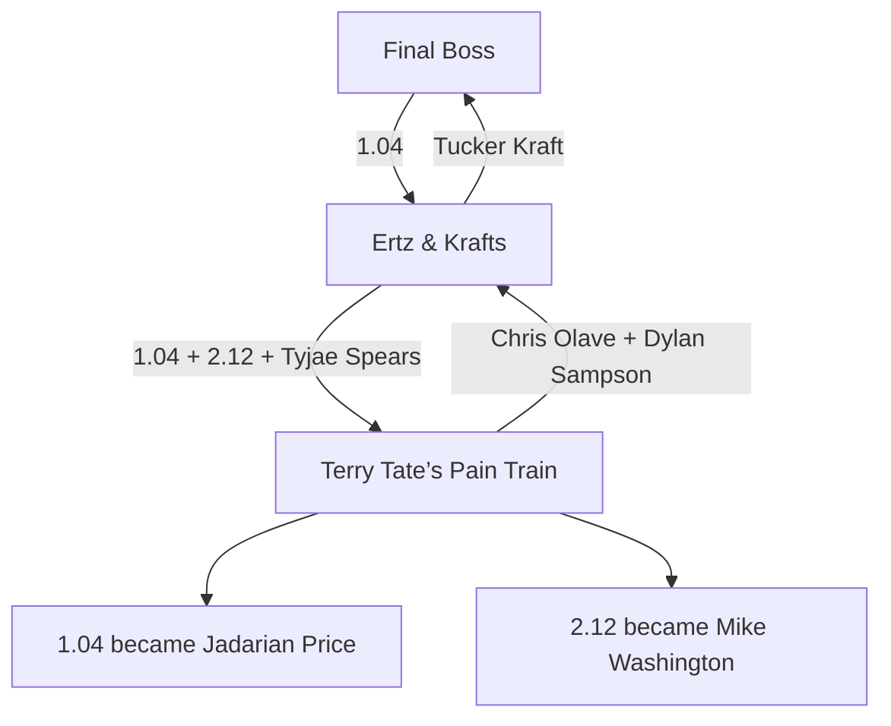

# Ape Invitational Dynasty: 2026 Draft-Cycle Grades

> **Historical source analysis — 44 of 48 picks, generated 2026-08-20.** Retained for editorial voice and superlative selectors. Grades are provisional. [MASTER_PLAN.md](../MASTER_PLAN.md) governs.

**A league-specific, team-by-team report card**  
Snapshot: 44 of 48 picks complete; updated 2026-08-20 with the complete 2026 pick-trade history from the linked 2025 and 2026 Sleeper leagues. Grades are provisional while the slow draft remains live.

This is an editorial draft-grades package in the spirit of a major-sports-site report card: a grade, a headline, the best pick, the biggest question, and a verdict for every roster. The writing is original; the underlying rankings and market signals are attributed below. The permanent grade covers the entire 2026 draft cycle: what each manager paid to assemble the capital, how well the picks were used, and whether the resulting portfolio fits the roster.

## The rules that change the grades

| League rule | Grading consequence |
|---|---|
| 12 teams, 1QB | Quarterbacks receive a major discount from superflex boards. |
| Four-point passing TDs | Rushing QBs retain an edge; pocket-QB stashes lose a little more value. |
| Half-PPR, no TE premium | WRs remain strong FLEX assets, but tight ends get no scoring subsidy. |
| 2 RB, 2 WR, 1 TE, 3 FLEX | RB/WR depth matters more than in a shallow two-FLEX league. |
| 14 bench, 2 rookie-only taxi slots, 5 IR | Developmental third- and fourth-round bets are more rosterable. |
| Kicker and team defense starters | Elite defenses matter to roster power, but they do not affect rookie-pick value. |
| Four rookie rounds; pick trading enabled | Extra selections earn no volume bonus; acquired picks carry their trade cost into the permanent grade. |

## How the grade is built

- **60% pick execution:** normalized expert/market value captured at each selection. The underlying pick score remains 55% expert consensus and 45% live market, with no reward for merely having more picks.
- **30% capital management:** current value received versus sent across all completed trades containing a 2026 rookie pick, including transactions made during the 2025 league year.
- **10% roster construction:** positional fit, competitive window, consolidation versus diversification, and this league's 1QB/no-TE-premium rules.
- **Trade valuation:** current FantasyCalc player and pick values; realized 2025 selections and generic future-pick values are used when they were part of the same acquisition package.

The capital score is intentionally large enough to matter but not large enough to let a favorable veteran trade erase poor drafting. It is a current-value retrospective, not a claim that today's values were known when every trade was made.

## League report card

| Pick grade | Cycle grade | Team | Capital outcome | Expert capture | Market capture | Headline |
|:---:|:---:|---|:---:|---:|---:|---|
| **A** | **A-** | Final Boss | 96.1% | 120.1% | 118.5% | Great selections, weaker capital management |
| **A** | **A-** | Terry Tate’s Pain Train | 101.0% | 114.5% | 113.8% | Excellent picks; full-cycle trades finish almost value-neutral |
| **A-** | **A-** | 2 Dagos and A Dream  | 197.9% | 117.0% | 104.7% | Drafted well and turned 2.08 into Harold Fannin |
| **B** | **B+** | Bub’s Club | 138.6% | 98.3% | 99.6% | Four acquired picks were earned through strong capital management |
| **B** | **B+** | Ertz & Krafts 🏆 | 101.2% | 117.0% | 83.3% | Ordinary picks, excellent veteran-roster consolidation |
| **C+** | **B** | Bijan And The Maye-ssiah | 146.4% | 93.6% | 84.2% | Capital wins rescue an inefficient set of selections |
| **C+** | **B-** | My Nabers Tetties | 112.0% | 88.2% | 95.7% | Five acquired picks, but uneven execution once on the clock |
| **B-** | **B-** | Gridiron geezers | 85.8% | 93.0% | 90.5% | Correct positions, expensive capital path |
| **B-** | **B-** | arkinsjt | 98.0% | 87.3% | 96.3% | Near-neutral capital management and sensible need picks |
| **B-** | **C+** | Max’s Shadynasty | 85.3% | 96.2% | 100.5% | One value pick cannot fully cover capital leakage |
| **C-** | **C-** | The Ape | 83.5% | 67.0% | 77.5% | Three acquired picks magnify four below-market selections |
| **Incomplete** | **Incomplete** | Bronco Stampede | 83.8% | — | — | No selection yet; 2026 capital management grades C |

## League-wide superlatives

- **Best first-round value:** Makai Lemon at 1.06. All four source boards placed him third or fourth, while the live market ranked him fifth.
- **Best foundational pick:** Carnell Tate at 1.03. The expert and market boards agreed he was the second-best rookie, and he went to the league's weakest roster.
- **Best third-round value:** Ted Hurst at 3.06. The expert median ranked him 19th; he lasted to pick 30.
- **Best fourth-round value:** Oscar Delp at 4.06. His expert median was 30th; he went 42nd and can use a rookie-only taxi slot.
- **Largest conviction bet:** Cyrus Allen at 2.03. The expert median placed him around 40th, although the live trade market was far more aggressive at roughly 17th.
- **Best draft-to-roster fit:** 2 Dagos and A Dream. Every pick attacked a room ranked 11th before the draft.
- **Best trade sequence:** Ertz & Krafts. It used 1.04 as a bridge asset and effectively turned Tucker Kraft, Tyjae Spears, and 2.12 into Chris Olave and Dylan Sampson—nearly value-neutral by the current market, but a sharp consolidation for a contender already starting Trey McBride.
- **Best draft-window trade return:** Terry Tate’s Pain Train. Alex received about 112.5% of the current value sent as traded; Mike Washington's value at 2.12 increased the realized return to 116.7%.
- **Best full-cycle capital outcome:** 2 Dagos and A Dream. The current value of Harold Fannin is nearly double the 2.08 sent to acquire him, although that is a retrospective result rather than a pure process grade.

## Who drafted with acquired capital?

| Team | Picks used | Original | Acquired | Acquired selections |
|---|---:|---:|---:|---|
| Bub’s Club | 8 | 4 | 4 | 1.09, 1.10, 2.10, 3.11 |
| My Nabers Tetties | 7 | 2 | 5 | 1.05, 1.11, 2.03, 2.05, 3.07 |
| Terry Tate’s Pain Train | 5 | 3 | 2 | 1.04, 2.12 |
| Bijan And The Maye-ssiah | 5 | 3 | 2 | 2.08, 4.02 |
| The Ape | 4 | 1 | 3 | 1.12, 2.09, 3.03 |
| Ertz & Krafts 🏆 | 3 | 1 | 2 | 2.06, 3.04 |
| Final Boss | 3 | 2 | 1 | 3.05 |
| 2 Dagos and A Dream | 3 | 3 | 0 | — |
| Gridiron geezers | 2 | 1 | 1 | 2.02 |
| Max’s Shadynasty | 2 | 1 | 1 | 3.09 |
| arkinsjt | 2 | 2 | 0 | — |
| Bronco Stampede | 0 | 0 | 0 | No selection through 4.08 |

This table is why pick volume is no longer part of the grade by itself. For example, My Nabers Tetties made seven selections, but five came from prior trades; The Ape made four selections, but only one was originally its own.

## Draft-window trade desk

Sleeper recorded two completed trades after the draft opened at 7:00 a.m. Pacific on August 16.

### Trade 1 — Ertz & Krafts acquires 1.04

| Ertz & Krafts 🏆 received | Final Boss received |
|---|---|
| 1.04 (3,456) | Tucker Kraft (2,928) |

**Trade grade:** Ertz & Krafts **B+**; Final Boss **C+**. The current market difference is 528 points, and 1.04 was the more liquid asset in a 1QB league with no TE premium. For Final Boss, the deal exchanged a premium rookie choice for a young top-five dynasty TE; defensible, but not optimal for the league's No. 12 roster.

### Trade 2 — Alex moves Chris Olave

| Terry Tate’s Pain Train received | Ertz & Krafts 🏆 received |
|---|---|
| Tyjae Spears (1,356) | Chris Olave (4,037) |
| 1.04 (3,456) | Dylan Sampson (1,336) |
| 2.12 (1,230 as traded; 1,649 as Mike Washington) | — |
| **6,042 as traded; 6,271 realized** | **5,373** |

**Trade grade:** Terry Tate’s Pain Train **A-**; Ertz & Krafts **A-**. Alex received a 12.5% current-value surplus before the picks were made and a 16.7% realized surplus after selecting Washington. The trade also converted WR depth into three RB bets for a roster ranked 10th at RB before the draft. Ertz & Krafts accepted the smaller side of the raw sum to acquire the best established player, a sensible consolidation premium for a contender.

### The 1.04 trade tree

### The linked-deal view

Because Ertz & Krafts acquired and then retransmitted 1.04, the cleanest assessment removes that bridge asset. Across both trades, Ertz & Krafts effectively:

- **Received:** Chris Olave and Dylan Sampson (5,373 current value).
- **Sent:** Tucker Kraft, Tyjae Spears, and 2.12 (5,514 at current pick value).

That is a difference of only 141 points, or roughly 2.6%. The transactions were almost perfectly balanced by additive market value, but Ertz & Krafts improved the shape of a contending roster by consolidating surplus TE depth into Olave.

## Expert notebook

- FantasyPros' current 1QB ECR is a 16-expert consensus, which makes it the broadest opinion input in the model. [FantasyPros ECR](https://www.fantasypros.com/nfl/rankings/dynasty-rookies-overall.php)
- DraftSharks' projection-driven board was especially positive on Makai Lemon and Jadarian Price, citing Lemon's formation versatility and Price's immediate Seattle opportunity. [DraftSharks rookie rankings](https://www.draftsharks.com/dynasty-rankings/rookies)
- Mike Washington is the clearest experts-versus-market disagreement in Alex's class. FantasyPros describes the size/speed profile as capable of three-down work if called upon, while his immediate role remains behind Ashton Jeanty. [FantasyPros player outlook](https://www.fantasypros.com/nfl/players/mike-washington-jr.php)
- Ted Hurst's expert case is stronger than his draft slot: Fantasy Life called him a reasonable second-round dynasty target, and FantasyPros has highlighted his strong camp. [Fantasy Life](https://www.fantasylife.com/articles/fantasy/ted-hurst-fantasy-football-outlook-with-the-tampa-bay-buccaneers), [FantasyPros](https://www.fantasypros.com/nfl/players/ted-hurst.php)
- Oscar Delp combines third-round NFL capital with elite testing, but his Year 1 path is blocked. FantasyPros sees a plausible 2027 starting window; that is exactly the type of profile a one-year rookie taxi slot can monetize. [FantasyPros player outlook](https://www.fantasypros.com/nfl/players/oscar-delp.php)

## Final Boss — A- draft-cycle grade

*A rebuild with an actual thesis*

| Pick | Player | Pos. | Expert rank | Market rank | Pre-draft room |
|---:|---|:---:|---:|---:|---:|
| 1.03 | Carnell Tate | WR | 2 | 2 | #9 WR |
| 3.05 | Kaytron Allen | RB | 28 | 29 | #11 RB |
| 4.03 | Seth McGowan | RB | 41 | 43 | #11 RB |

**Best pick:** Carnell Tate at 1.03  
**Biggest question:** Whether either late RB dart becomes more than depth

Final Boss took the consensus rookie No. 2 at 1.03, then used discounted picks on the roster's weakest room. Kaytron Allen was essentially market value at 3.05; Seth McGowan was a mild reach, but a fourth-round reach at a position of need is the right kind of miss to risk.

**Roster fit:** The league's No. 12 roster needed a foundational asset more than immediate points. Tate supplies that, while two RB swings attack an RB room ranked 11th.

**Capital context:** Final Boss used two original selections and one acquired selection. Across all trades involving 2026 capital, it retained approximately 96.1% of the current value sent. The draft-window exchange of 1.04 for Tucker Kraft was the largest strategic concern: a rebuild in a no-TE-premium league generally benefits more from the liquidity and ceiling of a premium rookie pick than from paying retail for a tight end.

**Verdict:** The selections were the cleanest marriage of value and team direction in the league. The capital record trims the overall grade because the Kraft trade works against that same rebuild logic. **Pick grade: A. Permanent draft-cycle grade: A-.**

## Terry Tate’s Pain Train — A- draft-cycle grade

*Five picks plus a calculated Olave-for-RB reset*

| Pick | Player | Pos. | Expert rank | Market rank | Pre-draft room |
|---:|---|:---:|---:|---:|---:|
| 1.04 | Jadarian Price | RB | 5 | 4 | #10 RB |
| 1.06 | Makai Lemon | WR | 4 | 5 | #8 WR |
| 2.12 | Mike Washington | RB | 26 | 15 | #10 RB |
| 3.06 | Ted Hurst | WR | 19 | 26 | #8 WR |
| 4.06 | Oscar Delp | TE | 30 | 36 | #4 TE |

**Best pick:** Ted Hurst at 3.06  
**Biggest question:** Whether Mike Washington's market enthusiasm outruns his blocked depth chart

Jadarian Price was a defensible need pick one slot ahead of expert consensus. Makai Lemon was the opposite: a consensus top-four rookie acquired at 1.06. The draft then turned into a value hunt—Hurst was ranked 19th by the expert median and went 30th, while Oscar Delp was ranked 30th and went 42nd. Mike Washington is the swing pick: experts place him around 26th, but the live trade market already values him around 15th.

**Roster fit:** Price and Washington directly attack a pre-draft RB room ranked 10th; Lemon and Hurst add needed WR succession; Delp fits the open rookie-taxi runway without forcing TE-premium economics onto the grade.

**Capital context:** Two of the five selections—1.04 and 2.12—were acquired in the Olave deal. Alex sent Chris Olave and Dylan Sampson for Tyjae Spears and those picks, creating a 12.5% current-value advantage as traded and a 16.7% realized advantage after the selections. An earlier sale of 2.06 for Kayshon Boutte offsets most of that gain in the full-cycle ledger, leaving the current capital outcome at 101.0%. The counterargument is concentration quality: Olave was the best established asset in the draft-window deal, so Price now carries substantial responsibility for making the reset work.

**Verdict:** This is how a lower-tier roster should use a draft window: turn one strong veteran into more total value at the roster's weakest position, add two players who can enter the lineup, then layer in asymmetric upside. The selections were stronger than the full acquisition record, so the permanent model lands one notch below the pure pick grade. **Pick grade: A. Permanent draft-cycle grade: A-.**

## 2 Dagos and A Dream — A- draft-cycle grade

*Drafting directly into the roster's empty spaces*

| Pick | Player | Pos. | Expert rank | Market rank | Pre-draft room |
|---:|---|:---:|---:|---:|---:|
| 1.08 | Denzel Boston | WR | 10 | 8 | #11 WR |
| 3.08 | Ty Simpson | QB | 20 | 24 | #11 QB |
| 4.08 | Brenen Thompson | WR | 37 | 50 | #11 WR |

**Best pick:** Ty Simpson at 3.08  
**Biggest question:** Whether Denzel Boston was worth passing on the higher-ranked names at 1.08

Denzel Boston was taken about two spots ahead of expert consensus, but the next two picks were sharp. Ty Simpson carried a consensus rank around 20 and lasted to 32; Brenen Thompson carried a rank around 37 and lasted to 44. Even in 1QB, Simpson is cheap enough at that price to justify the bet.

**Roster fit:** This roster entered the draft first at RB but 11th at both QB and WR. All three picks attacked those weaknesses, which matters more in a lineup with three FLEX spots.

**Capital context:** All three selections were original picks, so the class receives no extra credit for volume. The manager also turned 2.08 into Harold Fannin; using current values, that is the strongest 2026-capital outcome in the league. Because much of the gain reflects Fannin's subsequent appreciation, the capital grade is capped at A rather than treated as a perfect transaction-time score.

**Verdict:** A small class with almost no wasted motion and excellent capital management outside the selections. Boston needs to hit for the grade to age into an A. **Pick grade: A-. Permanent draft-cycle grade: A-.**

## Bub’s Club — B+ draft-cycle grade

*Volume, volatility, and one enormous safety net*

| Pick | Player | Pos. | Expert rank | Market rank | Pre-draft room |
|---:|---|:---:|---:|---:|---:|
| 1.01 | Jeremiyah Love | RB | 1 | 1 | #8 RB |
| 1.09 | Jonah Coleman | RB | 12 | 11 | #8 RB |
| 1.10 | Kenyon Sadiq | TE | 8.5 | 7 | #5 TE |
| 2.01 | Omar Cooper | WR | 7 | 13 | #10 WR |
| 2.10 | Caleb Douglas | WR | 35.5 | 21 | #10 WR |
| 3.01 | Antonio Williams | WR | 14 | 18 | #10 WR |
| 3.11 | Malik Benson | WR | 58 | 40 | #10 WR |
| 4.01 | Bryce Lance | WR | 34 | 42 | #10 WR |

**Best pick:** Omar Cooper at 2.01  
**Biggest question:** Why so much capital was spent ahead of consensus after the early wins

Jeremiyah Love at 1.01 was automatic, Kenyon Sadiq at 1.10 was fair value, and Omar Cooper at 2.01 was a major consensus win. Antonio Williams at 3.01 and Bryce Lance at 4.01 were also discounted. But Jonah Coleman went a few spots early, Caleb Douglas went roughly a round early by expert consensus, and Malik Benson was another aggressive bet.

**Roster fit:** The repeated WR swings correctly attack a bottom-three room, and the roster can absorb developmental players because the league provides 14 bench and two taxi spots.

**Capital context:** Four of the eight selections—1.09, 1.10, 2.10, and 3.11—were acquired. The full trade ledger involving 2026 picks currently returns 138.6% of value sent, so the large class was not merely purchased through overpayment. That earns an A capital grade, while the pick grade remains normalized per selection.

**Verdict:** Eight picks produced several genuine wins and several avoidable reaches. Love creates a high floor, and strong acquisition economics raise the overall result above the selections alone. **Pick grade: B. Permanent draft-cycle grade: B+.**

## Ertz & Krafts 🏆 — B+ draft-cycle grade

*Solid values, modest ceiling*

| Pick | Player | Pos. | Expert rank | Market rank | Pre-draft room |
|---:|---|:---:|---:|---:|---:|
| 2.06 | Chris Bell | WR | 16 | 25 | #5 WR |
| 3.04 | Demond Claiborne | RB | 24 | 27 | #5 RB |
| 3.12 | Max Klare | TE | 31 | 44 | #2 TE |

**Best pick:** Chris Bell at 2.06  
**Biggest question:** Whether Max Klare was the best use of a pick for the league's No. 2 TE room

All three players beat or approximated expert consensus: Chris Bell ranked around 16 and went 18, Demond Claiborne ranked around 24 and went 28, and Max Klare ranked around 31 and went 36. The live market is cooler on the group than the experts, which adds real uncertainty.

**Roster fit:** The roster is already deep and competitive, so it could afford value over need. Still, another tight end brings less marginal benefit in a no-premium format than an equivalent RB or WR swing would.

**Capital context:** Two of the three selections—2.06 and 3.04—were acquired. Across every trade involving 2026 capital, Ertz & Krafts received 101.2% of current value sent. During the draft it first sent Tucker Kraft for 1.04, then packaged 1.04, 2.12, and Tyjae Spears for Chris Olave and Dylan Sampson. Removing the bridge pick, the two deals were almost exactly value-neutral by current additive market value. Strategically, they converted a redundant top-five TE behind Trey McBride into a top-15 dynasty WR while preserving RB depth through Sampson.

**Verdict:** The selections alone were solid but low-ceiling. The trades were the real win: efficient consolidation without paying a meaningful market premium. **Pick grade: B. Permanent draft-cycle grade: B+.**

## Gridiron geezers — B- draft-cycle grade

*Correct position, average prices*

| Pick | Player | Pos. | Expert rank | Market rank | Pre-draft room |
|---:|---|:---:|---:|---:|---:|
| 2.02 | Germie Bernard | WR | 18 | 22 | #12 WR |
| 2.11 | Zachariah Branch | WR | 21 | 19 | #12 WR |

**Best pick:** Zachariah Branch at 2.11  
**Biggest question:** Whether two mid-tier receivers materially fix the league's weakest WR room

Germie Bernard was taken four spots ahead of expert consensus, while Zachariah Branch lasted a couple of spots beyond it. The two picks roughly cancel out on pure value.

**Roster fit:** No team needed receivers more: Gridiron Geezers entered the draft 12th at WR, and three FLEX spots make that weakness especially expensive.

**Capital context:** One of the two selections, 2.02, was acquired. The complete 2026-capital ledger currently returns 85.8% of value sent, so the acquired volume does not improve the grade; it slightly reduces it.

**Verdict:** The board value is ordinary and the roster logic is impeccable, but the acquisition path was expensive. Branch is the pick with the better chance to make this class look clever. **Pick grade: B-. Permanent draft-cycle grade: B-.**

## Max’s Shadynasty — C+ draft-cycle grade

*One value pick, one luxury reach*

| Pick | Player | Pos. | Expert rank | Market rank | Pre-draft room |
|---:|---|:---:|---:|---:|---:|
| 3.09 | Skyler Bell | WR | 27 | 35 | #2 WR |
| 3.10 | Drew Allar | QB | 42 | 31 | #3 QB |

**Best pick:** Skyler Bell at 3.09  
**Biggest question:** Why add Drew Allar to the league's No. 3 QB room in a 1QB format

Skyler Bell was a consensus top-27 rookie who fell to 33, a clean value. Drew Allar was closer to 42nd by expert consensus and went 34th. The live market likes Allar more than the rankers do, but the league settings and roster context both reduce the payoff.

**Roster fit:** The roster's weakest room was TE, not QB. In superflex the Allar bet would be defensible; with one quarterback and four-point passing touchdowns, it is a luxury selection.

**Capital context:** Skyler Bell at 3.09 was acquired; Drew Allar at 3.10 was original. The full 2026-capital ledger currently returns 85.3% of value sent, so the Bell bargain must be evaluated against capital leakage elsewhere rather than treated as free extra volume.

**Verdict:** Bell saves the selections from a lower grade, but the capital record pulls the permanent result down one notch. Allar needs either a meaningful value spike or a trade market to justify the opportunity cost. **Pick grade: B-. Permanent draft-cycle grade: C+.**

## arkinsjt — B- draft-cycle grade

*Need-driven and mostly sensible*

| Pick | Player | Pos. | Expert rank | Market rank | Pre-draft room |
|---:|---|:---:|---:|---:|---:|
| 2.04 | Nicholas Singleton | RB | 15 | 16 | #9 RB |
| 4.04 | Matt Hibner | TE | 55.5 | 45 | #12 TE |

**Best pick:** Nicholas Singleton at 2.04  
**Biggest question:** Whether Matt Hibner's athletic bet can overcome the opportunity cost

Nicholas Singleton was almost exactly consensus value at 2.04 and addressed a weak RB room. Matt Hibner was selected well ahead of the expert median, though the live market was somewhat less skeptical.

**Roster fit:** RB and TE ranked 10th and 12th before the draft, so both selections attacked real needs. The no-TE-premium setting means Hibner needs to become a legitimate starter—not merely an interesting athlete—to return value.

**Capital context:** Both selections were original. Across trades involving other 2026 picks, arkinsjt retained approximately 98.0% of current value sent—close enough to neutral that it does not materially change the pick grade.

**Verdict:** Singleton is the type of boring-correct pick that keeps a draft afloat. Hibner determines whether this finishes as a B or slides toward a C. **Pick grade: B-. Permanent draft-cycle grade: B-.**

## My Nabers Tetties — B- draft-cycle grade

*A huge class that never fully chose between value and conviction*

| Pick | Player | Pos. | Expert rank | Market rank | Pre-draft room |
|---:|---|:---:|---:|---:|---:|
| 1.02 | Jordyn Tyson | WR | 3 | 3 | #6 WR |
| 1.05 | KC Concepcion | WR | 6 | 6 | #6 WR |
| 1.11 | Fernando Mendoza | QB | 13 | 9 | #6 QB |
| 2.03 | Cyrus Allen | WR | 40 | 17 | #6 WR |
| 2.05 | Emmett Johnson | RB | 18 | 23 | #12 RB |
| 3.02 | Eli Stowers | TE | 13 | 14 | #8 TE |
| 3.07 | Kaelon Black | RB | 25 | 28 | #12 RB |

**Best pick:** Eli Stowers at 3.02  
**Biggest question:** The Cyrus Allen selection at 2.03

Jordyn Tyson, KC Concepcion, and Fernando Mendoza were all slightly early but defensible. The class swung sharply at 2.03, where Cyrus Allen went about two rounds ahead of the expert median, though the live market is considerably more optimistic. The recovery was strong: Emmett Johnson was reasonable, Eli Stowers was a major value, and Kaelon Black beat consensus.

**Roster fit:** The two RB selections correctly attack the league's 12th-ranked RB room. Mendoza is less valuable here than on generic boards because this is 1QB with four-point passing touchdowns.

**Capital context:** Five of the seven selections—1.05, 1.11, 2.03, 2.05, and 3.07—were acquired. The current full-cycle ledger returns 112.0% of value sent, so the manager deserves credit for assembling the class efficiently. That capital win cannot erase below-board selections, but it prevents the large class from being treated as empty volume.

**Verdict:** There is enough talent and efficiently acquired capital for this class to work, but Stowers and Black are doing too much repair work after the Allen reach. **Pick grade: C+. Permanent draft-cycle grade: B-.**

*Model grade: B-; editorial grade: C+. The difference reflects judgment about opportunity cost and league-specific roster construction.*

## Bijan And The Maye-ssiah — B draft-cycle grade

*A good roster drafted like it could afford to be picky*

| Pick | Player | Pos. | Expert rank | Market rank | Pre-draft room |
|---:|---|:---:|---:|---:|---:|
| 1.07 | De'Zhaun Stribling | WR | 13 | 10 | #7 WR |
| 2.07 | Malachi Fields | WR | 22 | 20 | #7 WR |
| 2.08 | Elijah Sarratt | WR | 22.5 | 33 | #7 WR |
| 4.02 | Eli Heidenreich | RB | 39 | 47 | #2 RB |
| 4.07 | Justin Joly | TE | 35 | 39 | #3 TE |

**Best pick:** Justin Joly at 4.07  
**Biggest question:** The cumulative opportunity cost of taking three receivers ahead of consensus

De'Zhaun Stribling at 1.07 was the largest early bet, with an expert median around 13. Malachi Fields and Elijah Sarratt were smaller reaches. The late picks were better: Eli Heidenreich was close to value and Justin Joly was discounted.

**Roster fit:** Receiver was the roster's weakest starting room, so the positional plan was sensible. The problem was price, not purpose.

**Capital context:** Two selections, 2.08 and 4.02, were acquired. Across all trades containing 2026 picks, the roster currently holds 146.4% of value sent, driven in part by acquiring Romeo Doubs, Wan'Dale Robinson, and 4.02 for Terrell Jennings and 3.07. The capital management materially outperformed the on-clock execution.

**Verdict:** The selections read as repeated conviction without enough board discipline, but the acquisition record was among the league's best. **Pick grade: C+. Permanent draft-cycle grade: B.**

## The Ape — C- draft-cycle grade

*Four selections, four bets against the board*

| Pick | Player | Pos. | Expert rank | Market rank | Pre-draft room |
|---:|---|:---:|---:|---:|---:|
| 1.12 | Ja'Kobi Lane | WR | 22 | 12 | #3 WR |
| 2.09 | Adam Randall | RB | 35 | 34 | #4 RB |
| 3.03 | Eli Raridon | TE | 32 | 32 | #1 TE |
| 4.05 | Colbie Young | WR | 47 | 53 | #3 WR |

**Best pick:** Eli Raridon at 3.03  
**Biggest question:** Why keep adding to the roster's strongest rooms

Ja'Kobi Lane went at 1.12 with an expert median around 22, Adam Randall went at 2.09 with a median around 35, Eli Raridon went at 3.03 with a median around 32, and Colbie Young went at 4.05 with a median around 47. Every selection was ahead of consensus, and the first two were substantial reaches.

**Roster fit:** The Ape already ranked second at WR and first at TE. In a no-TE-premium league, adding another tight end and two more receivers needed stronger value justification than the board supplied.

**Capital context:** Three of the four selections—1.12, 2.09, and 3.03—were acquired. The current capital ledger returns only 83.5% of value sent, so the extra selections increase the opportunity-cost burden instead of softening it.

**Verdict:** A contender can draft for conviction, but conviction is not free—especially when three of four selections required traded assets. Lane or Randall must become a clear outlier for this class to beat the opportunity cost. **Pick grade: C-. Permanent draft-cycle grade: C-.**

## Bronco Stampede — Incomplete

*The league favorite is finally on the clock*

*No selection has been made through the current snapshot.*

**Best pick:** Not yet made  
**Biggest question:** Whether the final pick can address a TE room ranked 10th or simply preserve value

Bronco Stampede has not selected through 4.08 and is on the clock at 4.09. A single late pick cannot materially change the league's No. 1 roster, but it can still produce a useful taxi or trade asset.

**Roster fit:** This is the strongest roster in the league, with elite QB and WR rooms. Tight end is the only relative weakness, though value should still beat need this late.

**Capital context:** Bronco Stampede has not selected through 4.08, but its completed trades involving 2026 picks currently return 83.8% of value sent. That capital record grades C; the final draft-cycle grade remains incomplete until its remaining selection activity is known.

**Verdict:** No grade until the selection is made. The larger story is that the favorite entered the rookie draft without needing it to rescue anything.

## Source ledger

- [Sleeper API](https://docs.sleeper.com/), the current league's [Week 1 transaction feed](https://api.sleeper.app/v1/league/1312209616372772864/transactions/1), and the linked [2025 transaction feed](https://api.sleeper.app/v1/league/1187879775490527232/transactions/1) — league settings, rosters, users, drafts, picks, and the weekly transaction history used for pick provenance.
- [FantasyCalc](https://fantasycalc.com/) — current 12-team, 1QB, half-PPR dynasty trade values.
- [FantasyPros 2026 Dynasty Rookie ECR](https://www.fantasypros.com/nfl/rankings/dynasty-rookies-overall.php) — updated August 19, 2026.
- [RotoBaller 2026 rookie rankings](https://www.rotoballer.com/updated-fantasy-football-rookie-rankings-rb-wr-te-qb-2026/1903558) — updated August 5, 2026.
- [Justin Boone's rookie trade values](https://sports.yahoo.com/fantasy/article/fantasy-football-dynasty-rankings-2026-trade-value-charts-justin-boone-rookies-162819768.html) — published August 5, 2026; model uses the 1QB value column.
- [DraftSharks 2026 rookie rankings](https://www.draftsharks.com/dynasty-rankings/rookies) — projection-driven board updated August 19, 2026.

### Important limitation

These grades combine process and current outcomes; they are not declarations of who will have the best NFL career. The expert boards and trade market measure current information, and the final four selections can change the result. Capital outcomes use today's FantasyCalc values rather than archived values from each 2025–26 transaction date, so subsequent player appreciation or decline affects the retrospective. Additive package values also do not fully capture the consolidation premium normally attached to the best player in a deal.
