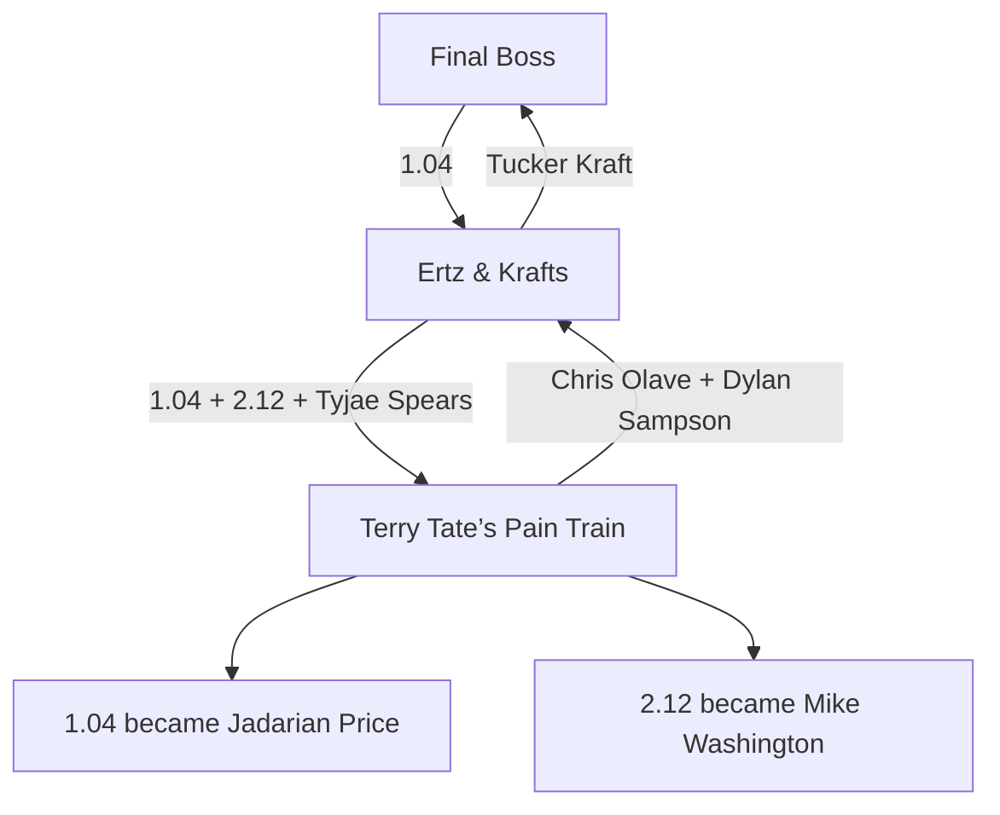

# Ape Invitational Dynasty — League Analysis and Draft Grades

> **Historical source analysis — 44 of 48 picks, generated 2026-08-20.** Its 21-transaction ledger is the reconciliation target for task P0-9. Grades are provisional. [MASTER_PLAN.md](../MASTER_PLAN.md) governs.

Generated 2026-08-19 23:39 UTC from live Sleeper data; updated 2026-08-20 with the complete 2026 pick-trade history from the linked 2025 and 2026 leagues. 
Draft status: **drafting** (44 of 48 picks made).

## Executive read

**Terry Tate’s Pain Train** ranks **#10 overall**, 
with the #10 dynasty core, #9 2026 lineup, 
and #5 depth. The roster profile is **retool / bubble**. 
Its strongest room is TE (#5); its weakest is RB (#9).

The current rookie selections grade **A** after blending expert consensus, live market value, and league-specific roster fit (117.1% adjusted value capture), 
ranking #2 among teams that have selected a player. 
Haul: 1.04 Jadarian Price, 1.06 Makai Lemon, 2.12 Mike Washington, 3.06 Ted Hurst, 4.06 Oscar Delp.

Alex also executed one of the draft window's two completed trades: Chris Olave and Dylan Sampson for Tyjae Spears, 1.04, and 2.12. Using current FantasyCalc player and pick values, Alex received approximately **112.5%** of the value sent before accounting for his selections. Converting 2.12 into Mike Washington increased the realized return to approximately **116.7%**. After permanently incorporating every trade involving 2026 capital—including the earlier sale of 2.06 for Kayshon Boutte—the overall draft-cycle grade is **A-**.

### What the ranking says about Alex’s roster

- **Foundation:** Nico Collins (WR-HOU), Tyler Warren (TE-IND), Javonte Williams (RB-DAL), Jadarian Price (RB-SEA), Marvin Harrison (WR-ARI), Makai Lemon (WR-PHI).
- **Room ranks after including the live draft haul:** QB #7, RB #9, WR #9, and TE #5.
- **Shape:** the roster is only #10 in starting-core value, but #5 in depth. That is a consolidation problem more than a lack-of-assets problem.
- **Strategic read:** this is a retool, not an automatic teardown. The rookie class improved the bench and long-term options, but a top-four finish likely requires turning surplus depth or the second 1QB into one more weekly difference-maker—preferably at RB.

## League power table

| Rk | Team | Window | Dynasty core | 2026 lineup | Depth | Best room | Weakest room |
|---:|---|---|---:|---:|---:|---|---|
| 1 | Bronco Stampede | contender with staying power | #1 | #1 | #4 | QB (#1) | TE (#10) |
| 2 | Bijan And The Maye-ssiah | contender with staying power | #2 | #4 | #1 | QB (#2) | WR (#7) |
| 3 | Ertz & Krafts 🏆 | deep playoff mix | #5 | #3 | #2 | TE (#2) | QB (#8) |
| 4 | The Ape | contender with staying power | #3 | #2 | #10 | TE (#1) | QB (#6) |
| 5 | 2 Dagos and A Dream  | middle / needs a direction | #4 | #6 | #9 | RB (#1) | QB (#11) |
| 6 | arkinsjt | middle / needs a direction | #7 | #7 | #6 | QB (#4) | TE (#12) |
| 7 | Max’s Shadynasty | middle / needs a direction | #6 | #8 | #8 | QB (#3) | TE (#11) |
| 8 | Gridiron geezers | middle / needs a direction | #9 | #5 | #12 | RB (#3) | WR (#12) |
| 9 | My Nabers Tetties | middle / needs a direction | #8 | #10 | #7 | WR (#3) | RB (#12) |
| 10 | Terry Tate’s Pain Train **(Alex)** | retool / bubble | #10 | #9 | #5 | TE (#5) | RB (#9) |
| 11 | Bub’s Club | retool / bubble | #11 | #11 | #3 | RB (#4) | QB (#12) |
| 12 | Final Boss | rebuild | #12 | #12 | #11 | WR (#8) | RB (#11) |

### Team-by-team roster snapshots

- **#1 Bronco Stampede:** contender with staying power. Core: Jaxon Smith-Njigba (WR-SEA), Puka Nacua (WR-LAR), Josh Allen (QB-BUF). Best room QB (#1); weakest TE (#10). Future capital: 0 first-rounder(s) and 10 total picks across 2027–29.
- **#2 Bijan And The Maye-ssiah:** contender with staying power. Core: Bijan Robinson (RB-ATL), Amon-Ra St. Brown (WR-DET), Chase Brown (RB-CIN). Best room QB (#2); weakest WR (#7). Future capital: 1 first-rounder(s) and 10 total picks across 2027–29.
- **#3 Ertz & Krafts 🏆:** deep playoff mix. Core: Trey McBride (TE-ARI), Emeka Egbuka (WR-TB), Saquon Barkley (RB-PHI). Best room TE (#2); weakest QB (#8). Future capital: 1 first-rounder(s) and 13 total picks across 2027–29.
- **#4 The Ape:** contender with staying power. Core: Brock Bowers (TE-LV), Justin Jefferson (WR-MIN), James Cook (RB-BUF). Best room TE (#1); weakest QB (#6). Future capital: 1 first-rounder(s) and 15 total picks across 2027–29.
- **#5 2 Dagos and A Dream :** middle / needs a direction. Core: Jahmyr Gibbs (RB-DET), Ashton Jeanty (RB-LV), Jonathan Taylor (RB-IND). Best room RB (#1); weakest QB (#11). Future capital: 1 first-rounder(s) and 12 total picks across 2027–29.
- **#6 arkinsjt:** middle / needs a direction. Core: CeeDee Lamb (WR-DAL), Caleb Williams (QB-CHI), A.J. Brown (WR-NE). Best room QB (#4); weakest TE (#12). Future capital: 1 first-rounder(s) and 11 total picks across 2027–29.
- **#7 Max’s Shadynasty:** middle / needs a direction. Core: Ja'Marr Chase (WR-CIN), Garrett Wilson (WR-NYJ), Quinshon Judkins (RB-CLE). Best room QB (#3); weakest TE (#11). Future capital: 1 first-rounder(s) and 12 total picks across 2027–29.
- **#8 Gridiron geezers:** middle / needs a direction. Core: De'Von Achane (RB-MIA), Omarion Hampton (RB-LAC), Christian McCaffrey (RB-SF). Best room RB (#3); weakest WR (#12). Future capital: 1 first-rounder(s) and 10 total picks across 2027–29.
- **#9 My Nabers Tetties:** middle / needs a direction. Core: Malik Nabers (WR-NYG), Tetairoa McMillan (WR-CAR), Joe Burrow (QB-CIN). Best room WR (#3); weakest RB (#12). Future capital: 2 first-rounder(s) and 13 total picks across 2027–29.
- **#10 Terry Tate’s Pain Train (Alex):** retool / bubble. Core: Nico Collins (WR-HOU), Tyler Warren (TE-IND), Javonte Williams (RB-DAL). Best room TE (#5); weakest RB (#9). Future capital: 1 first-rounder(s) and 12 total picks across 2027–29.
- **#11 Bub’s Club:** retool / bubble. Core: Jeremiyah Love (RB-ARI), Breece Hall (RB-NYJ), Jaylen Waddle (WR-DEN). Best room RB (#4); weakest QB (#12). Future capital: 1 first-rounder(s) and 16 total picks across 2027–29.
- **#12 Final Boss:** rebuild. Core: George Pickens (WR-DAL), Carnell Tate (WR-TEN), Tucker Kraft (TE-GB). Best room WR (#8); weakest RB (#11). Future capital: 1 first-rounder(s) and 10 total picks across 2027–29.

## Rookie draft grades

The grade blends multi-source expert consensus (55%) and live FantasyCalc market value (45%), then applies a small roster-fit adjustment for this league's 1QB, half-PPR, no-TE-premium, three-FLEX format. 
Total haul value is kept separate, so extra draft capital does not automatically produce a better execution grade.

| Rk | Team | Grade | Adjusted capture | Expert | Market | Fit | Expert surplus |
|---:|---|:---:|---:|---:|---:|---:|---:|
| 1 | Final Boss | **A** | 123.1% | 120.1% | 118.5% | 89% | +0.0 |
| 2 | Terry Tate’s Pain Train **(Alex)** | **A** | 117.1% | 114.5% | 113.8% | 82% | +4.4 |
| 3 | 2 Dagos and A Dream  | **A-** | 114.9% | 117.0% | 104.7% | 88% | +5.7 |
| 4 | Bub’s Club | **B** | 100.8% | 98.3% | 99.6% | 75% | -2.2 |
| 5 | Ertz & Krafts 🏆 | **B** | 100.6% | 117.0% | 83.3% | 35% | +3.7 |
| 6 | Gridiron geezers | **B-** | 95.6% | 93.0% | 90.5% | 100% | -1.0 |
| 7 | Max’s Shadynasty | **B-** | 95.0% | 96.2% | 100.5% | 10% | -1.0 |
| 8 | arkinsjt | **B-** | 93.8% | 87.3% | 96.3% | 83% | -7.2 |
| 9 | My Nabers Tetties | **B-** | 92.0% | 88.2% | 95.7% | 56% | -1.6 |
| 10 | Bijan And The Maye-ssiah | **C+** | 89.7% | 93.6% | 84.2% | 55% | -0.9 |
| 11 | The Ape | **C-** | 69.9% | 67.0% | 77.5% | 19% | -8.8 |

### Terry Tate’s Pain Train: pick-by-pick

| Pick | Player | Expert rank | Market rank | Expert surplus | Expert read |
|---:|---|---:|---:|---:|---|
| 1.04 | Jadarian Price (RB-SEA) | #5.0 | #4 | -1.0 | market |
| 1.06 | Makai Lemon (WR-PHI) | #4.0 | #5 | +2.0 | steal |
| 2.12 | Mike Washington (RB-LV) | #26.0 | #15 | -2.0 | reach |
| 3.06 | Ted Hurst (WR-TB) | #19.0 | #26 | +11.0 | steal |
| 4.06 | Oscar Delp (TE-NO) | #30.0 | #36 | +12.0 | steal |

## Permanent draft-cycle grading

The overall grade now measures the entire 2026 rookie-draft cycle, not merely the names selected:

- **60% pick execution:** expert/market value captured at each slot, calculated per pick so additional volume earns no automatic bonus.
- **30% capital management:** current value received versus sent across every completed trade containing a 2026 pick, including transactions from the 2025 league year.
- **10% roster construction:** whether the picks and trades fit the team's competitive window and this league's lineup/scoring rules.

Capital outcome is a current-value retrospective rather than a perfect transaction-time grade. It includes players, 2026 picks, realized 2025 selections, and future picks in the same trade packages.

### Pick provenance through 4.08

| Team | Picks used | Original picks | Acquired picks | Acquired selections |
|---|---:|---:|---:|---|
| Bub’s Club | 8 | 4 | 4 | 1.09, 1.10, 2.10, 3.11 |
| My Nabers Tetties | 7 | 2 | 5 | 1.05, 1.11, 2.03, 2.05, 3.07 |
| Terry Tate’s Pain Train | 5 | 3 | 2 | 1.04, 2.12 |
| Bijan And The Maye-ssiah | 5 | 3 | 2 | 2.08, 4.02 |
| The Ape | 4 | 1 | 3 | 1.12, 2.09, 3.03 |
| Ertz & Krafts 🏆 | 3 | 1 | 2 | 2.06, 3.04 |
| Final Boss | 3 | 2 | 1 | 3.05 |
| 2 Dagos and A Dream | 3 | 3 | 0 | — |
| Gridiron geezers | 2 | 1 | 1 | 2.02 |
| Max’s Shadynasty | 2 | 1 | 1 | 3.09 |
| arkinsjt | 2 | 2 | 0 | — |
| Bronco Stampede | 0 | 0 | 0 | No selection through 4.08 |

### Trade-adjusted report card

| Team | Pick grade | Capital outcome | Capital grade | Overall draft-cycle grade |
|---|:---:|---:|:---:|:---:|
| Final Boss | A | 96.1% | C+ | **A-** |
| Terry Tate’s Pain Train | A | 101.0% | B+ | **A-** |
| 2 Dagos and A Dream | A- | 197.9% | A | **A-** |
| Bub’s Club | B | 138.6% | A | **B+** |
| Ertz & Krafts 🏆 | B | 101.2% | A- | **B+** |
| Bijan And The Maye-ssiah | C+ | 146.4% | A | **B** |
| My Nabers Tetties | C+ | 112.0% | B+ | **B-** |
| Gridiron geezers | B- | 85.8% | C+ | **B-** |
| arkinsjt | B- | 98.0% | B | **B-** |
| Max’s Shadynasty | B- | 85.3% | C+ | **C+** |
| The Ape | C- | 83.5% | C- | **C-** |
| Bronco Stampede | Incomplete | 83.8% | C | **Incomplete** |

The capital outcome percentage is not a pick-count multiplier. It is the current value received divided by current value sent across all completed trades involving 2026 picks. This prevents an eight-pick class from looking better simply because its manager previously spent assets to assemble it.

## Draft-window trades

Sleeper recorded **two completed trades** after the draft opened at 7:00 a.m. Pacific on August 16. Values below use the current FantasyCalc snapshot as a consistent market proxy; they are not archived transaction-time values. Draft picks are valued as tradable pick assets first, then at the current value of the player actually selected.

| Completed (Pacific) | Team receiving | Assets received | Current value |
|---|---|---|---:|
| Aug. 16, 9:25 a.m. | Ertz & Krafts 🏆 | 1.04 | 3,456 |
| Aug. 16, 9:25 a.m. | Final Boss | Tucker Kraft | 2,928 |
| Aug. 16, 5:13 p.m. | Terry Tate’s Pain Train | Tyjae Spears, 1.04, 2.12 | 6,042 as traded; 6,271 realized |
| Aug. 16, 5:13 p.m. | Ertz & Krafts 🏆 | Chris Olave, Dylan Sampson | 5,373 |

### The 1.04 trade tree

### Trade-inclusive report card

| Team | Pick grade | Trade grade | Draft-window grade | Analysis |
|---|:---:|:---:|:---:|---|
| Terry Tate’s Pain Train | A | A- | **A-** | Sent the best established player in Olave, but received a 12.5% current-value surplus as traded and directly attacked the league's No. 10 pre-draft RB room. Drafting Price and Washington increased the realized surplus to 16.7%; the earlier 2.06-for-Boutte deal pulls the full-cycle capital grade back to B+. |
| Ertz & Krafts 🏆 | B | A | **B+** | Used 1.04 as a bridge asset and effectively converted surplus TE/RB depth plus 2.12 into Olave and Sampson. The linked transactions were nearly value-neutral, but the consolidation and roster logic were excellent for a contender that already has Trey McBride. |
| Final Boss | A | C+ | **A-** | Tucker Kraft is a strong young TE, but paying 1.04 for him in a no-TE-premium rebuild sacrificed liquidity and about 15% of current pick value. Carnell Tate at 1.03 keeps the overall cycle strong. |

### Alex trade ledger

| Sent | Current value | Received | Slot value | Realized value |
|---|---:|---|---:|---:|
| Chris Olave | 4,037 | Tyjae Spears | 1,356 | 1,356 |
| Dylan Sampson | 1,336 | 1.04 → Jadarian Price | 3,456 | 3,266 |
| — | — | 2.12 → Mike Washington | 1,230 | 1,649 |
| **Total** | **5,373** | **Total** | **6,042** | **6,271** |

**Interpretation:** Alex exchanged one higher-confidence WR asset for three RB bets. The return was favorable and matched the roster's weakness, but the risk became more distributed: the trade wins decisively only if Price becomes a reliable starter or Washington/Spears supplies meaningful secondary value. It was good process for a retool, not a risk-free steal.

## Methodology and limitations

- Sleeper supplies league settings, managers, rosters, drafts, and picks through its public read-only API.
- Sleeper's transaction feed supplies the completed trades, participating roster IDs, players, and transferred picks. Transaction completion is measured with `status_updated`.
- FantasyCalc supplies current 12-team, 1QB, half-PPR dynasty and redraft market values. It is a trade-market signal, not a projection model.
- Dynasty-core and 2026-lineup ranks optimize the league's 1QB/2RB/2WR/1TE/3FLEX skill-position lineup. Kicker and team defense are excluded from market-value totals.
- Expert consensus is the median of available ranks from FantasyPros ECR, RotoBaller, Justin Boone's 1QB trade-value order, and DraftSharks. FantasyCalc supplies a separate market signal.
- Value capture compares each selected rookie with the value normally available at that exact pick number. A 1.10 selection is therefore compared with the current rookie No. 10, not with the 1.01.
- Grades remain provisional while the draft is live. Values and grades will move as the market changes.
- Trade values use the current FantasyCalc snapshot rather than archived values from each 2025–26 transaction date. Additive package values also do not capture the normal consolidation premium for the best asset in a trade.
- Pick provenance follows the original-roster ID attached to each Sleeper pick. Capital outcomes include all 21 completed transactions containing a 2026 pick across the linked 2025 and 2026 league records.

## Sources

- [Sleeper API documentation](https://docs.sleeper.com/), the current league's [Week 1 transaction feed](https://api.sleeper.app/v1/league/1312209616372772864/transactions/1), and the linked [2025 transaction feed](https://api.sleeper.app/v1/league/1187879775490527232/transactions/1) — league, roster, user, draft, pick, player, and trade-history data.
- [FantasyCalc](https://fantasycalc.com/) and its [methodology FAQ](https://fantasycalc.com/frequently-asked-questions) — current market values derived from real trades.
- [FantasyPros 2026 rookie ADP](https://www.fantasypros.com/nfl/adp/rookies.php) — daily multi-source consensus ADP used as an external reasonableness check.
- [FantasyPros 2026 Dynasty Rookie ECR](https://www.fantasypros.com/nfl/rankings/dynasty-rookies-overall.php) — 1QB expert consensus.
- [RotoBaller August rookie rankings](https://www.rotoballer.com/updated-fantasy-football-rookie-rankings-rb-wr-te-qb-2026/1903558) — independent staff board.
- [Justin Boone's 2026 rookie trade values](https://sports.yahoo.com/fantasy/article/fantasy-football-dynasty-rankings-2026-trade-value-charts-justin-boone-rookies-162819768.html) — 1QB trade-value ordering.
- [DraftSharks 2026 rookie rankings](https://www.draftsharks.com/dynasty-rankings/rookies) — projection-driven dynasty rankings.
